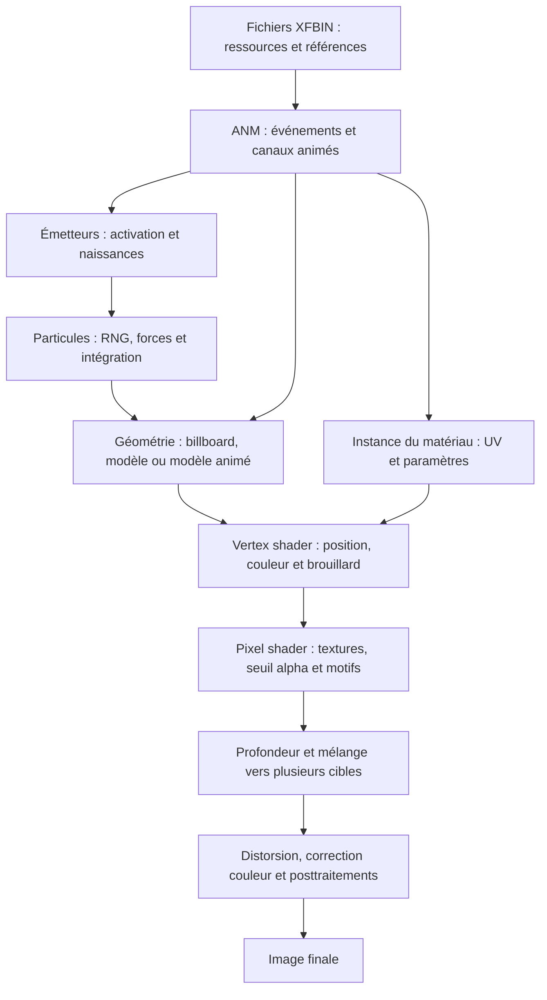

# Reverse du moteur d’effets Storm Connections

## Objectif et règle de validation

Reconstruire la chaîne générique qui transforme les fichiers NUCC/XFBIN en image, puis utiliser Amaterasu comme premier cas de validation. Les modules devront servir aux autres effets. Une fonction désassemblée, une formule traduite et un rendu validé sont trois résultats distincts.

Exécutable étudié : NSUNSC.exe, SHA256 cecf0405b5ac00b9b9c95e8ff594bde5f8543413b6308f74991c701218b20d1e. Les adresses ci-dessous appartiennent exclusivement à cette version.

Un test visuel demandé à l’utilisateur doit porter sur une version où la différence visée a été expliquée et contrôlée. Le lecteur actuel reste partiel. Aucune prochaine version ne doit être présentée comme exacte avant validation des transformations ET des pixels.

## Chaîne de calcul



## Inventaire des preuves et des lacunes

| Étape | Preuves locales | État réel |
|---|---|---|
| Archives et références | xfbin_chunks.py, inspect_page_refs.py | Extraction disponible ; couverture des types limitée aux ressources étudiées |
| ANM | decode_effect_animation.py ; loader 0x14134a350 | Valeurs et formats extraits ; tous les samplers et applications de canaux non validés |
| Émission | emitter_update.asm ; emission_core.lua | Traduction partielle du chemin horloge positive ; contrôles externes incomplets |
| Naissance | 0x14131b5c0, 0x14131c560, 0x14131cbf0, 0x14131d750, 0x14131d460 | Géométrie de naissance et RNG traduits ; seed/contexte/activation originaux inconnus |
| Forces et mouvement | 0x141385ec0, 0x141386b70 | Dispatch et intégration traduits ; liste exacte des forces du contexte à valider |
| Courbes de taille/couleur/alpha | 0x14130b200 | Comparaison de propriétés disponible ; quatre tailles amt01 restent incompatibles |
| Billboard | 0x1412c7b00, 0x1412c84b0, 0x1412c7dd0 | UV/horloge/roll étudiés ; comparaison de matrices complète à établir |
| Modèles/ANM de ressources | auxiliary_resources.json | Données extraites ; lecteurs Source absents |
| Matériau | 0x1412f5920, 0x1412f5ff0 | Layout UV et binder retrouvés ; tous les canaux ANM non appliqués |
| Shaders | DXBC capturés et ASM dans shaders | Deux chemins partiellement portés ; 19f002 reconstruit en référence D3D11 |
| Composition | material_pipeline_reference.json, material_postprocess_graph.json | Passes identifiées sur une capture ; port Source absent |
| Performance | verify_procedural_player.py | Pas de uploads de sommets par frame ; FPS/GPU réel non mesuré |

## Mathématiques et unités déjà identifiées

### Temps et naissance

L’horloge globale de matériau n’est pas l’âge de la particule. Son calcul suit des arrondis float32 : `clock = f32(f32(f32(counter)*f32(0.1))/denominator)`. Le compteur original ajoute `floor(denominator/60)` par appel, avec pause, limite d’appels et wrap modulo 2^31. Sa phase globale et le nombre d’appels du host restent à retrouver.

La particule stocke un âge en pas de simulation. Le runtime diagnostique utilise `step = seconds * simulationHz` ; cela doit être vérifié avec le facteur host original. L’atlas billboard avance par incréments de 50 ticks lorsqu’un pas entier de particule est consommé. Il copie les canaux avant l’incrément.

RNG traduit : `seed = (214013*seed + 2531011) mod 2^31`, sortie `(seed >> 16) & 32767`. Les appels de plages nulles consomment aussi un tirage. L’ordre des appels et la seed globale déterminent le résultat : une plage correcte ne prouve pas une trajectoire correcte.

### Forces et intégration

Sélecteurs identifiés : 0 vortex, 1 facteur de vitesse, 2 attraction, 3 déplacement, 4 rotation, 5 échelle, 6 vitesse. Le vortex accumule une différence de position obtenue par rotation autour d’un axe ; il n’ajoute pas une accélération persistante. Les masques de contexte 1/256/65536 sélectionnent les listes +90/+88/+80 dans cet ordre.

Les facteurs rayon, distance, falloff, force, scalar de particule et step doivent être appliqués dans l’ordre du code machine. Les vecteurs de direction peuvent transporter l’échelle du repère. La normalisation avant/après transformation n’est pas interchangeable. Le contexte de forces et la précision float32 restent des points de contrôle.

### Billboard et maillage

La position est distincte de la géométrie du modèle. Une texture correcte n’assure pas la forme : les sommets, UV, taille, rotation et orientation caméra interviennent avant le pixel shader.

Le roll original utilise 65536 unités entières par tour, avec arrondi signé, puis conversion par `float32(2*pi)/65536`. Les courbes de taille et les canaux de billboard ne sont pas tous cumulés : le rendu de particule remplace notamment position, taille, roll et alpha de l’instance billboard après son update.

Les modèles animés conservent leur géométrie 3D et leurs repères ANM. Ils ne doivent pas être remplacés par un quad face caméra.

### Layout générique de l’instance matériau

| Offset instance | Signification établie |
|---|---|
| +30 / +50 | UV0 offset.xy / scale.xy |
| +38 / +58 | UV1 offset.xy / scale.xy |
| +40 / +60 | UV2 offset.xy / scale.xy |
| +48 / +68 | UV3 offset.xy / scale.xy |
| +70 / +74 | blendRate.x / blendRate.y |
| +7c | commonParam.w |
| +80 | seuil alpha |

Les noms historiques `scroll0/scroll1` des exports désignent UV2/UV3. Le scroll écran prend leurs composantes scale, tandis que le poids du motif de la flamme principale prend UV3.x. Ces paramètres ne sont pas interchangeables. Les indices ANM doivent être reliés aux setters originaux ; leur ordre supposé ne constitue pas une preuve.

### Shaders et composition

Le vertex shader produit position clip, UV transformés, couleur et éventuellement brouillard. Le pixel shader échantillonne les atlases, applique le seuil alpha, mélange les motifs écran puis produit la couleur. Certains shaders produisent aussi une cible de paramètres utilisée plus tard. Le depth test, depth write et le blend sont une étape séparée.

Exemple confirmé : huit draws précoces correspondent exactement aux 68 sommets du modèle amt15. Son shader 19f002 mélange DEUX films écran et utilise SrcAlpha/InvSrcAlpha sans depth writes. Le shader principal étudié n’a qu’un film, avec blend désactivé et depth writes activés. Il faut deux chemins de rendu distincts.

Le HLSL de référence amt15 compile en VS/PS 4.0 avec le compilateur local D3D11. Compilation ne prouve ni équivalence complète, ni exécution Source. L’adaptation vers Source reste à faire.

La chaîne finale retrouvée comprend copies, distorsion, correction couleur, extraction/blur/composition de glare, focus et filtrage des contours. Ses ressources sont réutilisées dans le temps : le graphe doit préserver l’ordre des événements.

## Ordre de travail et critères d’acceptation

1. Retrouver les setters et samplers ANM génériques (type coord, material, point light). Valider indices, unités, interpolation, boucles et horloges sur les valeurs originales.
2. Comparer les matrices/UV/couleurs calculés avec les captures pour chaque famille de géométrie. Isoler les quatre écarts amt01 et les écarts des éléments secondaires.
3. Implémenter les lecteurs manquants avec leurs véritables shaders, états de profondeur et blending ; rendre le chemin projectile et son activation.
4. Établir une couverture draw par draw : texture + géométrie + shader + constantes + états + cibles. Une correspondance de texture seule n’est pas un identifiant d’effet.
5. Avec le même état GPU capturé, comparer les pixels du rendu Source pour isoler le rendering. Ces états servent au diagnostic ; la livraison procédurale doit les recalculer depuis les fichiers.
6. Refaire la comparaison à plusieurs instants et angles, puis mesurer CPU/GPU. Optimiser les ressources et batches avec les règles d’ordre du moteur préservées.

L’inventaire actuel couvre 475 draws à textures correspondantes dans sept captures ; il inclut des textures partagées et des passes tardives. Il n’est pas une preuve d’exhaustivité. La validation finale doit aussi compter les draws qui n’ont pas encore de correspondance.

## Première étape réalisée : paramètres animés de matériau

Le setter 0x1412f6380 est traduit avec ses 23 canaux masqués. Vérification contre les instructions originales dans un processus isolé : 2 026 cas passent. Huit draws amt15 confirment la correspondance aux constantes GPU. L’appelant actif, les samplers et les horloges restent à retrouver. Voir storm_connections_itachi_tools/captured_assets/procedural/material_animation_findings.md. Le module est préparé, sans modifier le lecteur visuel installé.

## Lecteurs ANM et contrôleur direct : 2026-10-02

Les formats scalaires 11, 12 et 22 sont traduits avec les opérations float32
originales. 49 034 comparaisons aux fonctions natives passent. Le format 22
possède un mode linéaire et un mode de maintien de clé ; le contexte actif
doit encore être identifié. Le contrôleur 0x14139d440 applique les animations
directement aux matériaux, sans appeler le setter masqué : seuil /255,
canal 17 inutilisé dans cette routine, propagation de certains canaux absents.
La traduction de ce contrôleur reste une analyse statique ; ses horloges,
les rotations, les géométries manquantes et le rendu final ne sont pas validés.
Détails : storm_connections_itachi_tools/captured_assets/procedural/scalar_animation_findings.md.

## ANM keys, local clock and matrix update — 2026-10-02

Quaternion sign mask and key preprocessing recovered: 4,013 native helper
comparisons pass, including extracted amt15 keys. Actual nuccAnmEffect local
clock recovered and connected to the file evaluator: 10,576 exact cases.
Matrix multiplication and column scale: 6,000 exact cases. The evaluator runs
800 local ticks from nine original quaternion keys and repeated loops. These
proofs cover bounded math, not host scheduling, world transforms or final
rendering. Previous unresolved-mask note is superseded. No visual deployment.
See storm_connections_itachi_tools/captured_assets/procedural/anm_clock_matrix_findings.md
and quaternion_animation_findings.md for addresses, assumptions and remaining
gates. Next: independently verify model matrices, then model shader integration.

## Generic shader binding inventory — 2026-10-02

`shader_bindings_dispatch.json` contains 72 native parameter accessor thunks
with semantic names and accessor indices. The index selects an accessor; the
runtime binding ID is loaded from the caller record at `+0x04 + 4*accessor_index`
for all 72 accessors, a formula now enforced by the extractor. Value accessors
and sampler accessors also use separate paths. The first categorized map is
in `storm_connections_itachi_tools/captured_assets/procedural/generic_shader_parameter_map.md`.
It distinguishes context source offsets from GPU registers: an accessor name
or ID does not establish a shader register, texture resource, or pixel meaning.
The inventory shows reusable engine families for lights, transforms, fog,
material/UV parameters, camera/screen transforms, sampler resources, and
post/stage controls. Native tracing establishes two routes: 61 value accessors
use their runtime binding IDs to select a 24-byte global registry entry and
match its key against the active shader list, then copy bytes with `memcpy`
into shader parameter staging; 11 sampler accessors use a
separate resource resolver and queued binding list. GPU upload/bind occurs
later. The 61 values split into 46 float4 copy accessors (including one
four-color loop), 14 matrix-transpose accessors, and one scalar. The extractor
now stops at tail jumps; previously it could append adjacent sampler thunks
to one assembly record. One Amaterasu draw cross-checks 11 context fields
against exact vertex-buffer offsets; `g_matWorldViewProj`, `g_blendType`, and
`g_uvScaleScreen` still need source tracing. Exact descriptor fields and
stage/register assignment remain open; see the map for evidence. Next, decode
those structures, join them to DXBC reflection and per-draw captures, then
validate both routes on another effect before treating them as engine-wide
behavior.

## amt15 GPU cross-check and clock bridge — 2026-10-02

Eight original amt15 draws agree with the file-driven rotation/anisotropic
shape invariant (max normalized error 1.11e-5). Texture hold mode matches all
eight, while six contradict linear UV. This is constrained shape evidence,
not full parent/world identity. Particle-to-model ANM speed math is recovered;
2,180 exact original-prefix cases pass. Model timing differs from billboard
timing. Diagnostic reader uses the capture-supported hold context and checks
both 30/60-rate timelines. No visual deployment. Details and caveats:
storm_connections_itachi_tools/captured_assets/procedural/amt15_clock_rotation_findings.md.
Next: trace particle parent through ANM vtable+48/clump transforms, then integrate
the original model shader and validate draw coverage/pixels.

## Hierarchy / light correction — 2026-10-02

The generic file reader now evaluates every hit00/blt00 ANM entry, with hierarchical
matrices and timestamp rotations. Type 6 is proven point-light animation; it
does not control particle emission. See anm_hierarchy_light_findings.md for
addresses, verification scopes and explicit diagnostic host assumptions.
Particle parent formation, activation and shader/compositing parity remain gates.

## Particle parent and skill graph — 2026-10-02

Native Euler, travel basis, angle quantization and 4x4-by-3x3 helpers are
translated and verified. Model parent/size/ANM bridge is prepared. Correct
4efb_amt1 skill XML now extracted: ARROW launch -> CRAWLER (velocity 25) ->
hit00 on contacts/frame 120, with explicit shot-axis placement. CRAWLER RTTI
and update are located; actual unit conversion, guidance and ground query
remain gates. Details: storm_connections_itachi_tools/captured_assets/procedural/particle_parent_skill_findings.md.
No new visual deployment or final parity claim.

### Integration checkpoint r12

The reusable ANM->scene attachment adapter is now exercised by the GMod player,
as is the amt15 model-particle->ANM->shader branch. Exact native helper tests
remain bounded evidence. New stationary unit-root phase inspection is not
final skill activation or full particle rendering. Explicit caller inputs and
remaining uncertainty are listed in captured_assets/procedural/r12_findings.md.
This adapter can be reused for later decoded ANM resources; shader family,
material static metadata, actor control and compositor must be verified per skill.

## r13 visual shader correction — 2026-10-02

The procedural player now routes materials by their bound texture group rather
than treating every format-77 material as the same shader. Three-texture groups
whose second and third textures are both `1efc_film_clash00` use the new
`amt_projected_anim_ps30` variant; ordinary two-texture format-77 groups retain
the existing primary shader, and one-texture groups avoid the projected-film
path. This follows the frame-22136 draw evidence: the fire04 family contains
both single-texture and two-film draws.

The new pixel shader preserves animated atlas UVs, samples each projected film
with its own captured screen scale/scroll, applies the two material film weights
from `scroll1.xy`, retains particle tint through c5, and preserves the alpha
cutoff/alpha multiplier. Shader source and Source v6 package round-trip compile
successfully. The server resource declaration and procedural installer include
this shader under the r13 diagnostic manifest.

This is a focused correction, not proof of matching the game. The captured
material clock still uses the provisional Source clock rather than the original
global epoch. Fog/MRT compositing and live GMod pixel comparison are unresolved;
other side flames, spirals, and ash are outside this change. Final Amaterasu
visual parity remains unverified.
## r14 visual scale correction — 2026-10-02

The procedural preview's default outer scale was 0.3 despite the decoded skill
attachment scale being 1.0. That multiplier was applied both to billboard axes
and to particle offsets, so it contracted the main flames and their force-driven
rise together. Default is now 1.0; an explicit first command argument still
allows manual scene fitting. This is a viewer/root scale correction, not a
change to any recovered emitter size or velocity parameter.

The current reader still excludes `1efc_part11b`; its NUD state contains a
nonstandard destination blend value (146), so its blend must be translated
before it can be rendered faithfully. Other cinder/debris assets are separate
resources and should not be conflated with this missing draw family.
## r15 cinder draw restoration — 2026-10-02

`1efc_part11b` was present in the skill parameters and decoded assets but was
explicitly discarded by the player. Its NUD source factor is 5 (SRC_ALPHA) and
its destination factor is the Storm-specific value 146. The player now routes
this family through the secondary texture shader with standard Source alpha
compositing and disables depth writes for that translucent draw. This restores
the skill-authored ash/debris geometry and its 75-tick size/fade curves; the
mapping of destination code 146 to the exact native blend op is still not proven.
The preview root scale defaults to unit scale so its authored rise is no longer
contracted by 0.3. This remains a live-render diagnostic, not a parity claim.

## r16 — effect lifetime and shader evidence

The impact ANM lasts 5,000 ticks; the preview advances 50 ticks per update.
Emitters stop at that animation endpoint, then existing particles age out using
their decoded lifetimes. This replaces the six-second preview window. It does
not explain or establish a reduction in the excessive ash visible at the active
effect peak; actual emitter count, activation, transforms and draw/render costs
remain under reverse analysis.

The original capture distinguishes the main fire material from the legacy
dual-film path: 47 principal atlas draws use one projected `4efb_maplus01`
film, while only two draws use `19f007_ps`. The current GMod shader still lacks
the original MRT/deferred output path, so main-fire parity remains unproven.
See `captured_assets/procedural/r16_findings.md`.

## r17 — captured MRT consumer chain

Frame 22136 main-fire event 5302 writes three render resources. The color and
metadata targets are read later by alpha-tested copy and offset-sampling passes;
a multi-input scene pass rewrites the render targets. The consumer pixel
shaders are disassembled and the event/resource trace is recorded in
`captured_assets/procedural/r17_mrt_chain_findings.md`. This is a scene-wide
capture, so downstream passes are not yet isolated to Amaterasu alone. The
meaning of target 1 and a Source-compatible replacement still need resolution.

## r17 — Source alpha fallback

Main fire materials now use conventional Source alpha blending with depth
writes disabled because the GMod path lacks the original deferred targets. The
pixel shader's output alpha is recovered; its full blend meaning is not. This
change is an approximation awaiting a live screenshot and compositor mapping,
documented in `captured_assets/procedural/r17_source_alpha_findings.md`.

## r18 — per-shader parameter selection

The generic constant dispatcher has now been traced through its caller record.
`0x141335710` indexes a runtime array of `0x130`-byte shader records, and
`record+0x124` is a 10-byte accessor mask. `0x141337b50` checks that mask and
calls only active entries from the 72-function accessor table. Each selected
thunk then reads its runtime binding ID from `record+0x04+4*accessor_index`.
This closes the path from a shader-specific semantic mask to descriptor copy
operations while preserving the distinction between accessor index, runtime
binding ID, and GPU register. The array initializer is now traced; the source
shader inventory, exact backend slot mapping, and sampler backend consumption
remain open. Full evidence is in
`storm_connections_itachi_tools/captured_assets/procedural/generic_shader_parameter_map.md`.

The dispatch chain is extended one step toward the global registry:
`0x1413356d0` searches the ordered shader-key tree rooted at
`[global_registry+0x28]` (global pointer `0x14974d558`), matches the 32-bit key
against node `+0x1c`, and returns the runtime shader-record index from node
`+0x20`. The record lookup then uses this index. `0x1413352c0` constructs the
records: it queries the shader inventory, resolves all 72 native semantic
names against each shader, stores binding IDs at `+0x04+4*index`, and sets
the corresponding bit in the 10-byte mask at `+0x124`. The remaining open
parts are the source of the shader inventory and the backend's slot meaning.

The shader record loader has also been narrowed to `0x1412e30a0`: it iterates
thread-local shader records, derives a 32-bit semantic identifier through
`0x1412e0ed0`, stores it in a 32-byte binding row, and maps it to a runtime
index with `0x1413356d0`. A separate `0x1412e29c0` pass translates material
shader keys to record indices and ORs a 128-bit feature mask returned by
`0x14134fc70`; this mask is distinct from the accessor mask until proven
otherwise. The detailed disassembly interpretation and open fields are in the
generic shader parameter map.

### r18 sampler correction

The resolved resource pointer is written to the selected sampler descriptor at
`+0x30`; `0x141239d10` returns a per-thread container whose `+0x20` vector
receives that descriptor pointer. The earlier shorthand saying the pointer is
cached in the sampler record was inaccurate. The container key/lifetime and
later GPU backend consumer remain open. See the pointer-flow clarification in
the generic shader parameter map.

Sampler resolution is also partially decoded: `0x14123e7f0` adds the current
TLS resource namespace (`+0x32c8`) to low-range selectors, probes the resource
hash table, and returns the resource pointer on a key match. `0x14123c0e0`
writes the pointer into the selected sampler descriptor at `+0x30`, packs the
selector/scalar at `+0x40`, then queues that descriptor pointer in the keyed
per-thread container. Its draw-side command packaging is traced further in
R20 below; the final GPU backend consumer remains unresolved.

### R19 — Sémantique shader jusqu'au staging CPU (2026-10-02)

La chaîne de liaison des paramètres génériques est maintenant établie plus
loin que dans les notes précédentes :

1. Le record shader global (`0x130` octets) garde le shader key, 72 IDs CPU et
   le masque des accesseurs disponibles.
2. Le nom d'un accesseur est résolu par `0x141239390` / `0x141239450` dans les
   registres de sémantiques. `0x141239510` fournit ou crée son ID dans la table
   globale de descripteurs, à pas de 24 octets (`manager+0x2008`).
3. `0x141239760` sélectionne le descripteur par ID. Il contient un pointeur de
   dispatch, une clé 64 bits, puis une description de copie.
4. Le constructeur `0x1412e30a0` produit les lignes propres à chaque shader à
   partir des déclarations parsées; `0x1412e0ed0` associe les clés aux
   déclarations et aux catégories/stages.
5. À l'exécution, `0x14123ab80` recherche la clé dans les liaisons actives du
   thread de rendu et copie la valeur dans la mémoire CPU de staging à l'offset
   et à la taille de cette ligne. L'ID CPU ne donne donc pas directement un
   registre GPU.

Ce résultat explique le rôle du moteur entre sémantique, déclaration de shader
et constantes CPU. Il ne révèle pas encore le point d'upload de cette mémoire
vers D3D11 ni tous les champs des déclarations sérialisées. Le tableau de
comparaison d'Amaterasu dans `generic_shader_capture_crosswalk.json` reste la
référence croisée pour les offsets observés par RenderDoc.

### R20 — Le draw matérialise les bindings en commandes (2026-10-02)

Le chemin de draw observé est `0x1412f4c30` -> `0x141337b50` pour les
accesseurs génériques, puis `0x141249850` / `0x141249880` -> `0x141248b70`
pour la préparation commune du draw. `0x141248b70` prépare les états et
ressources, et appelle `0x1412370a0` avec le shader actif. Cette dernière
fonction récupère le conteneur associé au shader dans l'état de rendu par
thread, puis transforme ses listes de données/samplers en objets liés à une
file de commandes.

Le chemin sampler est désormais suivi au-delà du simple ajout à un vecteur :
`0x14123c0e0` résout la texture et ajoute son descripteur à la liste du
conteneur; `0x141236d70`, appelée lors du packaging du draw, parcourt les
descripteurs et construit des commandes typées (codes observés `0x0a` et
`0x0d`) avec les valeurs de sampler et le pointeur de ressource. D'autres
états sont empaquetés avec des types `0x02`, `0x04` et `0x06`. Ces observations
ferment le chemin producteur -> conteneur -> commandes différées, sans encore
identifier leur interpréteur final ni l'appel D3D11 qui fixe les samplers.

Les wrappers de draw finissent par appeler `0x141248b70`, qui prépare les
commandes puis revient au caller. Ne pas traiter cette fonction comme une
preuve de `Draw*` immédiat : la soumission GPU passe par les commandes
différées, dont le dispatcher reste la prochaine cible. Les preuves détaillées
sont dans `generic_shader_parameter_map.md` et les désassemblages natifs.

### R21 — Snapshots et portée des commandes (2026-10-02)

Le chemin a été recoupé avec d'autres producteurs de draw. `0x141400980`
alloue un record de `0x110` octets, le marque `0x04` et copie un bloc contigu
de l'état (offsets `+0x30..+0xf0`), puis conserve des pointeurs de contexte à
`+0x100` et un indicateur à `+0x108`. `0x1412370a0` produit aussi le tag
`0x06`, avec deux pointeurs obtenus des champs `+0xf8` et `+0x1e8` du contexte
de rendu. Cela confirme que la liste liée contient des snapshots d'état de
draw et des liaisons, et pas uniquement une liste de textures.

Les fonctions `0x1413f40e0`, `0x1413f3ca0` et `0x1413f3c30` remplissent les
champs de records; elles ne montrent pas elles-mêmes d'appel D3D. `0x141237b80`
vide une liste de bindings par thread et libère les entrées : c'est un chemin
de nettoyage. À la rédaction de R21, les callbacks d'exécution n'étaient pas
encore remontés; R22 et R23 les identifient partiellement. La soumission D3D11
et les slots concrets restent ouverts. Ne pas déduire que les tags numériques
sont des enums publics ou des appels GPU.

### R22 — Callback d'exécution des commandes sampler (2026-10-02)

Le premier élément de chaque record est un pointeur de table de méthodes. La
table du tag `0x0a`, à `0x141b8d5e0`, expose au slot `+0x20` le callback
`0x1413f3050`; les données RTTI voisines nomment la classe
`Command_BindTexture`. Ce callback obtient le contexte renderer actif depuis
le singleton backend (`global+8`, puis méthode virtuelle `+0x20`) et lui
transmet binding ID (`record+0x30`), index/stage (`+0x34`) et ressource
(`+0x38`) par sa méthode virtuelle `+0xb8`. C'est maintenant une preuve du
callback d'exécution du record et du routage vers l'abstraction graphique;
l'implémentation concrète de `+0xb8` et son appel D3D restent à résoudre.

Le tag `0x0d` utilise une seconde table à `0x141b8e090`. Ses callbacks
`0x1412390e0` / `0x141239110` lisent le petit payload du record et appellent
`0x141237410`. Ce mapper transforme des champs de type/format et facteurs en
flags internes, puis appelle une méthode virtuelle du même contexte renderer
au slot `+0xc0`. Les slots `+0xb8` et `+0xc0` sont des opérations de
l'abstraction renderer; leur correspondance exacte avec les méthodes D3D11
n'est pas encore prouvée. Les tables et payloads sont décrits dans
`generic_shader_parameter_map.md` et `generic_shader_record_layout.json`.

### R23 — Types de commandes graphiques principaux (2026-10-02)

Les tables de méthodes donnent aussi les noms RTTI et callbacks de trois
commandes centrales :

| Tag | RTTI / record | Callback d'exécution | Chemin observé |
|---:|---|---|---|
| `0x02` | `Command_RenderPolygon` (`0x141b8e338`) | `0x1413f3570` | Récupère le renderer et choisit son slot `+0x80` ou `+0x88` selon `record+0x78`; passe les paramètres de géométrie/draw. |
| `0x04` | `Command_UpdateRenderState` (`0x141badcc8`) | `0x1413f3ae0` | Convertit le snapshot par `0x141400360`, puis transmet l'état transformé au contexte par `0x141420cc0`. |
| `0x06` | `Command_SetShader` (`0x141b8e030`) | `0x1413f39d0` | Passe deux références shader par le renderer slot `+0xa0`. |

Le tag `0x02` prouve que les records exécutables atteignent les méthodes
renderer de draw polygon; leurs noms D3D exacts ne sont pas établis. Le tag
`0x04` met à jour un état interne à partir d'un snapshot et n'est pas encore
un appel direct de render state D3D. Avec les tags `0x0a` et `0x0d` décrits en
R22, la charpente observable est : état shader -> état de rendu -> textures et
samplers -> opération de draw. L'ordre et les payloads propres à chaque draw
doivent encore être reconstruits depuis les événements GPU capturés.

### R24 — Initialisation du backend D3D11 (2026-10-02)

La chaîne de création du renderer rejoint maintenant l’API graphique native.
Le global consommé par les callbacks de commandes est `0x149751dd0`. Son
objet est initialisé par `0x1413f03c0`, puis `0x1413f0610` crée et configure
son contexte graphique. La configuration passe par un objet à table virtuelle
`0x141bacd80`; sa méthode d’initialisation `0x1413f1070` rejoint
`0x1413f1290`, puis `0x141415b10`. Cette dernière appelle le thunk
`0x14162dd53`, qui saute vers l’import `d3d11.dll!D3D11CreateDevice` à
`0x141736410`. Le backend de ce binaire est donc confirmé D3D11, et non une
déduction basée uniquement sur les noms RTTI.

La preuve ferme la branche de création du device, mais pas les opérations de
draw : les commandes différées passent encore par une interface renderer et
ses slots virtuels (`+0x80/+0x88`, `+0xa0`, `+0xb8`, `+0xc0`). Leur
implémentation finale, les mises à jour de buffers/constants, le parcours de
la file et les appels `ID3D11DeviceContext::*` restent à retrouver. La
création du device ne prouve pas à elle seule l’identité des slots. Le graphe
de cette chaîne et les adresses confirmées sont aussi dans
`captured_assets/procedural/generic_shader_parameter_map.md` et
`generic_shader_record_layout.json`.

### R28 — État depth/stencil confirmé, blend encore à identifier (2026-10-02)

Une méthode backend supplémentaire (`slot +0xe0`, `0x141417d00`) applique le
depth/stencil sur le contexte immédiat en appelant son slot `+0x118` avec
l’objet d’état et la référence stencil. La signature correspond à
`ID3D11DeviceContext::OMSetDepthStencilState`.

La méthode backend `slot +0x158` appelle `+0x148` sur ce contexte, mais passe
trois valeurs 32 bits qui ne correspondent pas à la signature attendue de
`RSSetState`; cette attribution reste ouverte. Des appels à `+0x110` existent
ailleurs, mais ils ont d’autres bases d’objet et ne prouvent pas encore un
`OMSetBlendState` pour ce contexte. Les méthodes backend recensées n’exposent
pas non plus de `Map`, `Unmap` ou `SetConstantBuffers` sur le contexte immédiat.
Blend, rasterizer et upload des constantes restent donc les prochaines cibles.
Le scanner réutilisable est
`storm_connections_itachi_tools/audit_backend_context_calls.py`; ses résultats
globaux doivent être validés en suivant la base de chaque appel.

### R25 — Sous-systèmes de rendu particule et trail (2026-10-02)

L’inventaire RTTI confirme des classes de rendu distinctes pour
`nuccParticleManagerRenderer`, `nuccParticleNodeListRenderer` et
`nuccTrailRenderer`, avec des threads dédiés `nuccParticleRenderThread` et
`nuccTrailRenderThread`. Les tables primaires retrouvées sont respectivement
`0x141b914f0`, `0x141b9a7a0`, `0x141b9c010`, `0x141b9a830` et
`0x141b9c170`. Cela établit une architecture dédiée par catégorie; le fait
qu’un type soit présent dans RTTI ne prouve pas encore qu’il soit utilisé par
chaque émetteur d’Amaterasu.

Deux chemins de commandes sont maintenant distingués. Le callback de
`nuccDrawCmd_DrawPrimitive` (`0x1412fdaf0`, avec sa variante
`0x1412fdb90`) résout le shader key, construit son contexte générique,
exécute les accesseurs de constantes, puis appelle la préparation commune du
draw (`0x141249850`). Pour `nuccDrawCmd_DrawTrail`, les méthodes
`0x1412d2b90` et `0x1412d2630` parcourent le contexte de rendu par thread,
résolvent les entrées shader/matière, et appellent `0x1412fe4c0` pour ajouter
des références de requêtes à la file du thread. `0x1412d3c40` compose une
matrice 4x4 à partir de transformations et choisit une branche selon un bit
du contexte; la sémantique exacte des champs sources reste à établir.

La mise à jour trail `0x1412c7dd0` recopie des valeurs matière conditionnées
par des pointeurs de paramètres et applique un facteur scalaire temporaire
avant `0x1412d1d10`. Les offsets et la copie sont vérifiés; les noms
sémantiques de ces canaux ne sont pas encore prouvés. Ces chemins montrent
pourquoi le rendu générique des particules ne suffit pas à couvrir les
traînées. Les VAs, tables RTTI et inconnues restantes sont consignées dans
`captured_assets/procedural/particle_runtime_notes.md`.

### R26 — Consommation de la file Trail et génération des segments (2026-10-02)

Le tick du `nuccTrailRenderThread` à `0x141326490` dépile bien sa file
circulaire (`+0x248` pointeur, `+0x250` capacité, `+0x258` curseur,
`+0x260` nombre en attente), lit un discriminateur à `requête+0x58`, puis
dispatch selon trois cas. Le cas 1 appelle `0x141325a50`, qui parcourt les
enregistrements Trail ordonnés de `objet+0x238` à `objet+0x240` avec un pas de
`0x3c`. Il calcule les deltas entre segments voisins, génère deux sorties de
`0x40` octets par segment dans le buffer référencé à `objet+0x320`, interpole
des valeurs de segment, prépare une requête via `0x141389eb0`, puis l’ajoute
à la liste d’objets via `0x1412fe4c0`.

La chaîne CPU Trail est donc établie jusqu’à la requête de draw préparée :
élément de travail du ring -> génération géométrique depuis des points
ordonnés -> enregistrements de rendu par segment -> requête dans la liste
Trail. Cela confirme que les trails n’utilisent pas simplement des quads de
particule billboardés. La disposition sémantique des champs, l’étape qui
transfère cette liste vers `nuccDrawCmd_DrawTrail`, puis les appels concrets
D3D11/blend/vertex format restent à résoudre.

### R27 — Chemin des commandes jusqu’au contexte D3D11 (2026-10-02)

Le dernier étage des commandes différées de rendu est maintenant identifié.
Le wrapper backend utilise la vtable `0x141bae0c0`; son champ `+0x50` reçoit
le contexte immédiat créé par `D3D11CreateDevice`. Les slots internes appelés
par les callbacks de commandes aboutissent aux API D3D11 suivantes :

- Draw indexé : `IASetInputLayout`, `IASetVertexBuffers`, `IASetIndexBuffer`,
  puis `DrawIndexed`.
- Draw non indexé : mêmes bindings, puis `Draw`.
- Shader : `VSSetShader` et `PSSetShader`.
- Texture : `VSSetShaderResources` et `PSSetShaderResources`.
- Sampler : `VSSetSamplers` et `PSSetSamplers`.

Les index buffers choisissent `DXGI_FORMAT_R16_UINT` (`0x39`) ou
`DXGI_FORMAT_R32_UINT` (`0x2a`) selon le champ de commande. Cela confirme que
les commandes shader, texture et sampler alimentent les étapes VS/PS de D3D11,
et ferme le trajet du callback à l’API pour les draws classiques. Le décodeur
du tag 4 doit encore être relié aux états blend, depth/stencil et rasterizer;
l’upload des constantes et le parcours complet de la queue restent ouverts.
Détails et offsets dans
`captured_assets/procedural/generic_shader_parameter_map.md` et
`generic_shader_record_layout.json`.

### R29 — Création des états blend, depth/stencil et rasterizer (2026-10-02)

Le chemin Storm -> descripteur D3D11 est confirmé pour les trois familles
d’état fixes. `0x1414238f0` décode les huit cibles de blend depuis des mots
packés, construit un `D3D11_BLEND_DESC` de 0x108 octets, puis appelle
`ID3D11Device::CreateBlendState` (vtable `+0xa0`). `0x141423a40` construit le
descripteur depth/stencil et appelle `CreateDepthStencilState` (`+0xa8`).
`0x141423b70` construit le descripteur rasterizer, dont biais, modes et flags,
puis appelle `CreateRasterizerState` (`+0xb0`). Dans chaque cas, l’objet D3D
retourné est gardé dans le wrapper à `this+0x10`. Les détails et limites sont
dans `captured_assets/procedural/generic_shader_parameter_map.md`.

Le gestionnaire `0x141420cc0` met à jour des maps d’état depuis le snapshot
packé. La création est donc établie, mais l’application de blend/rasterizer
au contexte immédiat reste à suivre jusqu’au call-site de draw. L’état
les liaisons d’application sont corrigées dans R31 : `0x141417d00` appelle
`OMSetBlendState` au slot contexte `+0x118`, et le depth/stencil est appliqué
par `0x141417d70` au slot `+0x120`.

### R30 — Tables d’énumérations D3D11 décodées (2026-10-02)

Les tables de conversion invoquées par les builders R29 sont maintenant
extraites : facteurs blend Storm `0..18` ->
`[1,2,3,4,5,6,9,10,7,8,11,14,15,14,15,16,17,18,19]`; opérations blend
`0..4` -> `1..5`; fonctions comparison `0..7` -> `1..8`; stencil ops `0..7`
-> `1..8`; raster fill `0 -> 2`, sinon `3`; raster cull `0 -> 1`, `1 -> 2`,
sinon `3`. Les valeurs de secours sont également consignées dans le fichier
de paramètres. Cela donne les enums réellement écrits en mémoire pour les trois
descripteurs. La signification exacte des codes d’origine attend encore une
validation contre le format Storm sérialisé.


### R31 — Correction des slots D3D11 et chemin compute (2026-10-02)

La première attribution des slots dans R28 était erronée : elle se fondait sur
une signature supposée sans respecter l’ordre réel de `ID3D11DeviceContext`.
La vérification de l’ordre dans l’en-tête WinSDK, puis des registres préparés
par chaque appel dans le binaire, établit les correspondances suivantes :

- Backend `+0xd8`, `0x141417d70` -> contexte `+0x120`,
  `OMSetDepthStencilState` (état et référence stencil).
- Backend `+0xe0`, `0x141417d00` -> contexte `+0x118`,
  `OMSetBlendState` (état, tableau BlendFactor, masque `0xffffffff`).
- Backend `+0xe8`, `0x141417e50` -> contexte `+0x158`, `RSSetState`.
- Backend `+0x158`, `0x141416250` -> contexte `+0x148`, `Dispatch(x,y,z)`.

Le JSON de référence et `generic_shader_parameter_map.md` sont mis à jour.
R28 est conservé comme trace historique mais ses attributions de slots sont
supplantées par cette correction. Sources d’incertitude restantes : origine
du tableau BlendFactor, sémantique des champs Storm packés, moment d’application
des états dans le cache, et transfert GPU des constantes.


### R32 — Génération native de ScreenToUV (2026-10-02)

Le setup du contexte de rendu `0x141337c60` calcule `g_ScreenToUV` à
`context+0x500` par `(1/largeur, 1/hauteur, 0, 0)`. L’écriture passe par le
helper feuille `0x1412a96c0`, dont les stores confirment l’ordre des quatre
composants (XMM1, XMM2, XMM3, argument de pile). Vérification contre les
constantes DXBC réfléchies : les 213 draws principaux des sept captures ont
tous `(1/3840, 1/2160, 0, 0)` à l’arrondi float32 près. Le script d’audit des
constantes et le crosswalk machine conservent cette correspondance.


### R33 — Projection écran du shader principal Amaterasu (2026-10-02)

La paire VS/PS capturée transforme `SV_Position` en UV d’échantillonnage écran.
Le VS calcule `(scaleX/width, -scaleY/height)` et le biais
`(offsetX*scaleX, offsetY*scaleY)`; le PS applique ce facteur+biais puis
échantillonne `(u,1-v)`. Pour le draw 5815, `scale=(3,1)` et la résolution
est 3840×2160. L’équation complète et ses offsets DXBC sont ajoutés au
crosswalk machine ainsi qu’au map des paramètres. Cela établit le calcul GPU
du screen/noise sampling pour cette famille de shader; l’origine CPU des
paramètres matériau demeure ouverte.


### R34 — Binder CPU de g_uvOffsetScreen (2026-10-02)

La chaîne CPU→GPU est établie pour l’offset screen du shader principal.
`0x1412f5ff0` lit quatre vitesses UV2/UV3 dans le matériau (`+0x60..+0x6c`),
les multiplie par l’horloge issue du compteur matériel `+0x958` (`counter *
0.1f / denominator`), conserve la fraction signée et met à zéro une vitesse dont
la valeur absolue est strictement sous `1.1920928955078125e-7f`. Il écrit le
vecteur ordonné en contexte `+0x4f0`; l’accessor 50 le copie au byte 240 du
buffer GPU comme `g_uvOffsetScreen`. `verify_material_context.py` passe sur
213 draws/7 captures et sur les cas float32/counter annoncés. Le fournisseur
de l’époque globale et du dénominateur d’update reste à tracer.


### R35 — Diviseur immuable de l’horloge matériau (2026-10-02)

Le dénominateur lu par le binder écran est le dword `3000` à VA `0x141b948e8`,
dans la section PE non inscriptible `.rdata`. Le multiplicateur lu par le même
chemin est le float32 `0.1`. La formule native complète est donc
`float32(float32(counter)*0.1f/3000.0f)`. `0x1412a0500` accumule le delta
`floor(3000/60)=50` par appel de scheduler, avec un plafond de 600 appels
avant consommation; `0x14129d760` consomme ce delta, respecte le flag pause
`+0x95c`, incrémente le compteur matériau `+0x958`, puis réinitialise les
accumulateurs. Aucun write direct au global du dénominateur n’a été trouvé et
la section `.rdata` n’est pas inscriptible; le diviseur est une constante du
binaire, pas une entrée runtime. Le crosswalk machine est mis à jour.


### R36 — Format matériau XFBIN -> champs runtime (2026-10-02)

La classe native `nuccChunkMaterial` est repérée par sa RTTI et son chemin de
source embarqué. Sa méthode de lecture `0x14134cde0` parcourt les bits du
format dans l’ordre `01,02,04,08,10,20,40,80` et copie chaque bloc compact
aux offsets de ressource `+28..+7c`. Le constructeur runtime
`0x1412f5920` mappe ensuite les vecteurs source `+28,+30,+38,+40,+48,+50,+58,+60`
vers les vecteurs runtime `+30,+38,+40,+48,+50,+58,+60,+68`; les champs
scalaires sont copiés à `+70,+74,+78,+84,+88`.

`decode_native_material_fields.py` applique cette table aux 18 chunks
`nuccChunkMaterial` de `2efb_amt.xfbin`. Vérification : les floats des 18
matériaux sont consommés exactement, aucun reste ni dépassement. Les taux
statiques pour `2efb_amt00/18` deviennent `(0.3,0.3,-0.3,0.3)` aux champs
utilisés par le binder `0x1412f5ff0`; `2efb_amt08` donne
`(0.3,0.3,-3.0,0.3)`. Le rapport généré est
`storm_connections_itachi_tools/captured_assets/procedural/native_material_parameter_map.json`.

Limite découverte lors de la confrontation aux captures : les trois dernières
composantes `g_uvOffsetScreen` sont égales et positives dans les 213 draws,
alors que la troisième vitesse statique de ces matériaux est négative. Le
fichier d’effet décodé ne montre pas de courbe matériau ANM ciblant
`2efb_amt00/20`; l’identité et les mutations runtime des matériaux de ces
draws restent à établir. Le lien statique est fermé, mais le rapprochement
capture -> instance runtime reste ouvert.


### R37 — Attribution des matériaux de flamme et phase de scroll (2026-10-02)

Correction de R36 pour le shader principal : les captures n’utilisent pas les
matériaux `2efb_amt` comparés initialement. Le draw 5815 et les 212 autres
draws 915c5e6e sont associés aux ressources `4efb_amt00/01` par hash SHA256 de
la première texture GPU, puis retrouvés dans
`captured_assets/data/effect/4efb_amt1.xfbin`. Les matériaux de mêmes noms
dans cet XFBIN référencent chacun leur texture correspondante. Le décodeur
native donne pour les deux les taux `(0,1,1,1)`.

L’audit `audit_native_material_scroll_capture.py` vérifie les 213 draws sur
sept captures : chaque `g_uvOffsetScreen` est de la forme `(0,t,t,t)`, conforme
aux taux et à une seule phase du binder pour chaque matériau. Le canal à taux
1 permet aussi de récupérer le compteur modulo 30000 depuis la capture. Les
phases échantillonnées correspondent respectivement à 14100, 16700, 19300,
21050, 23050, 25250 et 27700 ticks modulo 30000, toutes multiples de l’étape
nativement accumulée de 50 ticks. L’origine non déroulée du compteur reste
inconnue, mais son déphasage n’explique plus d’écart matériau/capture.

Les ANM `4efb_amt1` comprennent une animation matériau type 4 sur `4efb_amt15`;
les dessins de flamme capturés restent reliés aux champs initiaux `amt00/01`.
La source CPU de `g_uvScaleScreen=(3,1,1,1)` demeure ouverte. Rapports :
`captured_assets/procedural/4efb_amt1_native_materials.json`,
`4efb_amt1_animation.json` et `native_material_scroll_capture_audit.json`.

### R38 — Retrouver le bytecode original du draw principal (2026-10-02)

L’archive installée `data/system/nuccMaterial_dx11.nsh` contient 448 blobs DXBC valides. Leur inventaire a été analysé avec `inspect_nsh.py`; le dossier `storm_connections_itachi_tools/dxbc` contient leur extraction indexée. Comparer les SHA256 des shaders capturés à ces blobs identifie exactement le vertex shader `612d54c9…63f23` comme l’entrée `0260_00100fbc.dxbc`, et le pixel shader `915c5e6e…06abd` comme `0261_00101804.dxbc`. Cela confirme que les shaders capturés sont ceux de l’archive du jeu, pas des shaders reconstruits ou une variante ressemblante.

Cette correspondance ferme l’identification du bytecode des deux étapes pour le draw 5815 et fournit une entrée stable pour examiner les variantes du paquet. Elle ne résout pas encore toutes les sources CPU des constantes : `g_uvScaleScreen` reste notamment à tracer, et les effets de blending/MRT et le rendu des autres catégories de particules exigent encore leurs propres chemins. Le test a validé le format et le nombre des DXBC, puis retrouvé les deux blobs par SHA256 exact.

### R39 — Propriété NUD liée à la constante écran du shader (2026-10-02)

Le `(3,1,1,1)` observé dans `g_uvScaleScreen` provient de la propriété matériau NUD `NU_uvScaleScreen`. Dans le NUD extrait de `4efb_amt1.xfbin`, les groupes `4efb_amt00` et `4efb_amt01` déclarent exactement `(3,1,1,1)`; les groupes `amt08/amt15` déclarent `(1,1,3,3)`, ce qui montre que cette propriété varie selon le matériau et ne doit pas être codée en dur dans le shader.

`audit_nud_shader_properties.py` joint l’identité `base_asset` établie par la texture GPU, la propriété NUD du groupe, et le champ du buffer GPU. Résultat vérifié : 213/213 draws, sept captures, aucune différence au-delà de 1e-6. Rapport : `storm_connections_itachi_tools/captured_assets/procedural/nud_shader_property_crosswalk.json`. La source des données est donc identifiée dans l’asset; le site natif exact qui copie la propriété NUD dans le contexte shader reste à localiser par désassemblage. Pour les prochains effets, inclure les propriétés NUD dans le relevé d’import aux côtés des matériaux XFBIN, textures et shaders.

### R40 — Le scale écran suit un circuit distinct des 72 accessors (2026-10-02)

La liste complète des 72 accessors génériques ne contient pas `g_uvScaleScreen`; elle contient `g_uvOffsetScreen` à l’index 50, alimenté par le contexte `+0x4f0`. Le binder matériau natif `0x1412f5ff0` écrit ce contexte de scroll, puis parcourt les lignes d’accessors du shader via `0x141337b50`. Pourtant `g_uvScaleScreen` est visible dans la reflection du VS capturé et correspond à `NU_uvScaleScreen` du NUD pour 213 draws. Cela distingue deux chemins : l’offset animé passe par le binder générique documenté, tandis que l’échelle constante vient de la donnée du matériau NUD et son point de copie vers le buffer reste à identifier. Ne pas fusionner ces deux règles dans le port.

### R41 — Le staging de valeurs rejoint la commande SetShader (2026-10-02)

Le corps natif de `0x1412370a0` crée un record tag `0x06` (`Command_SetShader`) avec les références de shader issues du contexte courant. Avant de finir ce record, il appelle `0x141239d10` puis `0x141236b60` pour paquetiser les entrées de valeurs actives, et appelle de nouveau `0x141239d10` puis `0x141236d70` pour paquetiser les samplers. `0x141236b60` parcourt le vecteur d’entrées et clone chaque descripteur avec son payload avant de l’ajouter à la liste de commandes différées. Cela relie le staging sémantique et la collecte par shader à la file de draw; ça ne prouve toujours pas quel callback interprète ces entrées en upload de constant buffer. Les commandes sampler ont déjà des callbacks et des méthodes D3D11 confirmés dans R22/R31. Le dump complet du producteur est `storm_connections_itachi_tools/captured_assets/procedural/material_draw_setup.asm` (entrée `0x1413368f0`); le paquetage ciblé de tag 6 est `0x1412370a0`.


### R42 — Les valeurs shader sont mises à jour puis liées comme constant buffers D3D11 (2026-10-02)

Le trajet générique des valeurs est maintenant relié au backend graphique. Pour chaque entrée de valeur admissible, `0x141236b60` clone le descripteur et prépare un record `mmDrawCommand_UpdateConstantBuffer` (tag `0x10`, vtable `0x141baddf0`) via `0x1414032b0` / `0x1413f4330`; son callback `0x1413f3a80` transmet les champs payload au slot backend `+0xa8`. La méthode `0x1414185d0` appelle le slot `+0x180` de `ID3D11DeviceContext`, identifié comme `UpdateSubresource`, avec sous-ressource 0, boîte destination nulle, pointeur source du record et pitches nuls.

Le même producteur construit ensuite `mmDrawCommand_BindConstantBuffer` (tag `0x09`, vtable `0x141b913c0`) via `0x141401340` / `0x1413f3c30`. Son callback `0x1413f2df0` résout la référence du buffer et appelle le slot backend `+0xb0`. La méthode backend `0x141414bc0` route les entrées vers les helpers `VSSetConstantBuffers` (`+0x38`) et `PSSetConstantBuffers` (`+0x80`). Une autre branche appelle le slot contexte `+0x238`; l’identité de cette interface/méthode reste à confirmer et n’est pas attribuée ici. Le couple upload puis bind relie enfin le staging des sémantiques aux données de buffers vues par les shaders; le layout de registre et les constantes exactes restent propres au shader et doivent toujours être établis par reflection/capture.

Cette preuve ferme le chemin générique de transfert des valeurs, pas l’interpréteur complet de la queue ni toutes les familles de commandes des systèmes particule/trail/postprocess. Elle ne suffit donc pas à dire que le moteur FX est entièrement reversé ou qu’un effet GMod est déjà équivalent pixel par pixel. Détails structurés : `storm_connections_itachi_tools/captured_assets/procedural/generic_shader_record_layout.json`; fonctions inspectées : `0x141236b60`, `0x1414032b0`, `0x1413f4330`, `0x1413f3a80`, `0x1414185d0`, `0x141401340`, `0x1413f3c30`, `0x1413f2df0`, `0x141414bc0`.


### R43 — Ce que copie réellement 0x14123ab80 (2026-10-02)

La primitive de staging est entièrement lue. `0x14123ab80(programme, descripteur, valeur)` cherche le conteneur du programme dans les tables du thread (`TLS+0x130`, `0x141239d10`), y trouve l’entrée dont l’instance de constant buffer pointe sur la définition du descripteur, puis fait `memcpy(entrée.data + variable.offset, valeur, variable.size & 0xffffff)`. La destination est un bloc CPU ; rien n’est envoyé au GPU à ce stade.

Trois corrections des notes R19 :

- le premier champ du descripteur (24 octets, table `manager+0x2008`) est un **pointeur vers le programme shader**, pas une vtable. `0x14123bf10` le charge dans `rcx` et fait un appel direct ;
- la « clé 64 bits » est un **pointeur vers la définition du constant buffer**. La recherche compare des pointeurs ;
- le troisième champ pointe sur la variable réfléchie : `u32 StartOffset`, puis `u32 Size | masqueStages << 24`.

Un ID runtime désigne donc une variable d’un constant buffer d’un programme précis. Les lignes sont créées par `0x141236230` au chargement du programme. Détails et structures : `storm_connections_itachi_tools/captured_assets/procedural/shader_constant_pipeline.md`.

### R44 — Programme shader, réflexion D3D et buffers (2026-10-02)

Le programme (0x338 octets, constructeur `0x141234ad0`) contient deux objets de stage (VS `+0x10`, PS `+0x100`), les définitions de constant buffers fusionnées (`+0x1f0`), les arbres nom → ID (`+0x298` valeurs, `+0x2c8` samplers) et cinq IDs standards à `+0x2f8` : `g_matWorldViewProj`, `transform`, `textureSize`, `color`, `alphaTestVal`.

Chaque stage est créé depuis le bytecode par `0x141426eb0`, qui appelle **`D3DReflect`** ; `0x1414274f0` parcourt le résultat (slot = `BindPoint`, taille, puis `StartOffset` et `Size` de chaque variable). `0x141405cc0` fusionne VS et PS **par slot de registre** : taille maximale, variables réunies par nom. Conséquence : **les offsets GPU sont ceux du chunk RDEF du DXBC**. Une capture n’est plus nécessaire pour les connaître, seulement pour les valeurs. `dxbc_rdef.py` reproduit cette fusion.

Buffer GPU : un par (programme, slot), créé avec le programme par `0x1414019a0` → `0x141428000` (`CreateBuffer`, `ByteWidth = max(taille, 16)`, `USAGE_DEFAULT`, `BIND_CONSTANT_BUFFER`, sans données initiales). Staging CPU : un bloc par (thread, programme, buffer), aligné sur 16 octets, initialisé à zéro (`0x141234800`).

### R45 — Upload, bind et slot +0x238 (2026-10-02)

`0x1412370a0(programme, cléDeTri)` émet `SetShader`, puis pour chaque buffer une copie du bloc de staging dans l’arène de frame, `UpdateConstantBuffer` et `BindConstantBuffer`, puis les samplers moteur. Le buffer entier est remplacé à chaque draw par `UpdateSubresource`.

Le bind `0x141414bc0(stage, slot, buffer)` reçoit le slot de registre de la définition. Sélecteur de stage : 1 VS, 2 PS, 6 CS, 7 VS et PS. Le chemin générique passe toujours 7 ; chaque stage n’est lié que si son shader courant utilise ce slot. Le bind est ignoré tant que le buffer n’a jamais été mis à jour.

Le slot contexte **`+0x238` est `CSSetConstantBuffers`** (index 71 de `ID3D11DeviceContext`). Le receveur est le même pointeur `backend+0x50` que pour `VSSetConstantBuffers` et `PSSetConstantBuffers` dans la même fonction, avec les mêmes arguments `(slot, 1, &buffer)` ; la branche « buffer nul » délie les trois stages à la suite.

### R46 — File de commandes : tri, fusion, exécution (2026-10-02)

Les classes bas niveau s’appellent `mmDrawCommand_*` (le slot 1 de leur vtable renvoie le nom, le slot 4 est `Execute`). Le champ `+0x28` est une catégorie, pas un type : plusieurs classes partagent les tags 4, 8, 0x0d et 0x22. Le « tag 0x0d, table `0x141b8e090` » des notes R22 est une commande générique de fermeture (`mmDrawCommand_nummDrawCommand_Function`) ; `mmDrawCommand_BindSampler` est la vtable `0x141b91320`. Inventaire complet généré par `extract_draw_commands.py` dans `captured_assets/procedural/mm_draw_command_inventory.json` (33 vtables bas niveau pour 22 noms de classe, 14 classes `nuccDrawCommand` / `nuccDrawCmd_*`).

Chaque thread remplit sa liste (`[[TLS+0xf0]]`). Les commandes consécutives de même clé forment un groupe et restent dans leur ordre d’émission. En fin de frame, `0x14121b570` trie chaque liste par clé croissante (tri stable `0x1413f8cc0`) et réveille le thread `RenderThread` (`0x1413fc180`). Celui-ci fusionne les listes par clé (`0x1413f8990`), exécute chaque groupe (`0x1413f8510`, puis `0x1413fd740` pour la chaîne), puis remet les arènes à zéro.

Clé de tri (`0x141249150`) : `couche << 35 | bucket << 32 | profondeur`. Bucket 0 si les deux modes de blend valent 0 ; bucket 3 si bit 10 des flags ; bucket 1 si bit 11 ; sinon bucket 2 avec `profondeur = clamp(trunc(zVue * 512) + 0x80000000)`. La matrice capturée a `w = -z`, donc l’ordre croissant va du plus loin au plus près. La couche est un compteur global remis à zéro à chaque frame et avancé par `0x1412191d0` (point d’entrée `0x14121c450`, 103 sites d’appel, surtout dans les filtres écran).

### R47 — Chemin matériau des modèles NUD (2026-10-02)

Le site natif de copie des propriétés NUD, ouvert depuis R39, est trouvé. `nuccChunkModel` construit le modèle de rendu ; chaque matériau passe par `0x141270830`, qui réécrit le nom de chaque propriété avec le format **`"g_%s"` appliqué à `nom + 3`** (`NU_uvScaleScreen` → `g_uvScaleScreen`), copie ses flottants et résout l’ID dans le programme du matériau. C’est le seul site du binaire qui référence cette chaîne de format.

Au draw (`nuccDrawCmd_DrawModel` `0x141365030` → `0x1412d1870`) : setup du contexte, binder matériau `0x1412f5ff0` et accesseurs, puis par mesh `0x14126a3b0` : `0x141271ea0` écrit `g_matWorldViewProj` (64 octets à `TLS[+0x20]+0x70`) et les propriétés NUD ; `0x141271a50` émet l’état, `SetShader` avec les buffers, une texture et un sampler par texture NUD ; `0x1412499b0` émet le draw. Ensuite `0x141269590` **remet à zéro tout le staging du programme** : une constante que personne n’écrit vaut zéro sur le GPU. C’est l’origine de `g_blendType = (0,0,0,0)` sur le shader principal.

Les trois sources laissées ouvertes dans le crosswalk sont donc fermées : `g_matWorldViewProj` (ID standard du programme), `g_uvScaleScreen` (propriété NUD), `g_blendType` (jamais écrit).

### R48 — États de rendu et modes de blend natifs (2026-10-02)

Le bloc d’état packé (0xd0 octets) est décodé champ par champ depuis les trois builders D3D11 : rasterizer à `+0x00`, depth/stencil à `+0x20`, huit entrées de blend à `+0x30`, topologie à `+0xb8`. Les modes de blend sont des codes sur 4 bits dans deux tables de 13 entrées (`0x141b91150` couleur, `0x141b911f0` alpha), appliqués par `0x14126bc70`. Table complète et décodeurs : `native_render_state.py` (`--verify` relit les tables dans l’exécutable).

Pour un matériau NUD : mode couleur = `dest_factor & 0xf`, mode alpha = `(dest_factor >> 4) & 0xf`, écriture de profondeur = `!(source_factor & 4)`, cull depuis `cull_mode`. Pour les primitives : mode couleur = `flags & 0xf`, mode alpha = `(flags >> 12) & 0xf`.

L’activation du blend ne vient pas du matériau. À l’exécution, `0x141400360` remplace les champs masqués par l’état global `[0x149752108]`, et les draws passent le masque « blend enable + write mask ». `0x141219480` ouvre une couche et émet deux fermetures : blend désactivé à la clé du bucket 0, blend activé à la clé du bucket 1. Dans une telle couche, le bucket 0 est donc dessiné sans blend et les buckets 1 à 3 avec.

### Vérification R43–R48 sur les captures

`verify_constant_buffer_model.py` passe sur les sept captures Amaterasu (rapport `captured_assets/procedural/constant_buffer_model_check.json`) :

- 475 draws, 528 constant buffers, 6292 champs : tous les offsets capturés égalent les offsets réfléchis fusionnés, toutes les tailles aussi ;
- 235 champs prédits depuis les propriétés NUD concordent ;
- 327 champs sans écrivain natif valent tous zéro ;
- les 109 draws avec blend utilisent une paire (couleur, alpha) des tables natives : (1, 11) 59 fois, (2, 9) 28, (3, 0) 12, (1, 0) 10 ;
- 319 draws ont des groupes NUD candidats et leur état capturé égale l’état natif d’au moins un candidat ; sur 213 d’entre eux tous les candidats concordent, sur les 106 autres les candidats diffèrent et la preuve est plus faible. Les huit draws à trois textures avec blend ne concordent qu’avec `4efb_amt15`.

Limites : `base_asset` dans les captures nomme la première texture liée, pas le groupe NUD, donc le groupe exact d’un draw n’est pas toujours identifiable. `g_uvScaleNormal` et `g_uvScaleAlpha` (dix draws `1efc_nor_water01`) suivent le motif des propriétés NUD mais le NUD de ce modèle n’est pas dans l’inventaire. La clé de tri du chemin modèle, les huit presets d’état et l’association couche → cible de rendu restent à décoder. Les producteurs particules, trails, sprites et filtres écran utilisent la même primitive de staging, mais leurs écrivains et formats de sommets ne sont pas cartographiés ici.


### R49 — Qui dessine quoi : modèles, primitives, trails (2026-10-02)

Les 475 draws d’effet des sept captures Amaterasu, y compris ceux des shaders particules `01f002` et `01f008`, lient un vertex buffer par attribut et sont des triangle strips indexés. Ce sont tous des draws du gestionnaire de modèles : dans ce skill, les particules sont dessinées comme de petits modèles NUD. Le chemin tracé en R47 couvre donc tout ce que montrent les captures.

Routage des commandes haut niveau :

- `DrawModel`, `DrawModelShadow`, `DrawModelVelocity`, `DrawModelOutline` → gestionnaire de modèles (`[0x149708d08]`), un flux de sommets par attribut ;
- `DrawPrimitive`, `DrawPrimitiveRef`, `DrawModelPrimitive`, `DrawTrail` → renderer de primitives entrelacées `0x141248b70` (`[0x149708d18]`) ;
- `DrawModelPrimitiveBatch` (`0x141303b10`) : pas encore lu.

Renderer de primitives : cinq formats de sommets, chaque élément sur 4 flottants (strides 64, 48, 48, 32, 80). Il copie les sommets dans un anneau dynamique, calcule la position de tri (moyenne des positions), force `w = 1`, construit l’état et la clé (`0x1412486a0`), écrit `g_matWorldViewProj`, émet `SetShader` puis `RenderPolygon`. `DrawModelPrimitive` sans matériau utilise la clé de shader `0x1f002`. Un trail, à ce niveau, est une primitive entrelacée ordinaire. Aucune capture ne couvre encore ce chemin : ce sont des résultats statiques.

### R50 — Clé de tri et sommets du chemin modèle (2026-10-02)

Clé de tri d’un mesh (`0x141241450`) : elle dépend du mot `source_factor` du matériau NUD (l’en-tête NUD de 32 octets est copié à `matériau+0x40`). Bit 0 à zéro : bucket 0, trié du plus près au plus loin. Bit 0 seul : bucket 2, du plus loin au plus près. Bits 0 et 1 : bucket 1, ou 3 si le bit 3 est aussi posé. Avec les bascules de R48, **un matériau NUD est blendé exactement quand `source_factor & 1`**. `source_factor` est donc un champ de bits : bit 0 translucide, bit 1 et bit 3 choix du bucket, bit 2 pas d’écriture de profondeur, bits 5 à 7 preset d’état.

Sommets (`0x141269dd0`, conversion `0x14126ad50`) : un vertex buffer GPU par élément. Position sur 4 ou 3 flottants selon le type de sommet NUD ; couleur en 4 flottants, depuis 4 octets **divisés par 255.0** ou depuis 4 demi-flottants ; UV en 2 flottants, depuis des demi-flottants ou des flottants. Les strides capturés concordent (16 ou 12, 16, 8).

Le vérificateur inclut désormais la règle « blend actif = bit 0 de `source_factor` » et passe toujours sur les 319 draws qui ont des groupes NUD candidats.

Restent ouverts : `DrawModelPrimitiveBatch`, le draw de mesh skinné (`0x14126a5c0`), quels types de particules passent par le renderer de primitives, les huit presets d’état, et l’association couche → cible de rendu (ordre MRT et post-traitements). Aucun rendu GMod n’a été comparé au jeu pixel par pixel dans cette session.


### R51 — Inventaire des passes et des classes de couches (2026-10-02)

Une passe encadre ses draws par deux appels : `0x14121c240` (ouvre une couche et émet les bascules de blend) et `0x14121c450` (avance la couche). `extract_layer_passes.py` recense les 63 fonctions qui font ces appels, avec les helpers de cible de rendu qu’elles utilisent et les noms de constantes qu’elles résolvent, dans `captured_assets/procedural/layer_pass_inventory.json`.

On y trouve les méthodes de rendu (slot `+0x08`) de classes RTTI nommées : `nuccLayer` (`0x1412fe860`), `nuccLayerZPrePass`, `nuccLayerOutline`, `nuccLayerReduction2`, `nuccLayerOpaqueClearZ`, `nuccLayerRefraction`, `nuccLayerAfterImage`, `nuccLayerToneControl`, et les filtres écran (glare, DOF, sunshafts, fringe, fisheye, motion blur, outline) avec leurs constantes. Le fichier liste aussi les 33 classes `nuccLayer*` / `nuccPostEffect*` (`Shadow`, `Opaque`, `Transparent`, `PostDecal`, `Stencil`, `MotionBlur`, etc.).

C’est une carte de départ, pas un résultat : l’ordre dans lequel `nuccLayerManager` exécute ces couches et la couche qui reçoit les modèles d’effet ne sont pas établis.


### R52 — Oracle pixel : rejeu RenderDoc et rejeu logiciel (2026-10-02)

Jusqu’ici aucune image du port n’avait été comparée au jeu. Deux outils ferment ce trou.

- `run_renderdoc_script.ps1` + `rd_export_textures.py` : RenderDoc 1.46 rejoue une capture sans interface et écrit le contenu brut des cibles à un événement donné (manifeste cumulatif par capture). `rd_dump_samplers.py` lit les descripteurs complets des samplers.
- `soft_replay.py` : interpréteur de bytecode (listings `D3DDisassemble`, SM4 et SM3) et rasteriseur aux règles D3D (top-left, sous-pixel 1/256, interpolation perspective, test et écriture de profondeur, blend, quantification UNORM8). `replay_capture_draws.py` rejoue les draws capturés avec le bytecode du jeu.

Résultat sur la couche principale du feu (capture 22136, événements 5302–6156, 59 draws) : 1 456 224 pixels modifiés, 1 373 551 identiques, 1 456 071 à ±1/255, erreur moyenne 0,025/255, aucun écart hors couche. Les entrées des shaders, la rasterisation et les états sont donc compris au pixel.

Structure d’une frame : la flamme noire est une couche **opaque** (blend désactivé, écriture de profondeur, `discard` sur le seuil alpha). Le fondu alpha de ces particules n’a donc aucun effet visible dans le jeu ; elles disparaissent par l’animation du seuil et de la taille.

### R53 — La clé de shader est le mot `flags` du matériau NUD

Le mot `flags` du matériau NUD est la clé du couple vertex/pixel : `0x9f007` → `612d54c9`/`915c5e6e` (flamme principale, un film écran), `0x1f007` → `f65da7b4`/`c4ee9b55`, `0x19f007` et `0x19f002` (deux films), `0x1f002`, `0x1f008` (falloff), `0x3f009` → `3dc10cf4`/`4bf6e191` (réfraction). Les bits 19 et 20 ajoutent chacun un film projeté en espace écran.

Mathématique commune (familles F002/F007) : couleur = sommet × `g_multColor` × `g_ambientColor` ; UV = uv × `g_uvOffset0.zw` + `.xy` ; alpha = texture.a × sommet.a ; `discard` si `g_commonParam.x >= alpha` ; chaque film : `rgb = lerp(rgb, film.rgb, film.a × g_uvOffset3[i])` avec UV écran = `SV_Position.xy × g_ScreenToUV.xy × (sx, −sy) + g_uvOffsetScreen × g_uvScaleScreen`, v inversé ; sortie = `fogColor + fog × (rgb − fogColor)`, alpha × `g_commonParam.y`.

- F008 ajoute `alpha *= falloff(min(|n.z|/|n|, 1), g_uvOffset2.x).g`, `n` étant la normale en espace vue.
- 3F009 échantillonne une copie de la scène à `SV_Position.xy × g_ScreenToUV + (d.x, −d.y)`, `d = (nA.xy + nB.xy − 1) × (g_commonParam.y × g_uvOffset1.z × sommet.r) × masque.a × 2`, et ne garde le décalage que si la profondeur de la scène à l’endroit décalé est derrière le fragment.

Listings : `captured_assets/procedural/effect_shaders/`.

### R54 — Samplers d’effet

Les codes `wrap_s` / `wrap_t` des textures NUD sont les modes d’adressage D3D11 (1 wrap, 2 mirror, 3 clamp, 4 border). Les samplers des modèles d’effet portent un **biais LOD de −15,996** : seul le mip 0 est échantillonné, même quand la texture a neuf niveaux. La couleur de bordure est (0, 0, 0, 0). La famille F008 fait exception (biais 0).

> **Corrigé par R80** : le biais, le filtre et les adressages sont des données du NUD, par texture. Le « biais −16 partout » ne valait que pour les draws capturés ; environ la moitié des textures d’effet du jeu sont mip-mappées, et les codes d’adressage vont jusqu’à 8.

### R55 — En-tête `nuccChunkModel` : fog, ambiant, couche

Les octets 5, 6, 7 de l’en-tête (avant le NUD) portent des attributs, une couche et une catégorie de lumière. Corrélation sur tous les draws capturés :

- bit 1 des attributs à zéro ↔ fog de la scène appliqué (`g_fogParam` = (200, 13000, 0,3), couleur (0,647, 0,922, 1)) ;
- lumière = 4 ↔ ambiant de la scène appliqué (0,941, 0,961, 0,824) ;
- la couche fixe la place dans la frame : 2 (événements ~2070), 18 (~5300, feu principal), 0 (~6240, cendres), 1 (~6450, translucides), 14 (~6760, réfraction).

Ce sont des corrélations, pas un résultat de désassemblage : le producteur natif des bits 23 à 25 du masque de fonctionnalités de `0x1413368f0` n’est pas tracé. L’ordre de tri de R50 est en revanche vérifié sur les captures : couches opaques strictement du plus près au plus loin (54/54, 58/58, 50/50 pas croissants), translucides du plus loin au plus près.

### R56 — Opacité de nœud (`nuccChunkCoord`)

Le dixième flottant du `nuccChunkCoord` d’un modèle (après position, rotation, échelle) multiplie l’alpha du modèle. `g_commonParam.y` capturé = alpha de la particule × cette valeur : `4efb_light00` 0,9 (six valeurs du treillis), `1efc_nor_dst03` 0,5, `1efc_shock09` 1,0. Pour les billboards, la même valeur arrive par le canal 4 du billboard.

### R57 — Fondu, taille et naissance des particules modèles

- Fondu : initialisation `0x14130c350` (`rateIn = 1/(vie × fadeIn)`, `rateOut = 1/(vie × fadeOut)`, `début = vie − int(vie × fadeOut)`), machine d’état dans `0x14130b200` (`+0x184` : 0 montée, 1 plateau, 2 descente, 3 fini ; valeur à `+0x68`). La mise à jour qui détecte `âge > début` ne fait que changer d’état ; la valeur ne baisse qu’à la suivante. La forme fermée utilisée avant était en avance d’une mise à jour.
- Taille : `0x14130b200` écrit la sortie de la courbe de taille (`+0x88`) puis transmet au modèle la matrice `+0xA0` que le déplacement de la particule a construite avant cette écriture. Un modèle montre donc la taille de la mise à jour précédente avec l’alpha courant. Capture 22127 : `shock09` a la taille de la fraction de vie 4/8 et l’alpha de 4,5/8 ; `nor_dst03` 4/6 et 4,5/6. Les billboards lisent `+0x88` directement.
- Une particule modèle n’est pas dessinée à sa frame de naissance : les captures montrent trois disques `light00` par frame (âges 1–3 ou 1,5–3,5), jamais l’âge 0,5.

Avec ces trois règles, le port sort exactement les valeurs capturées : treillis alpha de `light00` {0,0884 ; 0,165 ; 0,1769 ; 0,2653 ; 0,297 ; 0,3538}, teinte (0,9647 ; 1 ; 0,8118), trois disques par frame, et pour `amt15` les couples (décalage UV, alpha) {(0,125 ; 1), (0,375 ; 1), (0,625 ; 0,9601), (0,875 ; 0,192)}.

### R58 — Orientation de l’acteur de skill

`0x140a61c20` reconstruit l’orientation (4×4 à `acteur+AC`) : Y = normalize(−vitesse), X = normalize(Y × ancienZ), Z = normalize(X × Y) ; si un produit dégénère : Z = normalize(ancienX × Y), X = normalize(Y × Z). Tous les tests de longueur sont `> FLT_EPSILON` ; en cas d’échec l’orientation est conservée, donc un acteur immobile garde l’identité. Le setup commun `0x140a6cb10` pose la vitesse initiale à −Y × (vitesse + aléa) après deux rotations paramétrées, puis la gravité et les valeurs de guidage.

### R59 — Horloge de défilement des films

Vérifié sur les captures : `g_uvOffsetScreen` = partie fractionnaire signée de (horloge × taux), les quatre taux étant les échelles uv2 et uv3 de l’instance de matériau (`+0x60..+0x6C`). Pour `amt15` l’animation met ces échelles à 1 (les quatre composantes capturées sont égales, `g_uvOffset3.zw` = (1, 1)) ; le fichier matériau donnait 0,3 et −0,3. L’horloge avance d’environ 0,1 par seconde réelle.

### R60 — Port GMod r18 : ce qui est vérifié, ce qui ne l’est pas

Le rendu du port a été réécrit sur les règles natives (`storm_fx_render.lua`, shaders `storm_fx_*`) : clé de shader, états de blend et de profondeur, ordre couche / bucket / profondeur, modes d’adressage, fog et ambiant par modèle, opacité de nœud. Le joueur gère plusieurs effets simultanés, les ressources clump (`light00`, `fire03a`, `shock09`, `nor_dst03`) et la séquence du skill (`storm_amt_skill` : CRAWLER à 12,5 unités par tick, puis `hit00` au contact).

Vérifications hors-ligne :

- `verify_port_shaders.py` : pour chaque draw capturé, le couple SM3 du port, alimenté par les constantes que produit le Lua du port, est comparé au couple du jeu sur le même framebuffer (résultats dans `captured_assets/procedural/port_shader_check.json`).
- `verify_port_constants.py` : les constantes déterministes ci-dessus.
- `verify_port_winding.py` : les triangles des matériaux avec cull arrivent dans le sens que Source garde (le jeu a ses faces avant anti-horaires, Source l’inverse ; l’exporteur avait déjà inversé la parité des strips).
- `port_preview.py` : le Lua du port tourne sous lupa et ses draws sont rendus dans la caméra et la frame d’une capture.

Limites connues, à ne pas présenter comme acquises :

- aucun test dans GMod lui-même : les conventions de `screenspace_general` sont émulées, pas mesurées ;
- la réfraction ne fait pas le test de profondeur du jeu : 0,77 % des pixels diffèrent sur la capture 22127, au bord des objets de premier plan, qui se dédoublent pendant ~12 frames ;
- le guidage natif du CRAWLER (`0x140a62320`) n’est pas reproduit, la trajectoire est droite ; le point de départ (40 unités devant le lanceur) est une estimation ;
- la lumière ponctuelle de `blt00` (intensité −1, rayons 150 et 300) n’est pas portée ;
- la chaîne de post-traitement du jeu et les effets propres au personnage (œil, aura) ne sont pas portés ;
- le placement des particules est aléatoire : l’accord se juge sur les statistiques et les constantes, pas pixel à pixel.

### R61 — Ambiant et fog : mécanisme natif (corrige R55)

Le masque passé à `0x1413368f0` n’est pas un interrupteur par modèle. C’est le pointeur `ressource+0x100` du modèle : les accesseurs génériques que ses shaders déclarent (bit 23 `g_ambientColor`, bit 24 `g_fogColor`, bit 25 `g_fogParam`). Quand le drapeau global `[0x1420ce610]` est posé, le contexte ne calcule que les champs dont le bit est présent. Il ne décide donc pas si le fog s’applique.

Ce qui décide, dans le draw du modèle (`0x1412d1d10`, slot `0x20` de `nuccModel`) :

- **Ambiant** : l’octet `modèle+0x2B` (octet « lumière » de l’en-tête `nuccChunkModel`) est passé au contexte, qui appelle `0x1412b59f0` → `0x141312a90(contexte+0x38, octet)` : c’est l’indice d’un jeu de lumières du contexte de rendu ; l’ambiant envoyé au shader est lu à `jeu+0x20`. Dans les captures, le jeu 4 porte l’ambiant de la scène et le jeu 1 du blanc.
- **Fog** : couleur et paramètres sont lus dans l’objet `contexte+0x20` du contexte de rendu courant (`TLS[+0x3400]`) au moment où le modèle est soumis. C’est donc une propriété du contexte, pas du matériau ni des attributs du modèle. L’octet `modèle+0x2A` (couche) est celui que reçoit `0x1413651e0` pour créer la commande de draw. Par observation, les couches 0 et 2 sont soumises avec le fog de la scène, les couches 1 et 18 avec un fog désactivé (`FLT_MAX, FLT_MAX, 0`).

Le port suit maintenant ces deux règles (`stage.lightSets`, `stage.fogLayers`) au lieu du bit d’attribut de R55 ; les deux coïncidaient sur toutes les captures. `verify_port_constants.py` vérifie que les 18 ressources dont le couple (shader, texture) a été capturé utilisent un contexte fog/ambiant vu dans le jeu. Reste ouvert : quel objet associe une couche à son contexte de rendu, et la signification des bits d’attributs (`modèle+0x29`).

## Généralisation : du cas Amaterasu au moteur d’import (2026-10-02)

Objectif fixé : extraire, skill par skill, paramètres, matériaux, textures, shaders, animations et comportements, et les rejouer dans GMod avec un moteur réimplémenté. Amaterasu reste le cas de validation. Tout ce qui suit est vérifié hors-ligne (rejeu logiciel, données du jeu) ; **rien n’a encore été testé dans GMod**.

### R62 — Contrôle de ton de la scène

Le premier passage de la chaîne de post-traitement du jeu (pixel shader `81206c57…`, constantes `paramR/G/B`, `hparam`, `lparam`) est traduit (`storm_tone_ps30`). `verify_tone_control.py` : le shader du jeu rejoué en logiciel et le shader du port sont à moins de 1/255 de la sortie du jeu sur les 8 294 400 pixels de la capture. Il est optionnel dans le port (`storm_fx_tone`), désactivé par défaut. Glare et soft focus ne sont pas portés.

### R63 — Scripts de skill : vocabulaire complet

Les fichiers `data/skill/*_x.xfbin` contiennent un XML Shift-JIS par script (`skill_script.py`) : `<Skill id type>`, `<Files>`, `<Actions><Action type>` avec paramètres, `<Event type command commandParameter arg loopCount>` et `<Effect name shotType>`. Sur les 751 fichiers (6 000 scripts) : actions NONE 5857, ARROW 2036, CRAWLER 951, SINCURVE 72, ELEVATOR 58, BOUNDBALL 32 ; commandes KILL 18604, CHANGE_ACTION 4564, STICK 364, REMOVE 4 ; types de tir CONST_AXIS_UP, DEFAULT, ENEMY_TARGET, RANDOM_CREATION, N_WAY_HORIZONTAL, HIT, ENEMY_FOOT, HIT_FOOT. Un événement peut lancer un script défini dans un autre fichier de skill : l’importeur le récupère (index `script → fichier`, `skill_script.script_index`) quand un seul fichier le définit.

### R64 — Références externes entre fichiers

Un xfbin référence des chunks par (type, chemin, nom) sans dire quel fichier les contient (ex. `e\1efcmn\max\1efc_part09b.max` → `data/effect/1efcmn.xfbin`). `chunk_index.py` indexe les chunks de tous les fichiers d’effets, de personnages (`data/spc`, 6 170 fichiers) et de boss : 7 058 fichiers, 546 781 chunks (SQLite dans `game_cache/`). L’importeur résout une référence absente par le chemin que le fichier référent déclare. Les fichiers hors archives (`data/system/*.xfbin`, dont la rampe toon `celshade`) sont indexés aussi.

Dans un `nuccChunkAnm` récent (version > 0x67), une référence est un couple (indice de nom, indice de chunk) : **le nom est un nom d’instance** (un même clump peut être instancié deux fois, `1efc_dmy01_01`, `1efc_dmy01_02`), le chunk est celui qui est instancié. Les attaches du chunk particule visent le nom d’instance.

### R65 — Un matériau NUD par passe, un `nuccChunkMaterial` par mesh

Un mesh NUD porte plusieurs matériaux : ce sont des passes. Le sélecteur `0x14126ac30` lit un indice par thread (`TLS+0x32D0`, posé par `0x141246600`) : 0 pour la passe couleur (`DrawModel`), 1 pour le contour (posé par `DrawModel` quand `objet+0xA8 & 4`, et par `DrawModelOutline`), les suivants pour l’ombre et la vélocité. Exemple courant : `0xF00A` (toon) + `0xF001` (contour) + `0xE000` (vélocité) + `0xE001` (ombre). Le port dessine la passe couleur ; contour, ombre et vélocité ne sont pas portés.

Le modèle liste un `nuccChunkMaterial` par mesh NUD, dans l’ordre (19 240 modèles d’effets, comptes toujours égaux). Le moteur a donc une « partie » par mesh, chacune avec son matériau, ses textures et son shader.

### R66 — Chargeur et lieur de matériau, complets

`nuccChunkMaterial` (chargeur `0x14134cde0`) : offsets UV par défaut (0, 0), échelles (1, 1), le reste 0. Blocs selon l’octet de format : 0x01..0x08 = UV 0..3 (offset xy, échelle xy), 0x10 = deux flottants (`g_blendRate.xy`), 0x20 = un flottant qui remplace `g_uvOffset2.x` (coordonnée de falloff), 0x40 = identifiant de contour (`g_olIdParam.x` = valeur / 255), 0x80 = mot opaque. `field02/255` = seuil alpha, `field04` = `g_commonParam.w`.

Lieur `0x1412f5ff0` (instance → contexte → constantes) : `g_uvOffsetN` = (offset.xy, échelle.xy) du jeu UV N ; `g_blendRate` = (+70, +74, 0, 0) ; `g_commonParam.x` = +80, `.w` = +7C ; `g_uvOffsetScreen` = frac(horloge × échelles uv2 et uv3). Les propriétés NUD `NU_x` sont écrites ensuite dans `g_x` (`g_blendType`, `g_uvScaleScreen`, `g_volumeParam`, `g_shadeColor`…) ; une constante que rien n’écrit vaut zéro.

### R67 — Shaders : traduction automatique du bytecode du jeu

`nuccMaterial_dx11.nsh` contient 224 couples (VS, PS) indexés par clé (`shader_library.py`). Les modèles d’effets en utilisent ~75 (`survey_shader_keys.py`, 19 240 meshes). Bits de la clé observés : 16 couleur de sommet × `g_multColor`/ambiant, 17 seconde texture mélangée (`g_blendRate`, `g_blendType`), 18 ombre reçue, 19/20 films écran, 21 fondu de profondeur ; octet bas : 0 / A toon, 1 contour, 2 non éclairé, 3 quatre lumières ponctuelles, 4 lumière directionnelle, 7 variante fog, 8 / F falloff, 9 réfraction.

`shader_port.py` traduit mécaniquement un couple du jeu en couple SM3 pour `screenspace_general` :

- le vertex shader du port **est** le programme de sommet du jeu, instruction par instruction ; les matrices du jeu sont reconstruites à partir des constantes standard de Source (`cModelViewProj` c4, `cViewProj` c8, `cModel` c58 ; l’espace vue du jeu regarde vers −z) ;
- le pixel shader du port est le programme de pixel du jeu ;
- chaque constante est classée : *par draw* (16 flottants de c0–c3), *de scène* (cuite dans les TEXCOORD du mesh mis en cache), *de matériau* (compilée dans le shader : un couple par matériau importé) ;
- le vertex shader ne voit pas c0–c3 : les instructions du programme de sommet qui dépendent d’une constante par draw sont différées au début du pixel shader, sur des copies interpolées des valeurs calculées jusque-là. C’est exact quand l’instruction différée est affine en ce qu’elle lit (transformation d’UV, produit de couleur).

Vérifications :

- `verify_shader_port.py` (rejeu logiciel différentiel, scènes aléatoires, cas difficile : plage de fog dans la scène, une normale par sommet, échelle non uniforme) : ~50 clés à moins de 1/255 du bytecode du jeu, la plupart identiques, familles toon et falloff comprises. Écart mesuré : `0x1F004` (lumière directionnelle × couleur par draw : produit de deux valeurs interpolées).
- `verify_port_shaders.py` (draws capturés, géométrie et constantes réelles, 3840×2160) avec les shaders traduits : `915c5e6e` 213 draws / 28,5 M px à 99,9999 % (15 px de couverture), `c4ee9b55` 147 draws, `19f002` 8, `19f007` 6, **`01f008` 46 draws / 11,7 M px** (les 44 draws à adressage « border » auparavant exclus sont maintenant couverts), `01f002` 45 draws / 41 M px (4 px de couverture), tous à ≤ 1/255. Réfraction `4bf6e191` : 68,4 % sur tampon de profondeur vide, même chiffre que l’ancien portage manuel.
- `verify_package_shaders.py` : chaque mesh d’un skill importé, avec ses constantes et son adressage réels (Amaterasu : 22 meshes, écart max 1/255).

Non traduits, avec la raison : plus de quatre textures (limite de `screenspace_general`) ; flux de contrôle (réception d’ombre) ; cibles internes du jeu (profondeur de scène pour le fondu doux, cible de contrôle de ton, vélocité) ; passes sans sortie couleur. La réfraction lit « plan lointain » à la place de la profondeur de scène : elle déplace toujours (écart connu). Les familles toon se traduisent, mais leurs constantes de scène (`g_celShadeParam`, direction de lumière en espace objet…) n’ont pas encore de source dans le moteur : ces meshes ne sont pas dessinés.

### R68 — Textures NUT non compressées

Formats identifiés sur les textures du jeu (un seul agencement donne une image plausible) : 7 = A4R4G4B4 gros-boutiste, 8 = R5G6B5 gros-boutiste (rampe `celshade`, parchemin de substitution), 14 = X8R8G8B8 et 17 = A8R8G8B8 (octets A, R, G, B). Réécrits en BGRA 32 bits dans le VTF ; le 5-6-5 n’est pas exact au bit (≤ 0,2 %). Les textures non puissances de deux ne sont pas converties.

### R69 — Nœuds, opacité animée et clés d’animation

- `nuccCoord` (constructeur `0x1412892a0`) : matrice locale = translation × rotation d’Euler (degrés dans le fichier, `Rx·Ry·Rz`, `0x1411e9bd0`) × échelle. La rotation de nœud des clumps est maintenant appliquée.
- Le contrôleur de coordonnée `0x1413679d0` écrit à chaque mise à jour l’opacité du nœud (`nuccCoord+0x38`) : courbe 3 de la coordonnée, ou 1,0 si elle est absente. Un modèle animé prend donc son opacité de l’animation.
- Fabrique de clés `0x141367040` (`anm_key_classes.py`) : une classe par format. Lecteurs ajoutés d’après le code : 6 vecteur à clés (interpolation linéaire, `(1−t)·a + t·b`), 8 rotation d’Euler fixe (degrés), 15 table d’opacité en courts non signés (× 1/32768), 16 table d’échelle en courts signés (× 1/4096), 21 table de vecteurs interpolée, 24 table de flottants tenue, 26 table de vecteurs tenue. Recensement sur 8 420 animations d’effets (`survey_anm_curves.py`) : tous les formats rencontrés sur les coordonnées et les matériaux ont un lecteur, sauf 0x1D (7 animations). Les entrées caméra (type 2), lumière directionnelle (5) et les types 8 / 9 sont ignorées.
- En-tête ANM ancien (version ≤ 0x65) : 16 octets, pas de pas de frame (`0x14134a350` prend 3000 / 30 = 100 ticks).

### R70 — Chunk particule version 0x7B

Après les cinq sections, un bloc optionnel (lu par `0x141320290` quand l’octet `+0x1E` d’un émetteur est non nul) : par enregistrement de ressource, une liste de meshes, un par frame de billboard — sommets {position, uv, second uv, couleur}, indices en strip, et un indice de partage. Les positions sont l’uv de la frame dans un quad de 100 unités : c’est un contour rogné du sprite. Le port dessine le quad complet ; l’écart éventuel (texels hors contour) n’est pas mesuré.

### R71 — Moteur générique : état

`storm_import.py <skill>` écrit un paquet (`lua/storm_fx/packages/<skill>.lua`), les VTF et un couple de shaders par matériau. `lua/storm_fx/player.lua` (r20) joue n’importe quel paquet : scripts (NONE, ARROW, CRAWLER ; événements, commandes), émetteurs, billboards, clumps, ressources animées, **modèles portés par l’animation de l’effet lui-même**, matériaux animés par mesh.

Sondage hors-ligne (`survey_play.py`, 20 skills tirés au hasard, importés puis joués dans le moteur sous lupa) : 20 importés et joués, 83 scripts avec effets, 27 sans effet (fichiers ou animations que le jeu ne contient plus), aucune erreur Lua. Ce sondage vérifie que le moteur tourne et liste ce qui manque ; il ne vérifie aucun pixel.

Manques relevés, par fréquence : constantes de scène des shaders toon ; paramètres de mouvement non reproduits (`Inductivity`, `RandomRoll`, `VelocityRandomize`, `Gravity`, `RandomDirection`) ; types de tir N_WAY_HORIZONTAL et RANDOM_CREATION joués comme DEFAULT ; actions SINCURVE / ELEVATOR / BOUNDBALL sans mouvement ; sommets NUD skinnés ; jeux de lumières jamais capturés (ambiant par défaut) ; nœuds extérieurs à l’effet (os du lanceur) placés à la racine de l’effet ; trails ; clump membre d’un clump.

## Comportements des objets de skill (2026-10-02, suite)

Trois états restent distincts : *désassemblé*, *traduit*, *vérifié*. Nouveau dans cette partie : « vérifié contre le code natif » veut dire que le code du jeu lui-même a été exécuté sur les mêmes entrées que la traduction Lua, et que les sorties sont identiques au bit près. Rien de ce qui suit n’a été testé dans GMod.

### R72 — Exécuter le code du jeu dans le processus Python

`native_image.py` projette `NSUNSC.exe` entier à sa base préférée (`0x140000000`, 166 Mo) dans le processus Python : en-têtes et sections copiés à leurs adresses virtuelles, imports du CRT et de kernel32 liés (les autres pointent sur une trappe), rien du jeu n’est initialisé (ni point d’entrée, ni constructeurs statiques, ni TLS). On peut alors appeler une routine du jeu par `ctypes` avec ses vrais appelés et ses vraies constantes, pourvu qu’elle ne fasse que du calcul.

- Les statiques locales s’initialisent seules : les trois aides CRT de l’initialisation « thread-safe » (`0x141441c00`, `0x141441ba0`, `atexit` `0x1414419a8`) sont remplacées par des équivalents mono-thread, et les 5 789 lectures de `gs:[0x58]` de `.text` sont redirigées vers un bloc privé (l’époque d’initialisation y vaut −5).
- Les globales remplies par un constructeur statique valent zéro et doivent être écrites par le vérificateur (ex. la matrice identité `0x149707f10`), comme les objets que la routine atteint (gestionnaire de scripts `0x1421d7498`, tables d’objets `0x1421d7570` / `0x1421d7508` / `0x1421d74a0` qui sont des `std::map`, taux de mise à jour `[0x149709518]+0x952`).
- Contrôle : le générateur `0x14132d200` est un MT19937 standard (semé par `0x14132d580`, graine du jeu = l’horloge) ; semé à 5489 il rend 3499211612, la valeur de référence.

Piège d’outillage relevé au passage (lupa 2.8 / Lua 5.5) : une fonction Python passée nue en argument à chaque appel Lua peut revenir sous la forme d’un proxy déjà finalisé, dont l’appel rend son propre argument sans erreur. Les vérificateurs tiennent donc chaque fonction Python dans une fermeture Lua créée une fois.

### R73 — `ccGameObjectSkill` : un tick, les événements, les commandes

Table virtuelle `0x14188e4a8` : +50 init (`0x1405eae00`), +60 mise à jour (`0x1405e5240`), +70 changement d’action (`0x1405e06d0`), +78 racine de l’effet (`0x1405e00c0`), +88 événements (`0x1405e8690`), +90 déclenchement d’un événement (`0x1405e72f0`).

Un tick (`0x1405e5240`) : **mouvement de la classe d’action si le compteur de frames de l’action (+100) est > 0** — le premier tick d’un objet ne bouge pas —, puis événements, puis racine de l’effet et avance de l’animation, puis compteur +1. Un changement d’action remet le compteur à 0 (il vaut donc 1 au tick suivant).

Init (`0x1405eae00`) : position ; **la direction de la requête devient la vitesse initiale** ; le guidage (+3B0) est armé dès que l’objet a une cible ; la base d’orientation est l’identité dont l’axe Z est l’axe « haut » de la requête, passée à la mise à jour d’orientation `0x140a61c20` ; rayons +F4 / +F8 pris dans `<Hit>`.

Changement d’action (`0x1405e06d0`) : crée la classe d’action par indice de type (énumération `0x142060b30` : NONE, ARROW, ELEVATOR, CRAWLER, SINCURVE, BOUNDBALL, LASER, LIGHTNING_CRAWL), appelle son init, puis lance l’animation de l’action **sauf si `<Animation inherite="true">`** : l’effet de l’action précédente est alors conservé (834 actions). Le moteur tuait l’effet dans ce cas : corrigé.

Événements (`0x1405e8690`, énumération `0x142060c80`) :

- `FRAME_ELAPSED` : se déclenche quand le compteur **est égal** à `arg × taux / 30` (tronqué). Le moteur comparait `>=` sans conversion de taux : à 60 Hz les événements partaient deux fois trop tôt. Corrigé.
- `FRAME_FIXED` : à chaque tick où le compteur est multiple de `arg × taux / 30` (période 0 : jamais). Événement répétitif, absent du moteur jusqu’ici (132 usages).
- `ANIMATION_END` : `0x1412a3c00` — une animation en boucle ne finit jamais ; sinon fin quand le temps atteint la durée, `loopCount` fins comptées (l’animation est relancée entre deux). Le moteur déclenchait la fin d’une boucle après un tour : corrigé.
- Événements de contact avec le décor : chaque type teste les drapeaux de la surface touchée (bit 1 = solide ; code couleur `drapeaux & 0xF0F0F0` : eau `E0E000` / `E0A000`, terre `003060` / `90B0C0` / `0060C0`, pierre `606060`, herbe `005000`, sable de fer `404040`, neige `F0F0F0` / `C0C0C0` ; mur = bits `0x40010000` ; sol = bit `0x20000000`). `HIT_WORLD_DEFAULT` et `HIT_CHARACTER_DEFAULT` sont évalués dans une seconde passe ; le premier seulement si aucun événement de surface n’a pris le contact.

Commandes (`0x1405e7dc6`, énumération `0x142060d20` : NONE, CHANGE_ACTION, KILL, STICK, SHAKE) : `CHANGE_ACTION` prend l’**indice** de l’action ; `KILL` et **`STICK` terminent tous deux l’objet** (STICK sans la décalcomanie de KILL) — le moteur se contentait d’arrêter l’objet sur STICK ; `SHAKE` secoue la caméra ; `REMOVE`, présent 4 fois dans les données, n’est pas dans l’énumération et ne fait rien.

### R74 — Classes d’action : init commun et mouvements

Paramètres flottants d’une action : table de noms `0x142060bd0`, valeurs à `action+0x10C + 4 × indice`, lues par `0x140a61ec0`. Le chargeur `0x140a67af0` multiplie par `30 / taux` **trois** paramètres seulement : `Velocity`, `VelocityRandomize`, `Inductivity`.

Init commun `0x140a6cb10` (toutes les classes, NONE comprise) :

1. trois tirages `0x1410abed0(RandomDirection)` (valeur dans ±x) → rotation d’Euler ; `M = orientation × Euler × RotX(Rotate_x)` (`0x14127e960(a, out, b)` calcule `b × a`) ;
2. vitesse = `−(colonne Y de M)` normalisée × (`Velocity` + tirage(`VelocityRandomize`)) ;
3. gravité de la classe = `−Z × Gravity × 980,665 / taux²` (unités par tick²) ;
4. roulis (+EC, degrés) += tirage(`RandomRoll`) : c’est l’angle que `0x1405e00c0` applique autour de Y à la racine de l’effet. Il s’applique aussi aux actions NONE (impacts orientés au hasard) ;
5. la classe garde `Inductivity` et `ViewingAngle`.

Mises à jour (une par tick, `multiplicateur` = +164) :

- **ARROW** `0x140a6ce80` : position += vitesse × multiplicateur ; vitesse += gravité ; guidage ; roulis ; orientation.
- **ELEVATOR** : init `0x140a6e700` (si `Velocity ≠ 0`, vitesse = `Velocity` × +Z), mise à jour `0x140a6e670` (comme ARROW sans guidage ni roulis).
- **SINCURVE** : init `0x140a6f030` (amplitudes, fréquences, point de base), mise à jour `0x140a6eb60` : le point de base suit la trajectoire d’ARROW ; position = base + Σ axes `sin(Fréquence × 360° × frame / taux) × Amplitude` le long des colonnes X, Y, Z de l’orientation (angle quantifié en 1/65536 de tour).
- **CRAWLER** : init `0x140a6e430` (garde la vitesse scalaire, pose l’objet sur le sol, base refaite si `FixedUp`), mise à jour `0x140a6e0d0` : avance, vitesse renormalisée dans le plan horizontal (la composante verticale n’est conservée que si elle monte), requête de sol `0x140a620a0` (sphère lâchée de `|v| × taux/30` au-dessus de l’objet, sur 30 000 unités ; première surface portant `0x20000002`) → hauteur ; sans aucune réponse, chute de `98 / taux` par tick ; guidage horizontal seulement.
- **BOUNDBALL** : init `0x140a6e060` (`Friction`, `Restitution`), mise à jour `0x140a6cfe0` : gravité, balayage le long de la vitesse ; au contact d’une surface solide, vitesse = composante tangentielle × (1 − Friction) + composante normale réfléchie × Restitution × (0,98, ou 0,5 si le rebond est faible), position au contact + 1 unité le long de la normale. La classe fait aussi rouler le modèle selon la distance parcourue et flotte sur les surfaces d’eau : lu, non traduit.
- LASER (`0x140a6e860`, mise à jour vide) et LIGHTNING_CRAWL (`0x140a6e870`, variante de CRAWLER qui pose l’objet à hauteur + rayon) ne sont utilisés par aucun script.

Guidage `0x140a62320` : cible = position de l’objet visé ; si l’angle entre la vitesse et la direction de la cible (quantifié en 1/65536 de tour) dépasse `ViewingAngle / 2`, ou sans cible, le guidage est **désarmé définitivement** ; sinon vitesse += direction × |vitesse| × `Inductivity` (par axe ; l’axe vertical est exclu pour CRAWLER et BOUNDBALL), puis renormalisée à la même norme. Deux cas propres à un personnage (`4mkgawa…`) ne sont pas traduits.

Roulis `0x140a61980` (`BankRollMax`, `BankStrong`, `BankSpring`) : selon le signe de (direction · axe X de l’orientation), le roulis gagne ou perd `BankStrong`, borné à ±`BankRollMax`, puis est multiplié par `1 − BankSpring`.

**Vérifié contre le code natif** (`verify_skill_actor_native.py`, 400 cas aléatoires par routine, identité au bit) : tirage, init commun, inits ELEVATOR / SINCURVE / CRAWLER, mises à jour ARROW, ELEVATOR, SINCURVE et CRAWLER sur 6 ticks consécutifs (2 400 ticks chacune, guidage, roulis et orientation compris). Non couvert : tout ce qui interroge la collision du décor (pose au sol de CRAWLER, BOUNDBALL, qui restent *traduits*), et les deux branches de guidage propres à un personnage.

### R75 — Requêtes de lancement et types de tir

Un `<Effect>` d’événement (structure de 0x54 octets : nom, `coord` +20, type +40, `shotParam1` +44, `shotParam2` +48, `planeDir` +4C, `targetDir` +50) est lancé par `0x1405e72f0` : la requête part de l’objet (position ; direction = −colonne Y ; haut = colonne Z), **ou du nœud `coord` de son effet** (matrice monde du nœud : 950 + 293 usages) ; `planeDir` met la normale du contact dans l’axe haut ; puis le gestionnaire du type de tir (table `0x141974e80`) :

- DEFAULT `0x140a6a8f0`, ENEMY_TARGET `0x140a6b020` (position de la cible), HIT `0x140a6b840` (position du contact) : `planeDir` projette la direction dans le plan de normale « haut » ; `targetDir` (`0x140a6a340`) la remplace par la direction de la cible.
- CONST_AXIS_UP `0x140a6a5f0` : haut = +Z, direction ramenée à l’horizontale.
- ENEMY_FOOT / HIT_FOOT `0x140a6abe0` : position de la cible projetée sur le sol (balayage de 1 000 unités vers le bas).
- **N_WAY_HORIZONTAL** `0x140a6bb10` : `shotParam1` lancements en éventail autour de l’axe haut, espacés de `shotParam2` degrés, centrés ; haut de chaque lancement = +Z.
- **RANDOM_CREATION** `0x140a6bfa0` : `shotParam1` lancements, chacun déplacé d’un nombre entier d’unités dans `[−shotParam2, shotParam2)` le long d’une direction tirée dans l’octant positif (trois composantes non négatives : particularité du code).
- ENEMY_UP_RANDOM `0x140a6b2e0` : aucun script ne l’utilise.

N_WAY et RANDOM_CREATION sont **vérifiés contre le code natif** (le lanceur `0x140a66080` est remplacé par un enregistreur : positions, directions et axes identiques au bit, 1 647 et 1 609 lancements). Les autres gestionnaires sont traduits.

### R76 — Moteur r21

`lua/storm_amt_lab/skill_actor_core.lua` contient le générateur, les classes d’action, le guidage, le roulis et les tirs ; `lua/storm_fx/player.lua` (r21) suit le cycle de `ccGameObjectSkill` (R73) et n’a plus de note « paramètre non reproduit ». Ce que le jeu prend dans son monde reste fourni par l’hôte, et c’est dit dans le code : la cible est un point ; le sol et les obstacles sont des traces ; un contact « personnage » est le passage de l’objet au point visé ; le type de surface vient du matériau Source (terre, herbe, neige, pierre, eau).

Vérifications hors-ligne :

- `verify_procedural_player.py` : chaîne Amaterasu, impact à la frame 42 (2 ticks de `begin00`, 1 tick immobile, 40 ticks à 12,5 unités) ; `play_package.py` sur les deux paquets : tout se termine.
- `verify_skill_behaviours.py` : pour chaque comportement, un script réel du jeu est importé, lancé dans le moteur (sol plat, cible à 500 unités) et mesuré contre ses propres paramètres — SINCURVE (`gkineff1_e_fire_blt00` : écart maximal 499,94 pour une amplitude de 500), ELEVATOR (25 unités par tick le long de +Z), BOUNDBALL (retombe et rebondit, jamais sous le sol), `Gravity` (−5 → +1,36203 par tick²), `Inductivity` (passe à 26,6 unités de la cible au lieu de 36,6 sans guidage), N_WAY (5 lancements à 10° d’écart), RANDOM_CREATION (6 lancements dans le rayon 42).
- `survey_play.py --count 30 --seed 5` : 30 skills importés et joués, 175 scripts avec effets, aucune erreur Lua ; la seule note de mouvement restante est BOUNDBALL (roulement et flottaison).

Reste ouvert côté comportements : `SkillHoming` (suivi d’un autre objet, 85 actions), `HitAttach`, décalcomanies (`SkillDecal`), secousse de caméra (`CameraQuake`), attribut `coord` d’`<Animation>`, événements de contact entre skills, limite de portée ou de durée d’un objet que rien ne termine (le moteur coupe à 3 600 ticks). Le premier manque en fréquence dans le sondage n’est plus le mouvement mais les constantes de scène des shaders toon (`g_celShadeParam`, 140 meshes sur 30 skills : armes de jet, corps d’invocations).

### R77 — Constantes de scène des familles éclairées (toon)

Le contexte de rendu que lisent les 72 accesseurs (`shader_bindings_dispatch.json`) est rempli, pour chaque modèle soumis, par `0x1413368f0(contexte, environnement, …, matrice du modèle, indice de jeu de lumières, drapeaux du shader)`. L’environnement est un objet de pointeurs (+20 fog, +28 couleur de scène, +30 jeu de lumières par défaut, +38 jeux de lumières par indice, +48 contour, +60 flottant « cel shade », +70 teinte d’écran, +80 couleur multiplicative) ; le jeu de lumières contient l’ambiant (+20), jusqu’à quatre lumières directionnelles (direction +30 + 0x20·i, couleur +40 + 0x20·i, nombre en +170) et quatre lumières ponctuelles (+B0…, nombre en +171).

| constante | source |
|---|---|
| `g_lightColor[0..3]` (contexte +40) | couleurs des lumières directionnelles ; emplacement inutilisé : (0, 0, 0, 1) |
| `g_lightDirection` (+80) | **inverse(matrice du modèle) × direction de la première lumière directionnelle** — espace objet ; (1, 0, 0) si la lumière est nulle |
| `g_pointLight*0..3` (+90…) | lumières ponctuelles du jeu de lumières ; emplacement inutilisé : couleur et position (0, 0, 0, 1), paramètres (0, 0, 1, ε) |
| `g_celShadeParam.x` (+2A0) | flottant de l’environnement ; **seul x est écrit** (les autres composantes capturées sont des restes de mémoire) |
| `g_ambientColor` (+2B0), `g_fogColor` (+2C0), `g_fogParam` (+2D0) | jeu de lumières +20, fog de l’environnement (R61) |
| `g_cparaColor1/2`, `g_cparaParam` (+600…+620) | teinte d’écran radiale : couleur 1 au point `param.xy` de l’écran, couleur 2 du rayon `.z` au rayon `.w` ; le `.w` des deux couleurs est l’inverse de la taille d’écran |
| `g_stageColor` (+660) | couleur de scène de l’environnement |

Le shader toon (`0xF00A` et sa famille, 32 clés) calcule par sommet la coordonnée de rampe `saturate(dot(−g_lightDirection, N)·0,5 + 0,5 + (couleur.b·2 − 1)·g_toneOffsetParam.x + g_celShadeParam.x)`, bornée à [1/32, 31/32], et lit la rampe `celshade` à la ligne `g_uvOffset2.x`. `g_shadeColor`, `g_toneOffsetParam`, `g_useStColor` sont des propriétés NUD ; une propriété absente vaut zéro (le bloc de constantes est remis à zéro après chaque draw : règle maintenant appliquée à toute constante qui n’est pas remplie par le contexte).

Valeurs de la scène capturée (`extract_stage_constants.py`) : une seule direction de lumière en espace monde sur les 476 draws éclairés, (−0,583 ; 0,292 ; −0,758) ; couleur (160, 160, 140)/255 ; couleur de scène (143, 142, 98)/255 ; `g_celShadeParam.x` = 0 ; teinte d’écran neutre (deux couleurs blanches, rayons 0 et 0,01).

**Erreur de lecture corrigée par exécution native.** J’avais lu `0x141280580` comme une inverse rigide (rotation transposée) et interprété dans ce sens les longueurs des directions capturées. `verify_light_direction_native.py` exécute `0x141280580` puis `0x141283c40` sur 4 000 matrices aléatoires : c’est une **inverse complète** (écart relatif 2,7·10⁻⁷ ; l’hypothèse « transposée » est fausse d’un facteur allant jusqu’à 4,6). La longueur de `g_lightDirection` vaut donc 1 / échelle du modèle : un modèle réduit est éclairé plus durement, un modèle agrandi plus à plat.

Port :

- nouvelle classe de constante `object` dans `shader_port.py` : le vertex shader calcule `g_lightDirection` à partir du vecteur de scène cuit dans le mesh et des lignes de l’inverse de la matrice de modèle que Source lui donne (l’échelle de l’hôte est compensée dans la valeur cuite) ;
- `g_lightColor`, `g_stageColor`, `g_celShadeParam`, inverse de la taille d’écran : valeurs de scène de la table `stage` du moteur ; lumières ponctuelles : emplacements « inutilisés » (le moteur n’en a pas encore) ; teinte d’écran : compilée dans le shader avec les valeurs neutres de la scène capturée (`FROZEN_STAGE`) ;
- budget : `screenspace_general` porte 16 flottants par draw et 14 cuits dans le mesh. Deux mesures pour y tenir : un champ de matériau animé n’est « par draw » que si une animation le fait réellement bouger ou le fixe à une autre valeur que celle du matériau (`animated_fields`, d’après l’évaluateur `0x14139d440`) ; et, en dernier recours, `g_celShadeParam`, `g_stageColor`, `g_lightColor` sont compilés avec les valeurs de la scène capturée (le paquet et `storm_fx_diag` le signalent).

Vérifications : `verify_shader_port.py` sur les clés toon (bytecode du jeu contre port, scènes aléatoires, direction de lumière dérivée comme le fait le jeu) : identiques ou à 1/255 ; `verify_package_shaders.py` sur le fichier d’armes communes `cw0_x` : **96 meshes sur 96 traduits** (35 toon, dont les corps de kunai et de shuriken), écart maximal 1/255 ; les deux paquets de l’addon : inchangés, PASS. Sondage 30 skills : les meshes sans shader passent de 148 à 8 (adressage inconnu ×3, passes de profondeur ×3, flux de contrôle ×1, cinq textures ×1).

Ce que cela ne prouve pas : aucun draw toon des captures n’a été rejoué (les personnages capturés sont skinnés) ; l’éclairage toon du port est équivalent au bytecode pour des entrées données, et ses entrées de scène viennent des captures. Le contour (sorties `o1` / `o2` du pixel shader du jeu, `g_olIdParam`) et les lumières ponctuelles portées par les effets ne sont pas portés.

### R78 — Clé d’animation 0x1D, lecteurs de tables vérifiés contre le natif

Le format 29 (0x1D) est la table d’opacité en courts non signés du format 15 **sans interpolation** (classe `0x141ba5260`, lecteur `0x141394e20`). Lecteur ajouté ; il débloque notamment `1efc_shock_ptc03` / `ptc04`, utilisés par plusieurs skills.

`verify_anm_keys_native.py` exécute les lecteurs du jeu : formats 15, 29, 16, 21 et 26, 3 000 tables aléatoires chacun, flottants identiques. Avec `verify_scalar_animation_native.py` (11, 12, 22, 24), tous les lecteurs scalaires et vectoriels à table sont maintenant *vérifiés contre le natif* ; restent *traduits* : 6 (vecteur à clés), 8 (Euler fixe), 20 (table de couleurs).

Les copies de cœurs Lua restées dans `storm_connections_itachi_tools/` (lues par d’anciens vérificateurs) étaient en retard sur l’addon pour neuf fichiers : resynchronisées, et les vérificateurs concernés repassent.

### R79 — Installation

`install_storm_fx.py` remplace `install_procedural_r7.ps1` : il installe la fermeture des `include()` du moteur, les paquets choisis, les VTF et les couples de shaders qu’ils nomment, génère la liste `AddCSLuaFile`, déplace d’abord l’addon déjà installé dans `garrysmod/storm_fx_backups/<date>/` et refuse de tourner si le jeu est ouvert. **Il n’a pas été exécuté** : pendant cette session une copie de l’addon (moteur r20, antérieur à R72–R78) se trouvait déjà dans Garry’s Mod, jeu ouvert. Le moteur r21 décrit ici n’est donc dans aucune installation, et rien de R72–R78 n’a été vu dans le jeu.

### R80 — État d’échantillonnage par texture : adressage complet, filtre, biais de LOD, mips

**Chaîne native relue.** Le constructeur de matériau NUD `0x141270830` lit, dans l’enregistrement de 24 octets de chaque texture : `+0xC`, `+0xD`, `+0xE` les codes d’adressage des trois axes (convertis par `0x1412720a0`), `+0xF` et `+0x10` les codes de filtre agrandissement / réduction (`0x141272030`), et les 13 bits bas du mot en `+0x14` le biais de LOD. Il emballe filtre (bits 0–3) et adressages (bits 4–15) dans un mot, et `0x141425e50` en fait le `D3D11_SAMPLER_DESC` : filtre par la table `0x141bae530`, adressages par `0x141412810`, couleur de bordure nulle, `MipLODBias`, `MinLOD`, `MaxLOD` pris dans la description, puis `ID3D11Device::CreateSamplerState`.

| donnée NUD | règle | niveau de preuve |
|---|---|---|
| code d’adressage | 1 wrap, 2 mirror, 3 clamp, 4 border, **5 clamp, 6 mirror once, 7 wrap, 8 mirror once**, tout autre code wrap | vérifié contre le natif (256 codes, les deux convertisseurs enchaînés) |
| codes de filtre (réduction, agrandissement) | (1 ou 3, 1) → point sur les trois ; (5, 1) → point, mip linéaire ; (4, 2) → linéaire, mip point ; (2 ou 6, 2) → linéaire sur les trois ; réduction 8–10 ou agrandissement 5–7 → anisotrope ; sinon linéaire sur les trois | vérifié contre le natif (65 536 couples) |
| biais de LOD | octet bas / 256 + bits 8–11, − 16 si le bit 12 est mis (virgule fixe signée 5.8) | désassemblé ; une valeur recoupée avec la capture (champ `0x1001` ↔ −15,99609375) |
| `MinLOD` 0, `MaxLOD` 16, bordure (0, 0, 0, 0) | — | capture (tous les samplers d’effet exportés) |

`verify_sampler_state_native.py` exécute les convertisseurs du jeu. Les noms des champs de `inspect_nud.py` venaient d’un autre moteur : `+0xE` n’est pas un filtre mais le troisième adressage (toujours 4), `+0x10` est le filtre de réduction, `+0x16` le biais. Ils sont renommés (`wrap_r`, `min_filter`, `mag_filter`, `lod_field`).

**Affirmation de R54 retirée.** R54 disait que les samplers d’effet portent un biais de −16 et ne lisent que le mip 0, « la famille F008 faisant exception ». C’était une généralisation des draws d’Amaterasu capturés. Sur 3 987 textures de matériau de 92 paquets importés : 1 807 ont un biais nul et plusieurs niveaux (mip-mapping trilinéaire ordinaire), 287 un biais intermédiaire (−8 à +1) qui atteint des niveaux inférieurs, 877 un biais ≤ −15 (niveau 0 seulement), 1 016 une texture à un seul niveau. Le jeu mip-mappe donc environ la moitié des textures d’effet ; le port ne lisait jamais que le niveau 0 (rendu plus net et plus scintillant que le jeu dès qu’une texture est réduite à l’écran). Dans le paquet d’Amaterasu lui-même, 7 usages sur 32 sont concernés (`1efc_board01`, `1efc_fire03`, `4efb_amt03`…).

**Filtre point.** 347 usages, presque tous la rampe toon `celshade` (64 × 64) : le jeu la lit en point sur les trois filtres — bandes d’ombrage nettes. Le port la lisait en bilinéaire (bandes adoucies sur un texel).

**Niveaux des NUT.** La table des tailles de niveau est en `0x40` (un seul niveau : taille des données en `0x18`), chaque niveau est aligné sur 16 octets dans le fichier (contrôlé sur 1 099 NUT). Beaucoup de textures n’ont que trois niveaux (1 213 usages) : le jeu ne descend alors pas plus bas.

Port :

- `nut_to_vtf.py` écrit au besoin une seconde VTF `<nom>_m` avec tous les niveaux du NUT (blocs BC recopiés, pas de recompression), drapeaux `TRILINEAR | NOLOD` ; une VTF devant contenir la chaîne complète, les niveaux que le NUT n’a pas sont des zéros, jamais lus. Variantes par usage : `_c[s][t]` (clamp), `_p` (`POINTSAMPLE`).
- `shader_port.py` : le niveau de détail est calculé par le pixel shader, `Level = clamp(½·log2(max(|∂uv/∂x · taille|², |∂uv/∂y · taille|²)) + biais, 0, dernier niveau du NUT)`, puis `tex2Dlod`. Le biais et le nombre de niveaux ne peuvent pas être portés par une VTF ; ils sont compilés par matériau (`port_lod<i>`, `port_size<i>`). Un sampler qui ne quitte pas le niveau 0 garde la VTF à un niveau et lit explicitement le niveau 0 (`tex2Dlod(…, 0)`), ce qui le rend insensible à un filtrage anisotrope forcé dans les réglages du joueur. Bordure avec mips : chaque niveau fond vers la bordure sur son propre texel (deux lectures) ; mirror once : `|uv|` sur VTF clampée ; point + bordure : test dur.
- `storm_import.py` : filtre, biais et niveaux lus par usage de texture ; un filtre que le port ne sait pas rendre (point avec mip linéaire, linéaire avec mip point, anisotrope) serait signalé — aucun cas dans les données sondées.
- `soft_replay.py` (rasteriseur de vérification) : niveaux de mip, biais, filtre point, dérivées d’écran par quads 2 × 2 (`dsx` / `dsy`, LOD implicite), `texldl` / `texldb` complets, adressage mirror once.

Vérifications : `verify_package_shaders.py` (bytecode du jeu contre port, chaque niveau de texture rempli de texels aléatoires indépendants) sur `4efb_amt1_x` (22 meshes, écart 0), `3efb_3ssk1_x` (15, ≤ 1/255), `cw0_x` (96, ≤ 1/255), `3mdr_2_x` (101, ≤ 1/255, dont `3mdreff1_2_gkm02` en mirror once, auparavant non rendu). Contrôle négatif : en donnant au côté jeu un biais + 1, un niveau de moins, un seul niveau ou l’autre filtre, la comparaison échoue (0 à 75 % de pixels exacts au lieu de 100 %) — le test voit bien la sélection de niveau. Non-régression : `verify_port_constants.py`, `verify_procedural_player.py`, `verify_import_equivalence.py`, `verify_port_winding.py`, `verify_skill_behaviours.py` PASS.

Ce que cela ne prouve pas :

- la formule de niveau est celle de la spécification D3D11 (sans anisotropie). Le jeu obtient son niveau du pilote graphique, qui peut s’en écarter d’une fraction de niveau ; aucun draw capturé n’a été rejoué avec ses mips (les exports de capture ne contiennent que le niveau 0) ;
- la correspondance « mot en `+0x14` de l’enregistrement en mémoire = court en `+0x16` du fichier » repose sur une seule valeur capturée et sur la cohérence des valeurs sondées, pas sur une lecture du chargeur ;
- rien de ceci n’a été vu dans Garry’s Mod : le chargement d’une VTF dont les derniers niveaux sont nuls, `tex2Dlod` et `ddx` / `ddy` dans `screenspace_general` restent à constater en jeu.

**Importeur.** Une attache d’émetteur peut nommer une coordonnée sans clump (référence `0xFFFFFFFF`, `5efb_9ind1_x`) : l’importeur plantait (`IndexError`), il écrit maintenant un clump vide — le moteur ne résout les attaches que par le nom de la coordonnée. `storm_import.py --addon <dossier>` importe dans un autre addon (sondages).

### R81 — Lumières ponctuelles : de l’animation d’effet aux constantes du shader

**Ce qu’est une lumière d’effet.** *(Corrigé par R86 : l’entrée référence le `nuccChunkLightPoint` lui-même ; la « coordonnée » ci-dessous venait d’une mauvaise résolution de la référence, et la position calculée n’en est pas changée sur les deux animations vérifiées.)* Une entrée d’animation de type 6 (contrôleur `nuccChunkAnmCtrlLightPoint`, voir `anm_hierarchy_light_findings.md`) a un indice de clump −1 et référence un `nuccChunkCoord`, pas un chunk de lumière : le chargeur crée un `nuccLightPoint` (vtable `0x141b96060`) accroché à cette coordonnée. Champs : `+40` type (3 = ponctuelle), `+50` couleur, `+60` intensité, `+70` position locale, `+7C` position monde, `+88` / `+8C` rayons proche / lointain. La mise à jour `0x1412c9a40`, exécutée nativement sur 200 objets factices, donne : **position monde = [matrice externe ×] matrice monde de la coordonnée parente × position locale**. `decode_effect_animation.py` enregistre maintenant le chunk visé par une entrée hors clump.

**Enregistrement.** À son activation (`0x1405fb550`), l’objet d’effet parcourt les lumières de son animation (`0x1412ba990` nombre, `0x1412ba880` accès) et les ajoute à la scène (`0x140adb300`, aiguillage sur le type) ; pour une ponctuelle, `ccCmnLightManager` `0x14110dac0` : refus si les deux rayons sont nuls, sinon ajout **en fin** de liste (masque 1). Retrait par `0x14110e300`.

**Jeux de lumières = modes de lumière.** R61 parlait de « jeux de lumières par indice ». Ce sont des *fonctions* : `nuccLightMode` (`nuccLightMode.cpp`) tient une table de callbacks indexée par l’octet « lumière » du modèle (`0x141312ab0`), remplie par `0x140ae98e0` : indices 0 et 1 → `0x140ae8e80`, indice 3 → `0x140ae91f0`. Le remplissage du contexte (`0x1413368f0`) appelle le callback avec la position du modèle ; il construit un jeu de lumières local. Sans callback (indice 4 des captures) : le jeu par défaut du contexte (`+30`).

| mode | ambiant | lumière directionnelle | lumières ponctuelles |
|---|---|---|---|
| 0, 1 | constante (1, 1, 1) | direction gestionnaire `+120`, couleur `+150` | sélection ci-dessous |
| 3 | gestionnaire `+F0` (ou mélange piloté par un flottant du contexte) | direction `+140`, couleur `+168` | sélection ci-dessous |
| autre | jeu par défaut du contexte | idem | celles du jeu par défaut (non tracé) |

**Sélection** (`0x140ae9ce0` → `0x14110ded0`) : les **quatre premières** lumières de la liste — dans l’ordre d’enregistrement, pas les plus proches — triées par clé croissante. Clé (`0x1412c9cd0`) : −(intensité atténuée) × distance, où l’atténuation vaut 1 en deçà du rayon proche, décroît linéairement jusqu’au rayon lointain, 0 au-delà ; une lumière d’intensité ≤ 0 a une clé nulle. La première du tri est donc la lumière « la plus forte à distance ».

**Constantes** (remplissage du contexte, par emplacement i) : `g_pointLightColor[i]` = couleur, `g_pointLightPos[i]` = position **monde**, `g_pointLightParam[i]` = (intensité, proche, lointain′, 1 / (lointain′ − proche)), avec lointain′ = lointain + lointain·ε quand lointain·ε > |lointain − proche| ; emplacement inutilisé : (0, 0, 0, 1), (0, 0, 0, 1), (0, 0, 1, ε).

**Usage par les shaders.** Les familles éclairées (toon) ne lisent que l’emplacement 0, neuf composantes. Le vertex shader calcule l’atténuation `saturate((lointain′ − d) · param.w)` et une seconde coordonnée de rampe à partir du vecteur lumière normalisé ; le pixel shader lit la rampe, la multiplie par l’atténuation, l’intensité et la couleur.

Données (92 paquets) : 172 animations sur 1 836 portent une lumière ; typiquement orange (255, 170, 0), intensité 0 → 3, rayons 0–500 / 1 000 ; 11 lumières d’intensité négative (Amaterasu : −1, rayons 150 / 300 — elle assombrit). 186 meshes sur 2 937 lisent la lumière ponctuelle.

Port (moteur **r22**) :

- `lua/storm_amt_lab/point_light_core.lua` : acceptation, clé, sélection, constantes. `verify_point_light_native.py` : clé identique au bit sur 4 000 cas (les quatre branches), sélection identique sur 4 000 listes de 1 à 7 lumières (égalités de clé comprises).
- `player.lua` : registre de scène (lumières des effets en cours, dans l’ordre de lancement puis d’entrée), position par la coordonnée parente, emplacement 0 donné à chaque mesh éclairé dont l’octet de lumière a un mode (0, 1, 3) ; l’ambiant du mode 0 est maintenant connu (1, 1, 1). `verify_point_lights.py` joue un effet du jeu portant une lumière (`1efc_exp_hit00`) à côté des armes communes : lumière présente 29 images, intensité maximale 3,0, 189 draws de meshes éclairés dont 96 atteints, 1 701 constantes égales à la règle recalculée en Python.
- **Canaux à quatre flottants.** `screenspace_general` accepte jusqu’à quatre composantes par coordonnée de texture (`$tcsize<n>`, `mesh.TexCoord(set, s, t, u, v)` — documentation de Garry’s Mod). Un shader dont les valeurs de scène ne tiennent pas en deux flottants par canal passe à quatre : 28 flottants cuits au lieu de 14. Les valeurs de scène ne débordent plus dans les constantes pixel ; les neuf flottants de la lumière y trouvent place. Sur `cw0_x` : 37 meshes éclairés sur 38 reçoivent la lumière par draw (15 constantes pixel, 21 valeurs cuites), plus aucune valeur de scène figée ; le dernier (matériau animé) garde l’emplacement compilé « inutilisé », et le paquet le dit.
- Substitut d’hôte : chaque lumière d’intensité positive devient une lumière dynamique Source de rayon « lointain » (`host.dynamicLights`, `host.lightBrightness`). Le jeu éclaire ainsi son décor et ses personnages ; l’équivalence de rendu n’est pas recherchée, et une lumière négative n’a pas d’équivalent.

**Écart assumé : par pixel au lieu de par sommet.** Le vertex shader de `screenspace_general` n’a aucune constante par draw ; la partie « lumière » du programme de sommet du jeu est donc exécutée dans le pixel shader. Sans lumière sur le mesh, le résultat est celui du jeu (≤ 1/255). Avec une lumière, les deux ne coïncident qu’à la limite des petits triangles ; `verify_package_shaders.py` le mesure sur des scènes où la lumière est placée parmi les triangles (37 meshes éclairés de `cw0_x`) :

| maillage de test | pixels à ≤ 2/255 du jeu |
|---|---|
| cinq grands triangles (scènes habituelles) | 10 à 65 % |
| chaque triangle coupé 12 × 12 | 91 à 97,5 % |
| coupé 48 × 48 (triangles d’environ un pixel), textures lues en continu | 99,65 à 100 %, écart maximal 8/255 |

La convergence (88 % → 95 % → 99,5 % → 100 % à 6, 12, 24, 48 coupes pour le pire shader) montre que la traduction est juste et que l’écart est bien celui de l’évaluation par pixel. Les écarts résiduels aux densités intermédiaires viennent des seuils durs de la famille `F00A` (la rampe éclairée est arrondie puis comparée à 0,5) et, dans les scènes de test, du bruit des textures (filtre point et choix du niveau : la moindre différence de coordonnée change de texel) — d’où la mesure « textures lues en continu ». Les meshes d’effet du jeu sont denses devant les rayons des lumières (centaines d’unités), mais l’écart existe et il est visible sur un mesh grossier proche d’une lumière.

Leçon de méthode : le premier passage de ce test était vert à tort. Les constantes de lumière y étaient tirées dans [0, 1] comme les autres ; une telle lumière n’éclairait presque rien et l’écart restait sous 1/255. Le test place maintenant la lumière dans la scène, avec des rayons qui la traversent.

Ce que cela ne prouve pas :

- le moment où le jeu retire une lumière n’est pas tracé (le moteur la garde tant que l’effet montre ses modèles) ; l’ordre entre l’enregistrement et la première évaluation de l’animation non plus (le refus « rayons nuls » est appliqué aux valeurs du tick 0) ;
- la matrice externe (`+28`) d’une lumière d’effet n’est pas identifiée : le moteur suppose que la matrice monde de la coordonnée suffit ;
- les lumières du jeu par défaut du contexte, l’ambiant et la directionnelle du mode 3 sont des valeurs de scène jamais capturées ;
- les constantes d’un emplacement sont lues dans le remplissage du contexte, non exécutées ;
- rien n’a été vu dans Garry’s Mod : coordonnées de texture à quatre composantes, lumières dynamiques.

### R82 — Meshes NUD skinnés : le skinning du jeu, retrouvé dans une capture

Les modèles skinnés étaient le premier manque de l’importeur (99 problèmes de modèle sur 120 skills sondés) : débris, queues, barbes, auras, corps d’invocations.

**Où est le skinning.** Un modèle skinné utilise le shader ordinaire de sa clé (`0xF000` pour `1efc_stn06_body`) : son vertex shader n’a ni indices ni poids d’os. Le chemin de draw `0x14126a3b0` passe par `0x14126a5c0` quand la requête porte une palette de matrices ; celle-ci met un travail en file (`0x1412512c0` → `0x141252640`) et `0x141252230` lie des tampons puis lance un **dispatch de compute shader** qui écrit les sommets skinnés dans un tampon dynamique. Ce shader n’est dans aucun fichier du jeu (ni `nuccMaterial_dx11.nsh`, ni l’exécutable : celui-ci importe `D3DCompile` et compile à l’exécution). Il est en revanche dans les captures RenderDoc : `rd_dump_compute.py` extrait de la frame 22136 ses 21 dispatches, le bytecode (`cs_4_0`, 3 888 octets) et les tampons.

**Ce que fait le shader**, par sommet : `g_inBlend[v]` = quatre poids et quatre indices ; pour chaque ligne k ∈ {0, 1, 2}, `Rk = Σ poids × colonne k de g_inMatrix[indice]` (accumulation : influence 2, puis 1, 3, 4) ; position (vec4 à l’offset `g_inSemanticInfoVec4`) : `(dot(R0, p), dot(R1, p), dot(R2, p), p.w)` ; normale (vec3 à l’offset `g_inSemanticInfoVec3`) : `(dot(R0.xyz, n), …)`, **non renormalisée** ; écriture à `outOffset + v × stride`. Les poids ne sont pas renormalisés non plus.

`verify_skinning_capture.py` recalcule la sortie des trois premiers dispatches à partir de leurs entrées et la compare à ce que le GPU a écrit : 1 444 sommets, écart relatif maximal 2·10⁻⁷ (Python et cœur Lua `skinning_core.lua`). Niveau de preuve : *vérifié sur capture*.

**Ce que contient la palette.** Les entrées de ces dispatches sont les sommets du NUD tels qu’ils sont dans le fichier : ce sont la langue et les cheveux du modèle d’Itachi (`data/spc/2itcbod1.xfbin`, modèles `2itc00t0 tongue` et `2itc00t0 kami`), retrouvés par leurs positions. La palette a une matrice par coordonnée du clump du modèle, jusqu’au plus grand indice d’os du NUD (35 pour la langue, 25 pour les cheveux, sur un clump de 215 coordonnées) : **un indice d’os du NUD est un indice de coordonnée du clump**. Règle : `palette[i] = transposée(pose_i × inverse(repos_i))`, dans l’espace du modèle (la première matrice est l’identité ; le placement dans le monde reste dans la matrice du draw). `verify_skin_palette_capture.py` le contrôle sans connaître la pose de la frame : sous cette règle `pose_i = transposée(palette[i]) × repos_i`, et un squelette garde ses longueurs d’os — la translation de `inverse(pose_parent) × pose_i` doit être celle du repos. Pour les os que chaque mesh utilise (4, 14 et 18 os, dont 12 et 15 tournés hors de leur repos) : écart ≤ 3,5·10⁻³ unité. Les trois autres lectures de la palette (ordre inverse, sans transposition) donnent des écarts de plusieurs unités à plusieurs milliers. Les matrices d’os que le mesh n’utilise pas ne sont pas toujours tenues à jour.

**Disposition des NUD skinnés** (35 modèles d’effet sondés, tous au type de sommet 1 et au type d’os 0x10 ; tailles de tampons conformes pour les 35) : premier tampon = couleur puis UV par sommet ; second tampon = 64 octets par sommet : position xyzw, normale xyz + remplissage, quatre indices (entiers), quatre poids (flottants). 4 meshes sur 32 seulement sont rigides (un os par sommet) : il faut un vrai skinning.

Port :

- `storm_import.py` : sommets skinnés (positions de repos, normales flottantes, indices, poids) et, par modèle, le squelette de son clump (noms, parents, valeurs de repos des `nuccChunkCoord`) ;
- `model_particle_adapter.lua` : à chaque mise à jour, pose de chaque coordonnée (matrice animée, ou repos sous la pose du parent), matrice de draw = celle qui rend identité l’entrée de la coordonnée racine, palette relative à cette matrice ;
- `player.lua` / `render.lua` : skinning CPU (`skinning_core.lua`, en doubles) une fois par mise à jour de l’effet, envoi en mesh dynamique à chaque draw ;
- `verify_skinned_models.py` : joue chaque animation d’un paquet qui dessine un modèle skinné et compare, image par image, les sommets envoyés par le moteur à un skinning linéaire écrit directement depuis les données du paquet. Trois paquets, six animations : pierres rigides `1efc_stn06_body` (déplacées jusqu’à 27 unités de leur repos), queues `4mnreff1_tail00/01` (trois et quatre influences par sommet, jusqu’à 163 unités), les cinq modèles de `3efbtf_srd1` (jusqu’à 2 304 unités) : écart relatif ≤ 6·10⁻⁶ sur les positions, ≤ 1,5·10⁻⁷ sur les normales, sur 632 000 sommets envoyés. Ce test prend les matrices animées dans l’évaluateur du moteur : il vérifie le skinning et son câblage, pas la hiérarchie.

**Hiérarchie des coordonnées non animées.** Ces modèles ont montré deux choses sur les animations. Leur liste de parents contient aussi les liens *internes* à un clump, et un même chunk de clump peut y figurer comme plusieurs clumps (un par modèle : les 28 coordonnées de `4mnreff1_tail00` sont réparties en quatre). Et une animation n’anime pas toutes les coordonnées qu’elle liste (les os `born` des queues ne le sont pas) : une coordonnée sans entrée garde sa transformation de repos sous la pose de son parent, comme le `nuccCoord` du jeu dont seule la matrice locale est réécrite par un contrôleur. L’évaluateur exigeait une entrée pour tout parent (« Missing animated parent coordinate » : une erreur Lua en jeu pour ces effets) ; l’importeur fournit maintenant les valeurs de repos par clump d’animation et l’évaluateur s’en sert.

Deux cas rencontrés sur un autre skill (`5obt_x`, six animations de plus vérifiées de la même façon, 1,3 million de sommets) : une animation peut jouer deux fois le même chunk de clump — chaque copie dessine le modèle sous sa propre pose, et une coordonnée que la copie liste elle-même n’est jamais empruntée à l’autre ; et une animation cache un modèle en mettant à zéro l’échelle de sa coordonnée racine — la matrice de draw n’est alors plus inversible et le modèle n’est simplement pas dessiné.

**Chunks particule anciens.** Le lecteur `0x141320290` lit, jusqu’à la version 0x77 du chunk, des enregistrements d’attache de 0x30 octets et de champ de force de 0x60 octets (0x38 et 0x70 ensuite) : mêmes champs, sans les deux derniers mots (la référence de clump, mise à « aucune »). L’importeur refusait ces effets (« attachment stride ») ; ils sont fréquents dans les effets communs (`1efcmn`, `cw0`).

Ce que cela ne prouve pas :

- la matrice de draw d’un modèle skinné d’effet : le moteur prend celle qui rend identité l’entrée racine de la palette, comme dans la capture (un personnage) ; les positions n’en dépendent pas, l’éclairage seulement si cette matrice n’est pas rigide ;
- aucun modèle skinné d’*effet* n’est dans les captures : la règle vient d’un personnage, et la routine qui remplit la palette n’a pas été lue ;
- les types de sommet autres que 1 / 0x10 sont refusés (aucun rencontré dans les effets sondés) ; la seconde palette (image précédente, passe de vélocité, `0x1412510f0`) est ignorée ;
- rien n’a été vu dans Garry’s Mod : mesh dynamique sous `screenspace_general`, coût du skinning en Lua sur les gros modèles.

### R83 — Emplacement de texture sans texture

Un matériau NUD peut avoir plus d’enregistrements de texture que son `nuccChunkMaterial` n’a de textures : `5efb_9ind1_bd_amt04` (variante d’Amaterasu d’Indra, clé `0x9F007` : texture de base + un film écran) n’a qu’une texture dans son groupe. Son poids de film (`g_uvOffset3.x`, bloc UV 3 absent du matériau : zéro) annule la contribution du film. L’importeur refusait le mesh (« le shader lit la texture 1, le matériau en a 1 »).

Ce que le jeu lie à cet emplacement n’est pas tracé (aucun draw des captures n’a moins de textures liées que son shader n’en déclare). Le port lit l’emplacement comme zéro et le note dans le paquet ; la traduction n’est valable que si la sortie ne dépend pas de cette texture, ce que `verify_package_shaders.py` contrôle de lui-même : côté jeu, la texture manquante reçoit des texels aléatoires. Sur `5efb_9ind1_x` : 129 meshes sur 129 traduits, tous à ≤ 1/255, dont celui-ci.

### R84 — NUT à plusieurs images : des variantes de couleur

Un `nuccChunkTexture` peut contenir un NUT de plusieurs images (cache : 1 141 NUT à une image, 10 à deux, 7 à quatre). Chaque image a son propre en-tête, le premier mot étant la taille de l’en-tête et des données. Ce sont **des variantes de couleur d’une même image** : même taille, même dessin, d’autres couleurs (`2nrqeff1_fire01` : orange, orange, jaune, rouge ; `1krsbody` : canaux rouge et bleu échangés ; corps de Naruto `2nrtbody_lod1` : deux images presque identiques). L’importeur refusait ces textures (« 2 textures in one NUT »), et donc tous les meshes de personnage qui les utilisent (`3efb_3nrtawa2_x` : douze modèles `2nrt0xt0 …` sans texture).

Ce que fait le binaire (désassemblé, pas exécuté) :

- le chargeur de chunk texture `0x141339b00` alloue un identifiant de base par chunk (`0x141346be0`, sauf `celshade` qui reçoit `0x10000001`), puis l’enregistrement `0x14123f040` donne à l’image *i* l’identifiant base + *i* ; chunk +0x15 = nombre d’images, +0x18 = identifiant de base ;
- la recherche d’une texture par identifiant (`0x14123e7f0`, celle de la boucle de liaison des textures du matériau NUD `0x141271a50`) ajoute à tout identifiant ≤ 0x0FFFFFFF le décalage par thread `TLS[0x32C8]` ;
- le draw de `nuccModel` (`0x1412d1870`) ne pose ce décalage que si le drapeau 0x80 de l’en-tête du modèle (`nuccChunkModel` +2, copié en +0xA8) est présent ; il vaut alors l’octet `modèle+0xD0`, et il est remis à zéro après le draw. Les seuls sites trouvés qui écrivent cet octet sont les constructeurs, et ils l’écrivent à 0 ;
- le draw des traînées (`0x141325a50`, classe `nuccTrailBase` : son constructeur `0x141323330` référence `nuccTrailBase.cpp` ; R84 disait à tort « particules ») prend base + son indice d’image `+0x1DC` si celui-ci est dans [0, nombre d’images), et sinon la base. Le constructeur initialise cet indice à −1.

Ce que le port en tire : sur les chemins trouvés, le jeu lie l’image 0, sauf si un indice de couleur est posé pendant la partie. `nut_to_vtf.read(source, image=0)` lit une image donnée d’un NUT multi-images ; l’importeur convertit l’image 0 et note les autres comme non portées. Aucun modèle n’a le drapeau 0x80, ni parmi les 3 319 modèles importés (paquets du relevé), ni parmi les 1 968 modèles de 200 fichiers de personnages tirés au hasard (`data/spc`, dont 212 qui nomment une texture multi-images) : le décalage du draw de modèle n’est donc jamais appliqué (constaté dans les données, pas observé en jeu). Le choix d’une autre couleur pour un personnage (deuxième joueur, costume) passe forcément par un autre chemin, qui n’a pas été trouvé.

**Format de pixel NUT 6** (`3nrvbody` ; deux images de ce format dans le cache de NUT) : 16 bits par pixel, A1R5G5B5 big-endian. Il a été identifié sur la seconde image du même NUT, qui est le même dessin en DXT5 : avec cette disposition, la corrélation est de 0,9998 sur chaque canal, et le bit 15 vaut l’alpha DXT5 sur 100 % des pixels. Les autres dispositions corrèlent moins (R5G5B5A1 : 0,90 ; A1B5G5R5 : 0,998 sur rouge et bleu, contre 0,9998). Conversion : `round(v·255/31)`, alpha 0 ou 255, donc pas exacte (à 0,2 % près, comme le format 8).

Contrôles : sur 221 textures à une image déjà converties, le convertisseur modifié produit les mêmes octets ; sur 15 NUT multi-images, l’image 0 et la dernière image sont identiques à un découpage manuel du fichier. `3efb_3nrtawa2_x` se réimporte complètement (93 modèles, 54 textures) ; la seule entrée non importée qui reste est la note sur les variantes. `verify_package_shaders.py` : 101 meshes à ≤ 1/255 du bytecode du jeu ; 27 meshes éclairés à 99,91–100 % des pixels à 2/255 près sur maillage dense. Le paquet se joue hors ligne sans erreur (3 scripts racines, 51 meshes dessinés).

Ce qui n’est pas établi :

- la routine qui remplace l’identifiant 0 d’un enregistrement de texture NUD par l’identifiant du chunk texture du matériau n’a pas été trouvée (ni le chargeur NUD `0x141241610`, ni le constructeur de matériau NUD `0x141270830`, ni les méthodes du chunk modèle ne l’écrivent). Que le slot *i* reçoive la *i*-ème texture du groupe est vérifié sur captures (R61, R66), mais seulement pour des textures à une image ; c’est sans doute dans cette routine que se choisit la variante de couleur d’un personnage ;
- qui pose l’indice de couleur d’un modèle ou l’indice d’image d’une particule pendant la partie n’a pas été cherché au-delà des écritures directes.

### R85 — Modèles face caméra et billboards membres d’un clump animé

**Le bit « face caméra ».** Le mot d’en-tête du `nuccChunkModel` à +4 (son octet bas est le champ `attributes` de l’importeur ; copié en `modèle+0x2C`, pas en +0x29 comme le supposait un commentaire) porte au bit 0 un crochet de draw. Le callback de draw du modèle `0x1412d1870` appelle le slot +0x68 de l’objet une fois par draw, sur la matrice monde du draw : le drapeau `contexte+0x6F4` est posé après l’appel et remis à zéro par les contextes (`0x141336600`, `0x1413368f0`), et rien d’autre ne l’écrit. Ce que font les deux crochets (exécutés en natif, `verify_facing_native.py`, 2 000 cas chacun, échelles négatives et roulis de plusieurs tours compris : écart relatif ≤ 1,5·10⁻⁷ et ≤ 6,1·10⁻⁶) :

- `nuccModel` `0x1412d4f40` : M′ = [C · diag(longueurs des colonnes de M) | t]. La rotation propre du modèle est remplacée par la rotation 3×3 de la caméra (`caméra+0x80`) ; les échelles et la position sont conservées ;
- `nuccBillboard` `0x1412c84b0` : M′ = [C · Rz(roulis) · diag(L₀·w, L₁·h, L₂) | t + décalage]. Le roulis est un entier (angle binaire : valeur × 2π / 65 536, en float32), (w, h) la taille, le décalage un vecteur de l’espace monde.

Les deux crochets partent de matrices identité globales que des constructeurs statiques remplissent ; l’image native ne les exécute pas, le vérificateur les écrit (`0x1420C3260` en 3×3, `0x149707F10` en 4×4).

La base de C vient des captures : sur les frames 22136 et 22171, les 94 draws dont la matrice monde (reconstruite depuis `g_matWorldViewProj`) est alignée sur la caméra envoient leurs axes locaux x, y, z vers right, up et right × up (déterminant +1, longueurs (w, h, 1)). Dans l’espace du port, qui est celui du jeu, C = [right, up, right × up]. C’est la base que le chemin des particules billboard employait déjà.

Ce que disent les données (paquets du relevé) : les 1 108 modèles des ressources billboard de particules ont ce bit, sans exception. Le bit est aussi posé sur 164 modèles dessinés par des animations et sur 31 modèles de ressources clump (`1efc_wtr01`, `1efc_wtr06_00`, `1efc_ring10`, `1efc_spk01/02/03`, `1efc_part02`…), que le moteur dessinait jusqu’ici dans l’orientation de leur coordonnée. Aucun modèle animé d’Amaterasu ne l’a (`4efb_amt15` : 0x06), ce qui s’accorde avec la règle tirée des captures : « les modèles animés gardent leur géométrie 3D ».

**Billboard membre d’un clump animé.** Un `nuccBillboard` (vtable `0x141b95f60`) est un `nuccModel` du modèle que référence le chunk billboard, plus des champs animés :

- **horloge** : le clump (`0x14128c890`) avance chaque membre billboard du delta de l’animation (`0x1412c7f90` : `+0x300` += delta ; au-delà du total `+0x304` = nombre d’images × pas, retour au début si le drapeau 1 du chunk est posé, sinon arrêt sur le total), puis copie les clés de l’image floor(ticks / pas) (`0x1412c7b00`). Une fois l’horloge passée au-delà de la dernière image, plus rien n’est copié. C’est l’ordre inverse des particules, qui copient puis avancent ;
- **canaux** (treize groupes, chacun absent, constant ou par image) : 1 décalage vec3 (+0x2B0), 2 roulis entier (+0x2BC), 3 taille (+0x2C0), 4 opacité (+0xA0, l’opacité du modèle), 5 / 6 offset et échelle UV 0, 7 / 8 blend x / y, 9 `g_commonParam.w`, 10 / 11 offset et échelle UV 1, 12 seuil alpha × 255 (divisé par 255.0), 13 identifiant de contour. Valeurs par défaut lues en natif : taille (1, 1), offsets 0, échelles 1 ; décalage nul. Le canal 2 est absent des 754 billboards de 150 fichiers sondés ;
- **draw** `0x1412c7dd0` : chaque canal présent est copié dans chaque instance de matériau du modèle (5 → +0x30, 6 → +0x50, 10 → +0x38, 11 → +0x58, 7 → +0x70, 8 → +0x74, 9 → +0x7C, 12 → +0x80, 13 → +0x84), après l’animation des matériaux ; puis le `nuccModel` est dessiné avec l’opacité multipliée par `+0x2F4` (1 à la construction).

Port (moteur **r23**) :

- `storm_import.py` importe les membres billboard d’un clump d’animation (`clump.billboards[modèle]` : canaux, pas, nombre d’images, boucle ; `rolls` en entiers si le canal 2 existe) ;
- `model_particle_adapter.lua` : image du billboard d’après l’horloge cumulée de l’animation (`a.ticks` pour l’animation d’un effet, somme des deltas pour une ressource anm de particule), champs du matériau, opacité × canal 4 ;
- `facing_core.lua` et `player.lua` : crochet face caméra pour tout modèle qui a le bit, appliqué dans l’espace GMod, avec le décalage passé par la partie linéaire de la matrice extérieure.

`verify_billboard_members.py` joue chaque animation de sept paquets qui dessine un tel modèle : 22 animations, dont 7 avec un billboard membre (`1efc_light07` deux fois, `wtch_03`, `7brneff1_bigthd02`, `2nejeff1_awa_core01`, `1efc_part01`, `2sineff1_08`, toutes les douze images parcourues). Les autres dessinent des modèles face caméra (`1efc_wtr01`, `1efc_wtr06_00`, `1efc_wtr07_00`, `1efc_part02`, `1efc_spk03`, `2nejeff1_02`, `3mdreff1_2_awadst01`…). À chaque draw, il compare la matrice et les constantes (`g_uvOffset0`, seuil, alpha) à ce qu’il recalcule depuis les données du paquet : écart nul sur les matrices, ≤ 1,7·10⁻⁸ sur les constantes. Contrôle négatif : avec le crochet coupé dans le moteur, l’écart relatif sur les matrices atteint 1,0, et la vérification le signale.

Ce qui n’est pas établi :

- les billboards membres d’un clump de *ressource* d’émetteur (deux cas dans `2mkg_x`) : qui avance leur horloge n’a pas été cherché, ils restent refusés ;
- le facteur `+0x2F4` (1 à la construction) : son écrivain n’a pas été cherché ;
- l’image tenue quand l’intervalle de la dernière image est sauté d’un coup : le port tient la dernière image, le jeu garde la dernière image copiée ;
- les poses des coordonnées viennent de l’évaluateur du moteur (vérifié ailleurs) ; aucun de ces draws n’est dans les captures, et rien n’a été vu dans Garry’s Mod.

### R86 — Références d’une animation : une règle par champ (corrige R64 et R81)

Un `nuccChunkAnm` désigne ses chunks de deux façons. La première est un indice local à la page dans la table de chunks du fichier (résolveur `0x1412864d0`). La seconde est un indice dans les paires de références de la page, (indice de nom, indice de table) (`0x1412864a0`) ; le nom y est le nom d’instance. L’importeur choisissait la façon selon la version du chunk et l’appliquait à tous les champs : locale jusqu’à 0x67, paires au-delà (R64). Le lecteur `0x14134a350`, qui lit toutes les versions (les deux tailles d’en-tête), choisit **par champ** :

| champ | résolveur |
|---|---|
| clump d’un bloc de clump | local jusqu’à la version 0x67, paires au-delà |
| coordonnées / matériaux du bloc, modèles du bloc | paires, toujours |
| objets hors clumps (caméras, lumières, ambiance), coordonnées supplémentaires | local, toujours |

Sur 1 491 chunks anm de 120 fichiers tirés au hasard, les clumps se décodent à l’identique avec les deux règles (toutes ces animations sont postérieures à 0x67). En revanche, les objets hors clumps ne sont justes qu’avec celle du jeu : l’ancienne règle donnait des `nuccChunkCoord`, des `nuccChunkClump`, des modèles et des matériaux ; sur un second tirage de 200 fichiers, celle du jeu donne 255 caméras (type d’entrée 2), 167 lumières directionnelles (5), 177 lumières ponctuelles (6), 142 ambiances (8), 7 modèles morphés (9) et 4 coordonnées (1). Les entrées hors clump n’ont aucun lien de parent dans la table `parents` des données : les 42 liens à enfant −1 du relevé ne désignent aucune d’elles.

Conséquences :

- **lumières** (R81) : une entrée de type 6 référence son `nuccChunkLightPoint` (`omni01` pour `1efc_exp_hit00`), pas une coordonnée. Le moteur accroche maintenant la lumière à la racine de l’animation : ce à quoi le jeu l’accroche n’est pas tracé, et rien dans les données ne la relie à une coordonnée. Sur `4efb_amt1_blt00` et `1efc_exp_hit00`, la coordonnée factice que l’ancienne règle donnait (`1efc_dmy01_00`, `1efc_dmy01_01`) coïncide avec la racine sur toute l’animation (écart 0) : les positions de lumière ne changent pas ;
- **animations anciennes** (versions 0x63 et 0x65, cinq dans `1efcmn`) : leurs membres étaient faux. `1efc_leaf_ptc01` (feuilles des esquives `1efcdodge26/41/47`…) listait son clump comme membre de lui-même, et prenait pour coordonnées un `nuccChunkNull` et l’animation elle-même. Désormais : coordonnée et matériau `1efc_leaf01`, modèle `1efc_leaf01` dessiné ; `1efcdodge26_x` s’importe sans manque et se joue (5 meshes dessinés) ;
- `verify_import_equivalence.py` : la donnée assemblée à la main nommait la lumière de `4efb_amt1_blt00` d’après l’ancienne règle (`1efc_dmy01_00`). La comparaison prend le nom de la règle du jeu (`omni01`) pour les seules entrées hors clump et l’affiche.

`decode_effect_animation.decode` accepte un résolveur par champ (`resolvers`).

Ce qui n’est pas établi : le parent réel d’une lumière ou d’une caméra d’effet ; caméras, lumières directionnelles, ambiances et modèles morphés ne sont pas portés.

### R87 — Scripts partagés définis dans plusieurs fichiers de skill

Un événement peut lancer un script qu’un autre fichier de skill définit (R63). Les scripts d’armes et de garde (`wskn_e_hit00`, `wskn_e_guard00`, `wkni_e_guard00`…) sont définis dans deux fichiers (le fichier de l’arme et un fichier commun, `wskn_x` / `cw0_x`). L’importeur les refusait (« 2 skill files define it »). Il les prend désormais quand toutes les copies sont identiques, car l’exemplaire que le jeu tient importe alors peu. Il les refuse encore quand elles diffèrent : `wskn_e_hitWorld00` porte `RandomRoll` 180 et aucun son dans `wskn_x`, un son `S_kunai_hitWall` et aucun roulis dans `cw0_x`. Le jeu tient l’une ou l’autre selon les fichiers chargés, ce qui n’est pas tracé. Sur `1hkg_x` et `3ngt_x`, il ne reste que ce script refusé.

### R88 — Passe de contour (0xF001) : une coque d’épaisseur nulle dans les captures

Le callback de draw du modèle (`0x1412d1870`) dessine la passe 1 d’un mesh (le matériau NUD suivant) quand le mot d’en-tête `+2` du modèle (copié en `+0xA8`) a le bit 4 et que la couche vaut 3 ou 0x10. Il pose pour cela la passe 1 avec `0x141246600(1)` (R65), dessine une seconde fois, puis remet la passe 0. Dans les paquets du relevé, 95 modèles remplissent ces conditions : des modèles toon (clés 0xF000, 0xF00A, 0x2F000) suivis de 0xF001, comme les bûches de substitution `1efcdodgeNN`, le kunai `wknz_body` ou les éventails `wfms_fan*`. Le matériau de la passe 1 élimine les faces avant (`cull_mode` 0x404) et n’a pas de propriété NU.

Le couple 0xF001 (lu au désassembleur) est un contour par coque inversée. Le vertex shader décale la position en espace clip le long de la normale projetée par `g_matWorldViewProj`, normalisée : décalage = `g_outlineParam.w` × w × `saturate(1 − (n·(−L) + 2·g_dloutlineParam.x − 1))` × `g_dloutlineParam.y`. Le pixel shader écrit la couleur `g_outlineParam.xyz` mélangée au fog, avec l’alpha de la texture × `g_commonParam.y` et un test alpha `g_commonParam.x`, et une seconde cible (`g_commonParam.w`, `g_commonParam.z`, 1, alpha).

Valeurs capturées (sept images, une vingtaine de draws de contour par image, ceux des personnages) : `g_outlineParam` = (0, 0, 0, 0,0019), `g_dloutlineParam` = (0, 0, 0, 0). Le facteur `.y` étant nul, **la coque n’est pas gonflée** : elle ne se voit que là où la passe couleur élimine les faces arrière, c’est-à-dire l’arrière d’une surface ouverte, dessiné en noir. Le contour visible des personnages du jeu vient donc d’une passe à l’écran. Ce n’est pas la passe `f826fc2c` qui lit la deuxième cible des draws (événement 7746) : celle-là est une distorsion, qui lit vélocité, normales, scène et profondeur. La passe de contour n’est pas encore identifiée.

Port : rien n’est changé ; la passe 1 n’est pas dessinée.

### R89 — Plus de quatre textures : `screenspace_general_8tex`

Sur les 224 couples de `nuccMaterial_dx11.nsh`, 52 lisent plus de quatre textures. Côté effets, il s’agit surtout de 0x1BF008 / 0x1BF00F (textures 0 à 3 + falloff), 0x19F004, 0x12F000 / 0x12F00A (+ rampe de ton), 0x1AF00x et 0x20F00x ; les autres sont des shaders de personnages (hachures, normales), d’eau ou de post-traitement. `screenspace_general` ne lie que quatre samplers, et le port refusait ces meshes.

D’après le wiki de GMod (page `Shaders/screenspace_general_8tex`), `screenspace_general_8tex` est le même shader avec huit samplers (`$basetexture`, `$texture1` à `$texture7`), ajouté dans la version 2025.12.01 et « peut-être seulement sur la branche dev » au moment de sa rédaction. Le port l’emploie pour les couples qui lisent de cinq à huit textures : le layout de `shader_port.py` porte `host`, `render.lua` crée le matériau avec cet hôte, et le joueur écarte la partie avec une note si le GMod installé ne connaît pas ce shader (`IMaterial:GetShader()`).

`3efb_3driawa1_kps_cap001` (0x1BF00F, cinq textures) se traduit, se rejoue à ≤ 1/255 du bytecode du jeu (`verify_package_shaders.py`, 23 meshes du paquet) et se dessine dans le moteur hors ligne. Ce qui n’est pas vérifié : la présence de `screenspace_general_8tex` dans la version de GMod de l’utilisateur, et son comportement réel.

### R90 — Traînées (`nuccChunkTrail`) : format, lancement, mise à jour, sommets

**Part des effets concernés.** 2 027 chunks de traînée dans le jeu (130 dans `data/effect`). Dans les paquets du relevé, 77 effets ou animations ont une traînée du même nom, dans 42 paquets sur 139 (traînées d’explosion `1efc_exp_trl00`, `1efc_trl_ptc01`, projectiles `*_blt00`…). L’importeur les ignorait sans le signaler.

**Classes.** `nuccTrailRoot`, `nuccTrailGroup`, `nuccTrailBase` (`nuccTrailBase.cpp`, constructeur `0x141323330`, objet de 0x380 octets), `nuccTrailRenderer`, `nuccTrailForceField`. Les slots `+0x30` à `+0x70` de leurs vtables sont ceux de la base des particules (`0x141300xxx`). Le code de `0x141325a50` (indice d’image `+0x1DC`, billboard `+0x198`, texture `+0x190`, R84) appartient à `nuccTrailBase`.

**Lancement.** L’objet d’animation d’effet (`0x1412ba6f0`, appelé avec la création des particules `0x1412ba540` / `0x1412ba5f0`) lit le chunk de traînée de son animation (`nuccChunkAnm` objet `+0xE8`), appelle la fabrique `0x14127aa20` (gestionnaire `0x14127afe0`, contexte de coordonnées de l’effet `+0xD0`), garde le handle en `+0x150` et démarre le groupe (`0x14127b360`). La fabrique crée un `nuccTrailGroup` (0x188 octets, `0x141321e20`) et une `nuccTrailBase` par record de la table 0.

**Format** (chargeur `0x14132b4e0`, versions 0x74 à 0x7B). En-tête : cinq groupes (décalage u32, nombre u16, mot u16). Les tables, d’après les données et les lectures du chargeur :

| table | taille d’un record | contenu repéré |
|---|---|---|
| 0 | 96 octets, un par traînée | référence de l’animation de l’effet ; indice de traînée (+4) ; +0x14 durée retenue (nombre d’échantillons gardés = trunc(+0x14 / dt), dt = trail +0x138 = 1) ; +0x18 subdivisions (trunc(+0x18 · dt), au moins 1) ; +0x1D drapeaux (bit 0 fondu d’alpha, bit 1 fondu de largeur, 0x10 profil de largeur) ; +0x1E / +0x1F vitesses des fondus (octet / 255 par mise à jour) ; trois couleurs RGBA (+0x20, +0x30, +0x40 : dégradé le long du ruban) ; +0x50 point de partage du dégradé ; +0x54 / +0x56 / +0x58 profil de largeur (mots / 255), +0x5A son point de partage |
| 1 | 32 octets, un par traînée | référence d’un `nuccChunkBillboard` (modèle, texture et UV du ruban), que le jeu cherche aussi parmi les ressources chargées par nom et chemin |
| 2 | 48 octets (32 jusqu’à la version 0x78), deux par traînée | les deux bords du ruban : référence d’une coordonnée, indice de traînée, +0x20 = 1, et (au-delà de 0x78) +0x28 la coordonnée parente |
| 3 | 64 ou 48 octets | champs de force (`nuccTrailForceField`, liste trail `+0x330`, appelés à chaque mise à jour sur les échantillons) : voir R92 |
| 4 | 24, 32 ou 40 octets, un par traînée | indice de traînée ; +0x10 nombre de clés ; +0x14 les clés (bit 31 : émission active, le reste : un instant en ticks d’animation) |

Défauts du chargeur : sans drapeau 1 ni 2, les deux fondus sont actifs à vitesse 0 ; sans drapeau 0x10, profil 255 × 3 et partage 0.

**Bords.** `0x14132b3f0` cherche chaque bord dans le contexte de coordonnées de l’objet d’animation, par (parent, nom), puis par le nom seul avec la clé par défaut (`0x14127c080`). Les noms sont ceux des instances que l’animation donne à ses clumps et à leurs coordonnées (paires de références de la page, R86), pas les noms de chunks : dans `1efc_exp_trl00`, les cinq clumps sont des instances du même clump `1efc_dmy01` nommées `1efc_trl_dmy_root`, `1efc_trl_dmy00` à `03`.

**Qui porte une traînée.** Chaque objet d’animation d’effet lance les traînées de son animation (`0x1412ba6f0`) : l’animation propre d’un effet, mais aussi celle que joue chaque particule dont la ressource est animée. Dans `1efcmn_x`, `1efc_exp_trl00` et `1efc_trl_ptc01` sont des ressources d’émetteurs (`1efc_exp_hit01`, `1efc_hitm01`…) : chaque débris traîne son ruban. Quand l’objet s’en va (effet terminé ou tué, particule morte), il libère sa traînée : `0x1412ba540` → `0x14127a090(handle, 0, 0)` → arrêt du groupe `0x141322310` → trail `+0x168` = 1. La traînée cesse alors d’échantillonner et rétrécit d’un échantillon par mise à jour jusqu’à disparaître.

**Mise à jour** (`0x141325090`, une par mise à jour de l’objet, avec le temps de son animation) :

- une clé au plus par mise à jour : quand son instant est atteint, le bit 31 allume ou éteint l’émission (rallumer remet alpha et largeur à 1) ;
- tant que la traînée n’est pas libérée, elle ajoute en tête l’échantillon courant (positions monde des deux bords) ;
- libérée ou sans émission : alpha −= octet +0x1E / 255 si le bit 0 est posé, largeur −= octet +0x1F / 255 si le bit 1 l’est, bornés à 0 ;
- les points du ruban sont recalculés depuis les échantillons, segment par segment (`0x1413248a0` : nombre de points adaptatif, mélange des directions, profil de largeur, fondu de largeur) ;
- puis l’élagage : libérée → un échantillon en moins ; sans émission → deux ; jamais plus que le nombre retenu ; points limités à subdivisions × échantillons ;
- le billboard de la traînée copie l’image floor(horloge / pas) puis avance son horloge de 50 ticks (`0x1412c7b00` avec edx = 1), comme pour les particules.

**Sommets** (`0x141325a50`) : longueurs cumulées le long de chaque bord, couleur du dégradé C0 → C1 → C2 selon la fraction de longueur et le point de partage, alpha × trail `+0x33C`, UV tirées du rectangle du billboard (`+0x2C8` à `+0x2E4` : canaux 5, 6, 10, 11, ou (0, 0), (1, 1), (0, 0), (1, 1) posés par `0x1412c8110`), deux sommets par point (bord 0, bord 1), dessinés en bande.

**Niveaux de preuve.** Désassemblé : tout ce qui précède. Vérifié en natif : `trail_core.lua` (sous-division `0x1413248a0` et sommets `0x141325a50`, exécutés dans le code du jeu) — `verify_trail_native.py`, 3 000 cas, 18 215 points, 123 338 sommets, identiques au bit près. Traduit sans exécution : la mise à jour `0x141325090` (elle alloue). Câblage du moteur : voir R91.

### R91 — Dessin des traînées (`DrawTrail`) et branchement dans le moteur

**Chemin natif.** Après les sommets, `0x141325a50` prépare un contexte de dessin local (constructeur `0x141336600`, remplissage `0x1413368f0` avec matrices identité, couleur (1, 1, 1), l’alpha `+0x328` = billboard `+0x2F0` (canal 9) et l’octet de lumière du modèle du billboard `+0x2B`), crée la commande `nuccDrawCmd_DrawTrail` (`0x141389eb0` : descripteur trail `+0x2D0`, sommets, billboard, nombre = 2 × points) et y recopie ce contexte. À l’exécution (`0x141389f40`) :

- `g_commonParam` (contexte `+0x3B0`) devient (FLT_MIN, 1, 1, alpha du billboard) : seuil d’alpha minimal, alpha 1 (l’alpha est dans les couleurs des sommets) ;
- le programme est celui de la **clé 0x1F007** (`+0x2DC`, posée par `0x141327240`), sans matériau NUD : les 72 accesseurs (`0x141337b50`) prennent les valeurs du contexte, les constantes de propriétés NUD restent à zéro ;
- le rendu passe par le renderer de primitives entrelacées `0x141248b70` : type 0 (bande), format de sommet 0 (position, normale, couleur, UV, quatre flottants chacun), tri sur la moyenne des positions, état bâti par `0x1412486a0`.

Valeurs du contexte pour ce programme (`0x1413368f0`, sans masque) : `g_uvOffset0` = `g_uvOffset1` = (0, 0, 1, 1) — les UV des sommets sont utilisées telles quelles —, `g_uvOffset2`, `g_uvOffset3`, `g_blendRate` = (0, 0, 0, 0) (statique jamais écrit de `0x1412a9e20`), `g_multColor` = la couleur du contexte de rendu (`+0x80` du contexte du fil, w = 1 ; sa valeur n’est pas tracée). Le couple 0x1F007 ne lit que `g_commonParam.xy`, `g_multColor.xyz`, `g_uvOffset0`, une texture, l’ambiante et le brouillard.

**Texture et échantillonneur.** La texture est la première texture du dernier matériau du modèle du billboard (`0x14138a020` → billboard `+0x310` → trail `+0x190`), image `+0x1DC` (R84). L’échantillonneur vient du descripteur (`+0x2E4` = 0, `+0x2EC` = −8,0), décodé par `0x141237410` puis `0x141425e50` : adressage wrap sur les trois axes, filtre trilinéaire (D3D11 0x15), MipLODBias −8, MinLOD 0, MaxLOD 16.

**État de rendu : non résolu.** Les drapeaux du descripteur (`+0x2D8` : modes de mélange couleur et alpha, culling, écriture de profondeur, seau de tri) sont dérivés de trois mots `+0x80`, `+0x82`, `+0x86` du premier `nuccChunkMaterial` du modèle du billboard (`0x1412c8070` ; même code dans `nuccModelPrimitive`, `0x1412f4660`). Ni le chargeur `0x14134cde0` ni le constructeur `0x14134cb90` n’écrivent ces champs, et aucun autre écrivain n’a été trouvé ; il n’est pas établi que l’allocateur les mette à zéro. Si le modèle n’a pas de matériau, la valeur par défaut est 0x121 (SrcAlpha / InvSrcAlpha, pas d’écriture de profondeur, pas de culling). Une capture d’un skill à traînée trancherait.

**Port.**

- `storm_import.py` (`Importer.ribbon`) : pour chaque traînée, un couple 0x1F007 traduit avec les constantes ci-dessus compilées (`g_multColor` reste une constante par draw) et la texture du billboard avec l’échantillonneur natif. L’état de rendu est celui du NUD du modèle du billboard, faute de mieux : le paquet le signale comme non pris en charge, avec la couleur de contexte supposée blanche.
- `player.lua` : ensembles de traînées par objet d’animation (effet, et chaque particule à ressource animée) ; bords par (parent, nom) puis nom ; libération à la fin de l’effet, à sa mort ou à celle de la particule ; un ensemble libéré rétrécit puis disparaît, et retient l’effet tant qu’il n’est pas vide. Dessin : sommets de `trail_core.vertices` avec le rectangle de l’image du billboard, passés dans le monde GMod, tri sur la moyenne des positions, calque du modèle du billboard (substitut).
- `render.lua` : `R.drawRibbon` émet les triangles de la bande, (a, c, b) puis (c, d, b), avec l’enroulement des maillages importés.

**Traînées que le jeu ne fait pas vivre.** Avec moins de deux records de bord, la fabrique détruit la traînée (`0x14127aa20` : `cmp esi, 2` puis destruction) ; sans billboard, l’identifiant de texture reste 0 et aucun dessin n’est émis. L’importeur ne les garde donc pas, sans les signaler comme lacunes (`1sineff1_wpn01_nut01`, `wpn02_nut01`). Un bord dont l’animation n’a pas la coordonnée donne une traînée qui n’échantillonne jamais (`0x141325090` sort aussitôt si `+0x10` ou `+0x18` est nul) : `1sineff1_wpn02_hit01` / `hit02` (version 0x78, bords `1efc_dmy01_03` à `06` absents de leur animation, présents dans celle de `1sineff1_ptc03`) ; le moteur fait de même.

**Vérification.** `verify_trails.py` rejoue dans le moteur hors ligne les effets qui portent des traînées, la racine de l’effet tournant et se déplaçant sur un cercle (entrée d’hôte, comme le personnage la déplace), et reconstruit chaque ruban dessiné indépendamment : points de la traînée → routine native `0x141325a50` avec l’image du billboard simulée selon l’ordre natif (copie puis avance de 50 ticks) → transformation monde de l’effet → triangles de la bande. Le maillage émis doit être identique : positions à la précision float32 du stub (≤ 5,9e-8 relatif), couleurs sur 8 bits, UV exactes ; nombre de rubans égal au nombre de traînées ayant au moins deux points ; bords résolus sans ambiguïté.

| paquet | rubans | sommets | écarts | remarque |
|---|---|---|---|---|
| `1efcmn_x` | 532 | 400 764 | 0 | traînées de débris (ressources animées d’émetteurs) |
| `1hak_x` | 42 | 2 220 | 0 | `1hakeff1_blt01` : billboard `1efc_trl04` à UV animées ; contrôle négatif (image décalée d’une mise à jour) : 21 rubans en écart, détecté |
| `2cyb_x` | 63 | 4 062 | 0 | traînées des animations propres des effets |
| `1sin_x` | 18 | 1 620 | 0 | 8 bords inertes, comme dans le jeu |

Shader du ruban : `verify_package_shaders.py` couvre maintenant les rubans (couple 0x1F007 avec les constantes de DrawTrail compilées, échantillonneur de la traînée côté jeu) ; sur `1hak_x`, les deux couples sont identiques au bytecode du jeu (100 % des pixels exacts).

Constat annexe : dans `1efc_hitm01` / `hitl01` / `hits01`, les émetteurs 11 à 13 (étincelles à traînée `1efc_trl_ptc01`) n’ont qu’un événement d’arrêt à 100 ms, et ils n’émettent jamais dans le moteur. C’est le cas de 254 émetteurs sur 5 051 dans les 140 paquets du relevé. Côté jeu, le constructeur du générateur (`0x14131b270`) met le drapeau d’activité `+0x70` à 0, et dans le code des générateurs seul un événement de démarrage (bit 31, `0x14131bd0b`) le met à 1. Ces émetteurs sont donc vraisemblablement désactivés dans le jeu aussi. Une activation venue d’ailleurs n’est pas exclue (non cherchée hors de ce code).

**Correction d’export.** L’écriture des paquets (`storm_import.lua`) passait les chaînes par `json.dumps`, qui échappe les caractères non ASCII en `\uXXXX` ; Lua ne connaît que `\u{…}`, donc `1knk_x` (noms `1kar00t0 bodybＬ1` en lettres pleine chasse) ne se chargeait pas, ni hors ligne ni, en principe, dans GMod (LuaJIT). Les octets UTF-8 sortent maintenant en échappements décimaux `\ddd`. Aucun autre paquet du relevé n’était touché ; `1knk_x` réimporté se joue sans erreur.

Lecture hors ligne de `1efc_exp_hit01` (rendu logiciel des shaders du port sur le fond de la capture 22136) : les débris traînent des rubans jaune-orangé fins, qui suivent les particules.

Niveaux de preuve : sommets et câblage vérifiés contre la routine native ; texture, échantillonneur, constantes et programme désassemblés ; état de rendu, calque et couleur de contexte substitués ; rien de tout cela n’a été vu dans GMod.

### R92 — Champs de force des traînées (table 3)

**Création.** Pour chaque record de la table 3 portant l’indice de la traînée, la fabrique cherche la coordonnée du champ (`0x14132b350` : une seule recherche dans le contexte de coordonnées, avec la clé du parent, sans repli) puis crée un `nuccTrailForceField` (0x80 octets, `0x14132c740`) : `+0x20` le record du champ, `+0x28` la coordonnée (ou rien), `+0x18` la traînée, ajouté **en queue** de la liste de la traînée (`0x141324fd0`, `+0x330`). Les champs agissent donc dans l’ordre de la table.

**Format** (chargeur `0x14132b4e0`). Version > 0x78 : records de 0x40 octets ; le record du champ est le record mémoire à `+0x18`, soit le fichier à partir de `+0x10` : direction (3 flottants), décroissance (`+0x1C`), type (`+0x20`, seul 1 agit), rayon (`+0x24`, × 100), intensité (`+0x28`), drapeaux (`+0x2C` ; bits 0-2 nuls → 1), puis la référence du parent (`+0x30`). Jusqu’à 0x78 : records de 0x30 octets, et le record du champ commence au fichier `+0x18` ; son intensité et ses drapeaux viennent alors d’une zone de pile que le chargeur n’écrit jamais (valeurs indéfinies) — l’importeur le signale et ne garde pas ces champs.

**Action** (`0x14132c830`, vtable `+0x10`, à chaque mise à jour non finissante, avant l’ajout du nouvel échantillon) :

- direction = la direction du record normalisée ((0, 0, 1) si elle est nulle), tournée par la matrice monde de la coordonnée (`0x1411efdf0`, chaque ligne sommée ((m0·x + m2·z) + m1·y)) — ou laissée en espace monde si le drapeau 0x10 est posé (`0x1411ee160` remet la matrice à l’identité) — puis normalisée ; force = direction × intensité ; centre = la translation de la coordonnée, ou l’origine ;
- pour chaque échantillon et chaque bord : d = distance au centre ; atténuation k = 0,5 (drapeau 1, ou aucun drapeau), 1 − |d / r| (drapeau 2), 1 − (1 − |d / r|) (drapeau 4), bornée à [0, 1] (minss / maxss) ;
- si FLT_MIN < d < r : le bord est poussé de force × k, ce vecteur devient sa vitesse, et l’échantillon prend la décroissance du champ ;
- sinon, un bord qui a une vitesse et dont l’échantillon a une décroissance non nulle continue : vitesse += vitesse × décroissance, position += vitesse ;
- un nouvel échantillon (`0x1413235b0`) n’a ni vitesse ni décroissance.

**Port.** `trail_core.applyField` et le paramètre `fields` de `T.update` ; l’importeur lit la table 3 ; le joueur cherche la coordonnée du champ par (parent, nom), puis par le nom (approximation : la clé du parent n’est pas tracée), sinon le champ reste à l’origine comme dans le jeu.

**Vérification.** `verify_trail_native.py` exécute `0x14132c830` dans le code du jeu sur 3 000 cas aléatoires (coordonnée présente ou non, rotation et échelle quelconques, tous les drapeaux, types 0 / 1 / 2, rayon nul ou négatif, échantillons avec ou sans vitesse) : 20 810 bords d’échantillon, dont 9 025 poussés dans le rayon et 3 194 en dérive, identiques au bit près (positions, vitesses, décroissance). Dans le moteur, sur `1efb_bss_x`, les deux champs se résolvent sur une coordonnée de leur animation, 112 échantillons sont vus mis en mouvement, et les rubans restent identiques à la routine native (`verify_trails.py`).

Constat sur les données : sur les sept champs des paquets du relevé, un seul agit vraiment (`wkbk_hit03` : rayon 500, intensité 2) ; les autres ont un rayon ou une direction nuls, donc aucun effet, dans le jeu comme dans le moteur ; deux sont de version ≤ 0x78 (indéfinis).

### R93 — Relevé de lecture r24 (30 skills) et chemins de fichiers

`survey_play.py --count 30 --seed 7` (moteur r24, traînées comprises ; `captured_assets/skill_play_survey_r24.json`) : 30 skills importés et joués sur 30, aucune erreur Lua ; 77 scripts racines lancent des effets, 23 n’en lancent aucun. Lacunes relevées :

- 28 notes « état de rendu des rubans substitué » (R91) et une note « champ de force de version ≤ 0x78 » (R92) : attendues ;
- 11 animations d’effet introuvables (10 effets non joués) : `2efb_sun_demo02`, `2efb_cth_demo01` / `02`, `1inoeff1_wpn02_hit03`, et les effets `b02cmneff1_*` des boss b02. Aucune n’existe dans l’index des chunks (7 058 fichiers, dont `2efb_sun.xfbin` et `1inoeff1.xfbin`), et `data/boss/02/b02cmneff1.xfbin` n’est dans aucune archive : ce sont des données absentes du jeu livré, pas une lacune de l’importeur ;
- les scripts écrivent certains chemins avec des barres inverses (`data\bossNrt/08\01\b0101eff1.xfbin`) ; les archives n’ont que des barres obliques. `Library.add` normalise désormais le chemin : les fichiers `bossNrt` de `b0201_x` se chargent. `data/boss/01/03/b0103eff1.xfbin` reste introuvable (seul `data/bossNrt/08/01/b0103eff1.xfbin` existe ; une éventuelle redirection du jeu n’est pas tracée) ;
- notes d’hôte inchangées : jeux de lumière jamais capturés (31), points d’attache hors de l’effet placés à la racine (18), coordonnée absente de l’effet remplacée par l’acteur (6).

### R94 — Contact d’un objet immobile avec le monde (substitut d’hôte)

Dans le relevé r24, 23 scripts racines ne lancent aucun effet. Une partie attend un choc avec le monde sans bouger : `7brteff1_cmb06_e_worldhit00` (et `cmb06_n`, `cmb21`, `hola1`) est un objet de type NONE, posé là où un tir a touché le sol, dont l’action 0 n’a que des événements `HIT_WORLD_DEFAULT / WATER / DIRT / SNOW` qui passent à l’action de poussière, d’éclaboussure ou de neige. Le moteur ne cherchait les chocs avec le monde que le long d’un déplacement (tracé du pas) : un objet immobile ne touchait jamais rien.

Les données montrent aussi que le contact avec le sol produit des chocs typés pour les *crawlers* : 23 crawlers de `1efcmn_x` et d’ailleurs (`1efc_e_ge12`, `ge13`…) ont une première action qui ne fait qu’attendre `HIT_WORLD_WATER / DIRT / STONE / GRASS / SNOW` pour passer à la variante de la surface, et ces variantes nomment de nouveau les surfaces (y compris la leur : l’action 1 de `ge13` revient à l’action 1 sur `DIRT`) ; d’autres posent un effet au sol sur `HIT_WORLD_FLOOR` (`1efc_e_exp_eff01l`). Le moteur ne faisait rencontrer aux crawlers que les murs plus hauts qu’une marche.

Substitut d’hôte, documenté comme tel (`contact` dans `player.lua`) : un objet NONE, ou un crawler en dessous d’un mur, rencontre le monde quand une surface se trouve à moins de son rayon de choc avec le monde (`hitRadiusWorld` du paramètre `Hit` de l’action, sinon `worldHitRadius` du script, unités du jeu) au-dessus ou au-dessous de lui ; eau d’abord, sinon sol ou mur selon la normale, matière du tracé convertie en type de sol (matières dures inconnues du jeu → pierre, matière inconnue → `P.host.defaultGround`, terre). Le contact est signalé quand il commence et chaque fois que le type de surface change, pas à chaque tick : sinon les variantes qui renvoient vers elles-mêmes recommenceraient sans fin. La requête de collision du jeu n’est pas tracée : le rayon est lu par `0x140a6670d` (champ `+0x34` de la structure `hit`), son consommateur n’a pas été suivi, et la règle « signalé au début et au changement » est déduite des données, pas du code.

Résultat : les quatre scripts `worldhit` de `7brt_x` et les quinze scripts de sol génériques de `1efcmn_x` (`1efc_e_ge12` à `ge19`, `fire_ge00`, variantes l / m / s) lancent maintenant leur effet ; la chaîne d’Amaterasu et les vérifications de comportement sont inchangées.

Restent sans effet, pour d’autres raisons :

- `2sgtspl1_e_all` (et d’autres `*spl1_e_all`) : scripts sans action, rien à jouer ;
- `5mdreff1_blt00` / `blt01` : objet sonde dont l’événement `FRAME_ELAPSED 0` (KILL) part au premier tick, avant que le moteur ait pu constater un choc avec le monde (ses effets `hitworld_*` ne sont lancés que par ce choc). Que le jeu dispose d’un choc dès ce premier tick, ou qu’un KILL laisse passer la seconde passe d’événements du même tick, n’est pas établi ;
- les scripts dont l’effet manque dans les données (R93).

Relevé r24b après R94 (`survey_play.py --count 30 --seed 11`, `captured_assets/skill_play_survey_r24b.json`) : 30 skills importés et joués sur 30, aucune erreur Lua ; 108 scripts racines lancent des effets, 14 n’en lancent aucun. Les lacunes restantes sont des données absentes du jeu livré (`7yrieff1.xfbin` que référence `4efb_7yri1_x`, animations `b1102eff1_bmdtwav_ptc0x` sous `b\11\02\e\anm`, animations d’effet introuvables) et les passes d’ombre en profondeur seule (`*_shdw00_shadow`), non dessinées à dessein.

### R95 — Octets de lumière sans mode : le jeu par défaut du contexte

Note la plus fréquente des relevés r24 (31 et 25 occurrences) : « light set N was never captured ». La table des modes de lumière des effets est remplie par `0x140ae98e0` (contexte `+0xC0`) : indices 0 et 1 → `0x140ae8e80`, indice 3 → `0x140ae91f0`, rien d’autre. Une seconde table (`0x140ae9930`, contexte `+0x98`, appelée par la même mise en place de scène `0x140adc690`) enregistre les indices 0 à 5 (`0x140ae8c40`, `0x140ae8e80`, `0x140ae9010`, `0x140ae91f0`, `0x140ae94e0`, `0x140ae9660`). Les draws d’effets capturés ont l’indice 4 sans mode : ils relèvent de la première table, et un octet sans callback prend le jeu de lumières par défaut du contexte (`+30`, R61 corrigé).

Conséquence : pour un modèle d’effet, tout octet de lumière autre que 0, 1 et 3 (2, 5, 6, 7, 8…) prend le même jeu par défaut que l’octet 4, dont l’ambiant est capturé. Le joueur l’applique (`P.stage.lightModes`) ; seule reste inconnue l’ambiante du mode 3 (gestionnaire de lumières), signalée comme « light mode 3 was never captured ». Vérifications inchangées (`verify_port_constants.py`, `verify_point_lights.py`, `verify_procedural_player.py`).

### R96 — Les gros paquets ne compilaient pas dans le LuaJIT de GMod

Les vérifications hors ligne exécutent le moteur sous Lua 5.5 (lupa) ; Garry’s Mod exécute LuaJIT 2.1. Compilés avec le LuaJIT du jeu (`bin/win64/lua_shared.dll`, chargé en lecture seule, `luaL_loadbuffer` sans exécution), 31 des paquets du relevé (sur 213 fichiers de l’addon de relevé) échouaient : « main function has more than 65536 constants ». Un paquet était un seul littéral de table, et LuaJIT limite à 65 536 les constantes d’une fonction ; Lua 5.5 n’a pas cette limite. Tous les gros paquets étaient touchés (`1efcmn_x`, `5efb_9ind1_x`, `3mdr_2_x`, `4mnr_x`, `2mkg_x`, …) : ils n’auraient pas chargé en jeu. Les deux paquets de l’addon du projet (`4efb_amt1_x`, `3efb_3ssk1_x`) passaient.

Correction (`storm_import.lua`) : l’écrivain compte les nombres et les chaînes (majorant, LuaJIT partageant les égaux). Une partie de plus de `LUA_CONSTANTS / 4` constantes (30 000 / 4) va dans une fonction à elle ; une table qui dépasse encore la limite est construite par morceaux, chacun dans sa fonction, fusionnés au chargement (positions conservées, nil compris). `1efcmn_x` réimporté compile dans le LuaJIT de GMod, et ses données chargées sous Lua 5.5 sont identiques à celles de l’ancienne écriture (492 237 valeurs comparées, aucune différence).

Nouveau contrôle : `verify_luajit.py` compile tous les fichiers Lua d’un addon avec le LuaJIT de GMod (moteur et paquets). Addon du projet : 59 fichiers, tous compilent. Il prouve la compilation dans le Lua du jeu, pas l’exécution. Les paquets écrits avant cette correction doivent être réimportés.

Complément R96 : compiler ne suffit pas, LuaJIT calcule aussi autrement que Lua 5.5 (pas d’entiers, `math.frexp` présent, donc une autre branche de `material_context_core.float32`, formatage des nombres). `verify_luajit_runtime.py` exécute le même script déterministe dans les deux : `float32` sur toute l’échelle des grandeurs, `trail_core` (subdivision, sommets, champs de force, vie d’une traînée) et `facing_core` (modèle, billboard). 2 000 cas, 837 015 valeurs, aucune différence (comparées en doubles : seul l’arrondi d’affichage `%.17g` diffère entre les deux). Ces cœurs calculent donc dans GMod ce qu’ils calculent hors ligne, où ils sont vérifiés contre le natif. Cela ne dit rien du reste du moteur ni du rendu en jeu.

### R97 — Coordonnées sans matrice monde : parcours d’une table qui grandit

Le relevé r24c (60 skills, graine 23) avait une seule erreur Lua : `3efbtf_2mkg2_e_begin00`, « attempt to index a nil value (local 'm') » dans `anm_scene_adapter.evaluate` (une coordonnée sans `worldMatrix`). Rejoué seul, le même paquet passait. L’erreur n’était donc pas reproductible.

Cause (`anm_resource_core.coordinateMatrices`) : les nœuds animés étaient résolus par `for name in pairs(nodes)`. Or `resolve()` ajoute à cette même table les parents que l’animation n’anime pas (matrice de repos sous la racine). Lua ne définit pas `next` quand on ajoute une clé pendant un parcours : la table se réorganise, et des clés sont sautées. L’ordre dépend du hachage des chaînes, que Lua 5.4+ initialise par une graine propre à chaque processus. `3efbtf_2mkg2_blt00` a 14 coordonnées animées sous 6 parents non animés (une chaîne `0:1` … `0:6`). Avec l’ancienne fonction injectée, la vérification ci-dessous trouve 6, 9, 12, 21, 0 et 0 évaluations sans matrice sur 42, dans 6 processus. Sous le LuaJIT de GMod (hachage sans graine), le même parcours avec les mêmes clés ne saute rien (20 états sur 20). Le défaut y était donc déterministe, selon les clés, et absent pour celles-ci : rien ne prouve qu’un autre paquet n’était pas touché.

Correction : résolution dans l’ordre des entrées (`ipairs(evaluated)`), sans `pairs`. Chaque matrice monde est calculée une fois à partir de son parent, donc l’ordre ne change aucune valeur. Copie de `storm_connections_itachi_tools/anm_resource_core.lua` synchronisée. L’autre résolution de hiérarchie (`scene_spatial_core`) écrit dans une autre table que celle qu’elle parcourt : elle n’est pas touchée.

Nouveau contrôle : `verify_anm_hierarchy.py [--addon …] [paquets]`. Toute animation de tout paquet est évaluée à trois instants (0, milieu, fin) sous une racine non identité. Pour chaque entrée de coordonnée, il exige une matrice monde, égale bit à bit à une référence indépendante : la chaîne des parents parcourue en Python, avec le même produit float32 (`anm_matrix_core.world`). Le contrôle (liens parents ignorés) doit trouver des écarts.

| Addon | Paquets | Animations | Évaluations de coordonnées | Avec parents non animés | Sans matrice | Écarts | Contrôle |
|---|---|---|---|---|---|---|---|
| projet | 2 | 7 | 114 | 0 | 0 | 0 | 7 écarts |
| relevé (`game_cache/survey_addon`) | 220 | 3 525 | 65 151 | 67 | 0 | 0 | 36 449 écarts |

Niveau de preuve : traduit, et vérifié contre une référence écrite à partir des mêmes données (cohérence de la hiérarchie), pas contre le natif. La règle d’une coordonnée sans entrée (repos sous la pose de son parent, R82) reste déduite du fonctionnement du `nuccCoord` : elle n’est pas vérifiée contre le natif.

### R98 — Traînées vérifiées sur capture (projectile de l’Amaterasu) : état de rendu et case du billboard corrigés

**Les draws.** Les captures de l’Amaterasu contiennent des draws de traînée, reconnus au contexte que seule la commande de traînée écrit : pixel shader `c4ee9b55` (clé 0x1F007) et `g_commonParam.x` = FLT_MIN. Il y en a quatre, deux dans l’image 22082 et deux dans l’image 22102 (aucun dans les cinq autres). Chacun est un strip de 18 sommets non indexés, au pas de 64 octets dans l’anneau dynamique (POSITION à +0, COLOR à +0x20, TEXCOORD à +0x30). La normale et uv.zw contiennent des valeurs résiduelles (NaN, 9·10¹³) : le jeu ne les écrit pas. `replay_trail_draws.py` (RenderDoc 1.46, sans interface) les exporte dans `gpu_captures/trail_draws.json`, avec la topologie, les tampons, la texture et l’état du pipeline.

**Identification.** C’est `4efb_amt1_blt00`, le projectile de l’Amaterasu. Il a deux traînées noires (C0 d’alpha 0, C1 et C2 d’alpha 1, séparation 0,075, 10 échantillons, une subdivision) sur le billboard `1efc_fire05` (texture 64×1024, 8 cases verticales, alpha 0,4 en canal 9). Le paquet du projet `4efb_amt1_x` datait d’avant R90 et ne contenait pas ces traînées. Il est réimporté, ainsi que `3efb_3ssk1_x` (anciennes versions gardées hors du projet).

**État de rendu.** La capture montre SrcAlpha / InvSrcAlpha en addition pour la couleur, One / Zero pour l’alpha, un test de profondeur LessEqual **sans écriture**, et pas de culling. C’est exactement 0x121 décodé. L’état NUD du modèle du billboard (`source_factor` 1, donc écriture de profondeur), que R91 prenait en remplacement, diffère sur la profondeur. Correction (`storm_import.py`, `TRAIL_STATE`) : toute traînée prend 0x121, soit `source_factor` 5, `dest_factor` 1, `cull_mode` 0 dans l’encodage de `render.lua`.

**Les mots +0x80 / +0x82 / +0x86, de nouveau.** L’objet lu est bien le `nuccChunkMaterial`. Sa vtable (0x141b9f748) a cinq slots : 0 crée une instance `nuccMaterial`, 1 est le destructeur, 2 le chargeur. Il fait 0x90 octets (fabrique 0x1412984d0). La traînée y arrive par la poignée de l’enregistrement de matériau du groupe 0 du modèle (`0x1412e1110` : slot 1 de `[record]`). La même lecture sert à `nuccModelPrimitive`, suivie de groupe 0 → texture 0. Le chargeur écrit jusqu’à +0x7C, pas au-delà. Le constructeur de `nuccMaterial` (`0x1412f5920`) et sa remise à jour (`0x1412f5ed0`) copient le chunk +0x24 → +0x80 et +0x78 → +0x84, mais dans l’objet `nuccMaterial`, pas dans le chunk. Les autres écritures de mots en +0x82 / +0x86 du binaire appartiennent à d’autres objets : en-tête CPK (`0x14117ddb4`), intergiciel CRI (`0x14154796c`). Des mots nuls donneraient 0x520 (opaque, sans mélange), ce que la capture contredit. Deux possibilités restent donc ouvertes : un écrivain hors de ce qui a été parcouru, ou un matériau nul ici, auquel cas le jeu prend 0x121.

**Constantes.** `g_multColor` = (1, 1, 1, 1) : la couleur de contexte supposée blanche en R91 l’est dans ces draws. `g_commonParam` = (FLT_MIN, 1, 1, 0,4), dont l’alpha vient du canal 9 du billboard. `g_uvOffset0` et `g_uvOffset1` valent (0, 0, 1, 1), `g_blendRate` vaut 0.

**Forme.** Chaque pas entre points fait exactement 12,5 à l’horizontale et 7,5 à la verticale. Les deux rubans font 80 de large, sont perpendiculaires (90,0°), partagent leur milieu et comptent 9 points. Ce pas de 12,5 est aussi la vitesse que le moteur donne au CRAWLER de ce sort : 25 à 30 Hz, soit 12,5 par tick à 60 Hz (`verify_procedural_player.py`). La capture confirme donc cette vitesse. Le moteur joue l’effet avec la racine en ligne droite au pas capturé, orientée comme l’acteur de sort du moteur oriente ce projectile (axe local −y vers l’avant, lignes (0, −1, 0), (1, 0, 0), (0, 0, 1) pour une marche selon +x). La montée de 7,5 par mise à jour sort du champ de force porté (R92). Après rotation dans la direction de marche capturée et alignement sur le point le plus récent, les 18 sommets de chaque ruban sont à 0,44 unité au plus du moteur. Cet écart s’explique par le trajet capturé, qui tourne de moins de 0,3° sur un ruban. La section tourne de 3° par mise à jour. Un ruban isolé se répète donc (traînées échangées ou bords inversés) toutes les 30 mises à jour, et une racine tournée de 90° se confond avec un âge décalé de 30. L’âge se fixe conjointement, avec les deux traînées au même âge et 20 mises à jour entre les images : **19, puis 39** (période 120, la durée de la boucle). L’âge voisin, 18, est à 2,03 unités.

**Case du billboard.** À l’âge ajusté, le jeu montre la case de l’âge − 2 (modulo 8), et le portage montrait celle de l’âge − 1 (un appel à `0x1412c7b00` par mise à jour de l’effet). Correction dans le lecteur (`t.updates − 1`) et dans `verify_trails.py`. Le mécanisme n’est pas tracé. L’explication la plus simple serait une traînée mise à jour pour la première fois une mise à jour après son lancement : ses mises à jour sont des tâches du fil de rendu (R90). *Erreur en chemin :* un premier harnais orientait la racine selon la marche, sans les 90° de l’acteur. L’ajustement donnait alors les âges 49 et 69 et une case « + 1 », appliquée un temps au lecteur. C’est la lumière ci-dessous qui a fait voir l’erreur, et l’orientation réelle du moteur qui l’a corrigée.

La lumière ponctuelle de `blt00` (canal 0 de l’image 22082 : intensité −1, rayons 150 et 300) donne la position courante de l’objet. La différence entre la lumière et la tête de la traînée, dans le repère de marche (devant, côté, haut), vaut :
- dans la capture : (3,516 ; −1,525 ; 114,314) à l’image 22082 et (3,741 ; −1,522 ; 114,315) à l’image 22102 ;
- dans le moteur : (3,781 ; −1,520 ; 114,315) aux âges 19 et 39.

Le côté et la hauteur concordent à 0,005 près. Comme la lumière est prise à la racine, cela fixe l’orientation de la racine indépendamment des rubans : avec la racine orientée selon la marche, le côté vaudrait +0,39. L’intensité est un canal animé dont les clés diffèrent au dernier bit d’une clé à l’autre. Elle vaut −1,0 puis −0,99999994 dans la capture, exactement ce que le moteur donne aux âges 19 et 39, et pas à 49 et 69. C’est une troisième confirmation de l’âge, par l’horloge de l’animation. Une traînée en retard d’une mise à jour donnerait environ 16 devant : c’est exclu. La composante « devant » diffère de 0,27 à l’image 22082 et de 0,04 à l’image 22102. Elle n’est pas expliquée, et le contrôle ne la teste pas serrée.

**Couleurs et UV.** `trail_core.vertices`, appliqué aux positions capturées avec la case choisie par le lecteur, redonne les couleurs et les UV au bit près. La case précédente (règle d’avant R98) décale V de 0,125. Le moteur dessine les mêmes couleurs, et des UV à 2·10⁻⁵ près, car ses longueurs d’arc suivent ses propres positions.

**Contrôle :** `verify_trail_capture.py` (état, constantes, texture, topologie, âge, forme, attributs, lumière). Contrôles négatifs :
- l’état NUD diffère ;
- la case de la règle d’avant R98 ne correspond pas : V décalé de 0,125, aussi bien sur les positions capturées que dans ce que dessine un lecteur gardant l’ancienne règle ;
- l’âge voisin est à plus d’une unité.

**Niveau de preuve.** Les traînées de `4efb_amt1_blt00` sont vérifiées sur capture pour l’état de rendu, les constantes, les attributs de sommet, la forme relative et la position par rapport à la lumière de l’effet. La trajectoire est une entrée. Sa vitesse (12,5) est celle du CRAWLER du moteur, et l’orientation de la racine est celle de son acteur. Une seule définition de traînée est capturée : la règle 0x121 et la case − 1 sont appliquées à toutes les traînées sans autre preuve. Rien de cela n’a tourné dans GMod.

**Outils.** `replay_trail_draws.py` et `verify_trail_capture.py` sont nouveaux. `port_preview.Port.parts()` inclut les rubans (ce qui corrige `verify_port_constants.py` après la réimportation). `verify_procedural_player.py` admet la seule note de traînée de l’Amaterasu. Son stub accepte aussi la forme dynamique `mesh.Begin(type, n)` des rubans, comptée à part puisqu’elle est reconstruite à chaque image par construction, et le banc exige que le projectile dessine ses traînées (232 draws de rubans).

**Bilan R97–R98.** Moteur r25, avec des matériaux `storm_fx_r25_*` puisque l’état et la case des rubans changent. La suite étendue (30 commandes) passe entièrement. Les contrôles négatifs échouent comme attendu :
- `verify_trails.py --control` sur `1hak_x` : 21 rubans en écart sur 42 ;
- `verify_trail_capture.py` contre un lecteur gardant l’ancienne case (`t.updates`) : UV dessinés à 0,125, échec ;
- ancien parcours de hiérarchie : coordonnées sans matrice dans 4 processus sur 6.

Le sondage r24d (même échantillon que r24c, 60 skills) compte 60 skills joués, 207 scripts avec effets et aucune erreur Lua. Les 24 paquets de l’addon de relevé écrits avant R96 sont réimportés, et ses 220 fichiers compilent dans le LuaJIT de GMod.

**Ordre de tri des rubans (non vérifiable ici).** Les deux rubans d’une image ont le même centroïde : profondeur de vue 906,85 à l’image 22082, 1150,43 à l’image 22102. Le jeu les dessine dans un ordre qui change d’une image à l’autre (traînée 1 puis 0, puis 0 puis 1) : à profondeur égale, son tri ne garde pas l’ordre des traînées. Le portage garde l’ordre d’émission. La différence ne touche que l’endroit où les deux rubans se recouvrent (leur axe commun) et n’est pas mesurée. Le seau (2, trié par profondeur) n’est pas vérifié par ces captures.

### R99 — Émetteurs sans ressource ; relevé r25a

**Relevé r25a** (`survey_play.py --count 40 --seed 41`, 40 skills nouveaux, moteur r25 ; la case de traînée provisoire « + 1 » était encore en place, sans effet sur ce que mesure le relevé). Les 40 skills sont importés et joués : 127 scripts lancent des effets, 14 n’en lancent aucun, et aucun script ne s’arrête sur une erreur Lua. Un effet est abandonné : `1efb_ktn_mov01` (`1nej_x`), sur « attempt to perform 'n%0' ».

**Cause.** C’est un émetteur sans ressource (liste vide), et le portage tirait un nombre au hasard modulo 0. Le jeu (`0x14131b5c0`, `0x14131c560`) compare le nombre de ressources à 1 avant le tirage (`cmp …, 1 ; jle`). En dessous de deux ressources, il ne tire rien et prend la tête de liste. Si elle est nulle, il saute l’initialisation propre à la ressource (appel virtuel +0x18, test à `0x14131b6af`) et poursuit : la particule existe (vie, taille, vitesse), sans rien à dessiner.

**Correction.**
- `particle_spawn_core.resource` : aucun tirage en dessous de deux ressources, et nil sans ressource. La suite des tirages est inchangée pour toute liste non vide.
- `procedural_scene` : ces naissances sont comptées sous « (no resource) ».
- `player.lua` : pas de mise à jour de modèle ni de dessin pour ces particules, et elles ne sont pas comptées comme ressources manquantes.

Quatre émetteurs du relevé sont concernés : `1kdm_x`, `1nej_x`, `2efb_edn_x`, `7brn_x`. `1nej_x` rejoué se joue sans erreur ; l’émetteur fait ses 30 particules, sans visuel.

**Niveau de preuve.** Désassemblé (le test et le saut), non exécuté.

**Autres manques de r25a.** Ce sont surtout des données absentes du jeu livré : 8 animations d’effet dans 4 fichiers, le modèle `wkni_body`, 2 fichiers. Viennent ensuite les limites connues : variantes de couleur des NUT, poses d’ombre, champs de force des chunks de version ≤ 0x78, scripts lancés par un événement sans fichier qui les définisse.

### R100 — Test en jeu préparé ; installation laissée à l’utilisateur

Le dernier niveau de preuve, « vu dans GMod », manque toujours. L’installation de r25 (`install_storm_fx.py`, GMod fermé, addon r20 déplacé dans `garrysmod/storm_fx_backups/`) a été tentée depuis la session et refusée par le contrôle des permissions. Elle est laissée à l’utilisateur, et rien n’a été copié dans GMod. L’addon installé reste r20.

Pour que le premier essai en jeu soit exploitable sans aller-retour, le moteur porte une commande `storm_fx_selftest [paquet] [script] [échelle] [graine]` (`lua/storm_fx/selftest.lua`, incluse par `player.lua`, donc installée). Elle attend que la console et le menu soient fermés, puis lance le skill depuis le joueur, comme `storm_fx_cast`. Elle capture l’écran juste avant, puis à 0,15 / 0,35 / 0,6 / 0,9 / 1,3 / 1,8 / 2,5 / 3,5 s, avec `render.Capture` dans `PostRender` comme l’exige le wiki. Elle écrit dans `data/storm_fx_selftest/` les PNG et un `report.json` :
- l’environnement (version, branche, carte, écran) ;
- à chaque capture : les effets en cours, les particules, les points de traînée, les draws de l’image, les ressources sautées et les effets abandonnés ;
- toute erreur Lua (hook `OnLuaError`) ;
- les matériaux créés, avec les matériaux d’erreur et le shader déclaré par chacun.

`verify_selftest.py` exécute la commande dans les stubs hors ligne, avec des hooks nommés comme dans GMod et des stand-ins pour `render.Capture`, `file`, `gui` et le joueur. La console reste ouverte 30 images, et le lancement n’a lieu qu’ensuite. On obtient 9 captures et un rapport valide. Après le lancement, le projectile tourne avec ses 2 traînées (jusqu’à 36 draws), puis vient l’impact ; les 25 matériaux sont en `screenspace_general`, sans erreur. Cela vérifie la logique du test, pas GMod : la capture, l’écriture et l’état de la console y sont simulés.

### R101 — Valeurs non finies dans les paquets

Relevé r25b (`survey_play.py --count 80 --seed 53`, 80 skills nouveaux) : les 80 skills sont importés et joués, et 356 scripts lancent des effets. Un seul s’arrête sur une erreur : `2scoeff1_awa_e_begin00` (`2sco_x`), « attempt to perform arithmetic on a nil value » dans le skinning d’une normale.

**Cause.** L’écrivain des paquets écrivait les flottants avec `repr()`, qui donne `nan` et `inf`. En Lua, ce sont des noms de variables globales, qui valent nil. Les données du jeu contiennent de telles valeurs :
- une normale de skin NaN pour 2 sommets sur 3 754 (`2scoeff1_15_body`), devenue `{}` ;
- une coordonnée UV `{NaN, 1.0}` (`3hsm_x`, `3efawa2_3hsm1_x`), devenue `{[2]=1.0}`.

Il y a 10 valeurs de ce type dans 3 paquets. Le GPU du jeu lit ces mêmes valeurs.

**Correction (`storm_import.py`).** Une valeur non finie s’écrit `(0/0)`, `(1/0)` ou `(-1/0)`, que Lua 5.5 et LuaJIT évaluent en NaN et ±∞. Les 3 paquets sont réimportés. `2sco_x` se joue sans erreur, et les 304 fichiers de l’addon de relevé compilent dans le LuaJIT de GMod.

### R102 — Billboards membres d’un clump de ressource d’émetteur

Ces clumps étaient refusés à l’import (« clump members … nuccChunkBillboard ») : on ne savait pas qui avance l’horloge de leurs membres. Les relevés r24d, r25a et r25b en trouvent dans 7 paquets : `4mkgspl1_x`, `1skrspl1_x`, `2efb_kgt_x`, `2efb_sbr_x`, `3obt_x`, `8bra_x`, `2mkg_x`. Dans `4mkgspl1_x`, `1efc_part07` perdait 44 dessins par partie.

**Ce que fait le jeu (désassemblé).**
- L’horloge d’un `nuccBillboard` n’avance que dans `0x1412c7f90`. Ses deux appels sont dans `0x14128c890`, la mise à jour des membres d’un clump.
- `0x14128c890` a trois appelants : la boucle des clumps d’un objet d’animation (`0x1412af9b5`, delta = ticks × constante, le cas R85) et deux sites du code du jeu (`0x140a90f84`, `0x140a949d2`).
- Aucun pointeur vers ces deux fonctions n’existe dans les données : pas d’appel virtuel.
- Le chemin des particules ne les appelle donc pas, et les membres d’un clump de ressource ne sont jamais avancés.
- Leur initialisation `0x1412c8110` (appelée par le constructeur `0x1412c73d0`) met l’horloge à 0, puis copie la **première clé** de chaque canal présent : décalage, roulis, taille, opacité (+0xA0), puis les canaux de matériau.
- Un tel membre montre donc l’image 0 de ses clés, à demeure.

**Port.**
- `storm_import.py` : un clump de ressource accepte ses membres billboard, qui donnent leur modèle et leurs clés (`resource.billboards`).
- `model_particle_adapter.lua` : un membre est dessiné par la même résolution que les membres d’un clump d’animation (R85), horloge à 0. On obtient l’image 0 (UV, seuil, mélange, opacité × canal 4) et le crochet face caméra (décalage, taille, roulis).

**Contrôle :** `verify_resource_billboards.py` joue les effets de ces 7 paquets dont les émetteurs créent de tels clumps. Il compare `g_uvOffset0` de chaque dessin d’un membre aux clés de l’image 0 (canaux 5 et 6, en float32) : 17 334 dessins de 8 membres, aucun écart. Contrôle négatif : `2efb_kgt07` est le seul membre dont l’image 1 change les UV ; l’image 1 diffère sur ses 929 dessins. Pour les sept autres membres, les UV sont les mêmes à toutes les images.

**Niveau de preuve.** L’absence d’avance est désassemblée (énumération des appelants et des références). La conséquence, l’image 0 tenue, est traduite. Aucune capture ne contient ces dessins.

### R103 — Rampe toon `celshade` d’un fichier non livré

Dans `3efawa2_3mdr1_2_x`, quatre modèles de pierre (`3mdreff1_2_stone01`, `3efawa2_3mdr1_2_stn01`…`03`) référencent la rampe toon `celshade` par le chemin `c/1fir/tex/celshade.nut`. Ce fichier n’est pas dans les archives du jeu, donc l’importeur refusait les modèles (« texture celshade unavailable »), et leurs particules n’étaient pas dessinées (10 sauts dans r25b).

L’index des chunks ne connaît que deux rampes : la rampe globale `shader/toon/celshade.nut` (`data/system/celshade.tex.xfbin`, chargée au démarrage) et celle de `2teneff1`, différente. Le chargeur de textures donne à toute rampe `celshade` l’identifiant fixe 0x10000001 (R84). Un matériau dont la rampe propre manque lit donc celle qui est enregistrée sous cet identifiant, la rampe globale.

Correction (`storm_import.Library.get`) : une texture `celshade` introuvable par son chemin se résout sur la rampe globale. Le paquet réimporté se joue sans saut ; les quatre modèles sont dessinés, avec un shader.

**Niveau de preuve.** Déduit de l’identifiant fixe (désassemblé) et de l’absence du fichier. L’ordre d’enregistrement de deux rampes sous le même identifiant (globale puis `2teneff1`) n’est pas tracé.

### R104 — Relevé r25c (100 skills)

`survey_play.py --count 100 --seed 67`, sur 100 skills nouveaux, avec le moteur r25 et l’importeur de R101–R102 (R103 est appliquée ensuite). Les 100 skills sont importés et joués : 345 scripts lancent des effets, 60 n’en lancent aucun. Il n’y a ni erreur Lua ni effet abandonné.

Les ressources encore sautées se répartissent ainsi :
- **données absentes** : `data/effect/1efelm_ktn1.xfbin` n’est pas livré (`1efelm_ktn1_spark00`, `ring02`, 2 fichiers) ;
- **poses d’ombre** : modèles dont tous les meshes sont des poses d’ombre, sans sortie couleur ; le jeu ne les montre pas à l’écran ;
- **rampe toon** : `3mdreff1_wood03` ; `3mdr_x` réimporté avec R103 n’a plus de note ;
- **réception d’ombre** (clés 0x5F002 et 0x7F002, 11 meshes dans 6 fichiers de tous les relevés) : le flux de contrôle compare la profondeur aux cascades d’une carte d’ombre interne du jeu (`t1`, `cb0[30]`). La traduction est refusée. Il faudrait remplacer cette carte par une approximation : c’est un choix de conception, pas une question de reverse, laissé ouvert.

Ailleurs, les manques sont ceux des relevés précédents : 86 animations d’effet absentes dans 13 fichiers et 15 fichiers non livrés, variantes de couleur des NUT, scripts lancés par un événement sans fichier qui les définisse.

### R105 — Premier passage dans Garry’s Mod

Sur demande de l’utilisateur, le moteur r25 et les deux paquets du projet sont installés dans Garry’s Mod (`install_storm_fx.py`, 146 fichiers contrôlés par empreinte, les 36 fichiers Lua compilés par le LuaJIT du jeu). L’ancien dossier r20 n’était plus présent au moment de la première installation ; les réinstallations suivantes sont sauvegardées dans `garrysmod/storm_fx_backups/`.

**Essai sans surveillance.** `storm_fx_selftest` peut aussi démarrer seul : un fichier `data/storm_fx_selftest/autostart.txt` le déclenche une fois la carte chargée, regard abaissé de 15°, puis le fichier est effacé. Le jeu a été lancé sur `gm_construct`, en fenêtre 1280×720 (GMod 2026.09.22, branche x86-64, `-condebug`). Le test a lancé `4efb_amt1_e_begin00` et écrit son rapport et ses 9 captures, puis le jeu a été fermé de l’extérieur : GMod refuse `quit` venu de Lua (« Command is blocked »), et l’appel est retiré du test. Résultats archivés dans `captured_assets/gmod_selftest/20261003_1117_r25/` (rapport, captures, console).

**Ce que montre le jeu.**
- Aucune erreur Lua venant du moteur. Les seules erreurs de la console viennent d’autres addons de l’utilisateur (`pfx_base` absent).
- 25 matériaux créés, aucun matériau d’erreur, tous sur le shader `screenspace_general_dx9`. Les shaders traduits ont donc chargé.
- Le projectile `4efb_amt1_blt00` tourne. On compte 2, 12, 21, 27 puis 33 à 35 particules de 0,15 à 3,5 s, avec ses 2 traînées, soit jusqu’à 37 dessins par image, et sa lumière est enregistrée. Le rendu coûte 0,14 à 1,4 ms par image.
- Sur les captures, les flammes noires de l’Amaterasu sont visibles : masses noires striées de violet, bords nets, éclats noirs. Le projectile part vers la cible visée et s’éloigne vers l’horizon. L’aspect concorde à l’œil avec la vignette de la capture du jeu à la même étape (image 22102).
- L’impact (`hit00`) n’a pas eu lieu dans les 3,5 s : le regard était presque horizontal, donc la cible était loin.

**Niveau de preuve.** C’est le premier niveau « vu dans GMod » : le moteur se charge, joue un sort et dessine ses effets dans Garry’s Mod, sans erreur. Aucune image n’a été comparée au pixel avec le jeu : la scène, la caméra et l’éclairage diffèrent, et l’impact n’a pas été filmé. Restent à faire en jeu :
- un essai visant le sol proche, pour voir l’impact ;
- un essai sur d’autres skills ;
- une comparaison à caméra équivalente.

**Second passage : le sort complet.** Le regard abaissé à l’arrivée sur la carte était remis à zéro par l’apparition du joueur. Le test abaisse maintenant le regard de 12° juste avant la première capture : la cible tombe au sol à environ 7 m. Relancé sur `gm_construct` (résultats dans `captured_assets/gmod_selftest/20261003_1120_r25_impact/`), le test a fermé le jeu de l’extérieur une fois le rapport écrit.

Le déroulé du sort :
- jusqu’à 0,6 s, le projectile `blt00` avance avec ses 2 traînées ;
- vers 0,9 s, l’impact `hit00` démarre : 35, 70, 69, 21 puis 11 particules, jusqu’à 80 dessins par image ;
- le projectile s’éteint vers 1,8 s, et l’impact décroît jusqu’à 3,5 s.

Ni la console ni le rapport ne montrent d’erreur ; les 25 matériaux sont sans erreur.

Sur les captures, l’impact montre une coupole translucide à 0,9 s (l’onde de choc à réfraction) et des éclats noirs. Vient ensuite le pilier de flammes noires striées de violet, avec ses volutes violettes et une pluie d’éclats, puis un assombrissement du sol à sa base ; l’ensemble s’éteint ensuite. À l’œil, c’est l’aspect du pilier de l’Amaterasu dans le jeu.

Écart visible : la coupole de réfraction paraît laiteuse. C’est l’écart connu de R67 : la réfraction lit le « plan lointain » au lieu de la profondeur de scène, absente dans GMod.

### R106 — Bibliothèque StormFX, profondeur et coût par image (premiers retours en jeu)

Après le premier essai, l’utilisateur a relevé deux problèmes et précisé le but. Les effets se voient à travers tout (son personnage en troisième personne, les murs), et chaque effet lancé divise les i/s par deux. Le but : un addon bibliothèque qui rend les effets du jeu, appelable d’ailleurs à la manière de `ParticleEffect`, sans coût notable.

**Profondeur.** Le shader traduit sort une position de clip calculée avec `cModelViewProj`, la matrice de Source : la profondeur est juste. Les matériaux demandent `$depthtest 1` et `$writedepth` selon l’état NUD. Mais `R.begin` appelait `render.OverrideDepthEnable(true, false)` avant chaque dessin translucide. Le wiki ne parle que de l’écriture ; le symptôme indique que la surcharge règle aussi le test. Hypothèse, à confirmer en jeu par la capture d’occlusion de `storm_fx_perftest`. Correction : plus de surcharge de profondeur. Le matériau porte l’écriture et le test, et `R.depthOverride` / `storm_fx_depthoverride 1` remet l’ancien comportement pour comparer.

**Coût.** Au premier essai, le moteur prenait jusqu’à 1,4 ms de simulation et 1,1 ms de préparation des dessins par image (80 dessins), sans compter le GPU. À 300 i/s (3,3 ms par image), cela suffit à diviser la cadence par deux. Trois corrections :
- l’arrondi float32 de chaque opération (un `frexp`, une division, un arrondi au pair) ne sert qu’aux comparaisons au bit près hors ligne. Dans GMod (LuaJIT), le moteur calcule maintenant en doubles, avec un écart relatif inférieur à 1e-6, invisible. `storm_fx_exact 1` ou `STORM_FX.setExact(true)` le remet ; hors ligne (sans `jit`), il reste actif, et toutes les vérifications sont inchangées ;
- les constantes de dessin (`R.apply`) : les 16 noms `$cN_x` sont construits une fois au lieu d’être concaténés à chaque dessin, et seule une valeur qui change est envoyée au matériau ;
- `P.draws`, `P.renderMs` et `P.updateMs` sont remis à zéro quand aucun effet ne joue (ils gardaient leur dernière valeur).

Les dessins par particule restent un appel chacun ; le regroupement est à étudier après mesure.

**Bibliothèque** (`lua/storm_fx/api.lua`, `net.lua`) :
- `StormFX.Precache(paquet)` ;
- `StormFX.Play("paquet/effet", pos, ang, {scale, seed, parent, attachment})` renvoie une poignée avec `IsValid`, `Stop` (l’effet finit comme dans le jeu), `Remove`, `SetPos`, `SetAngles`. Le parent est suivi à chaque mise à jour et l’effet s’arrête s’il disparaît ;
- `StormFX.Cast("paquet/script", origine, cible)` ;
- `StormFX.StopAll()` ;
- `StormFX.Effects(paquet)`, `StormFX.Scripts(paquet)` ;
- côté serveur, `Play`, `Cast` et `StopAll` sont transmis aux clients (message réseau `storm_fx_call`, à tous ou à un filtre), comme `ParticleEffect`.

L’installeur fait exécuter `net.lua` par le serveur. `verify_api.py` vérifie l’interface dans les stubs : lecture et dessin, fin après `Stop`, `Remove`, parent suivi puis disparu, noms invalides sans erreur, `Cast`, `StopAll`.

**Mesure en jeu préparée.** `storm_fx_perftest` (ou `autostart.txt` = `perftest`) :
- capture d’occlusion, avec une plaque opaque devant un effet, prise avec puis sans l’ancienne surcharge ;
- temps image réel, temps du moteur et dessins pour 0, 1, 2, 4 et 8 copies d’un effet en boucle, arrondi float32 activé puis coupé.

Le tout va dans `data/storm_fx_selftest/perf.json`. Vérifié dans les stubs (`verify_selftest.py`). Pas encore joué dans GMod : le jeu de l’utilisateur était ouvert.

### R107 — Effets visibles à travers tout : cause trouvée dans le shader hôte de GMod

**Symptôme** (retour de l’utilisateur, R106) : les effets se voient à travers les murs et à travers son personnage. La suppression de `render.OverrideDepthEnable` (R106) n’a rien changé.

**Mesures en jeu** (`storm_fx_perftest`, gm_construct, une plaque `plate2x2` opaque à 150 unités devant un effet à 360 unités) :
- essai 3 : l’effet passe devant la plaque dans les cinq variantes (avec et sans surcharge, `SetInt` + `Recompute`, passe opaque). La sphère rouge de référence (`render.SetColorMaterial`, testée en profondeur), dessinée après l’effet, n’apparaît qu’aux pixels de l’effet, avec le contour des flammes : l’effet a écrit sa profondeur sans avoir été testé ;
- essai 4 : sans dessin Storm, la sphère est cachée par la plaque, dans la passe translucide comme dans la passe opaque, et aussi avec les hooks de rendu des autres addons retirés. GShader Library (abonné, `r_shaderlib 0`, mais son hook `NeedsDepthPass` reste actif) n’est donc pas en cause. L’effet, lui, passe toujours devant la plaque, même sans les autres addons et dans la passe opaque.

**Cause** (désassemblée dans `bin/win64/stdshader_dx9.dll` de GMod 2026.09.22, état « shadow » de `screenspace_general` à `0x18004e8e8`) :
```
EnableDepthWrites($writedepth != 0)
if ($writedepth) { EnableDepthTest(true); DepthFunc(7 = SHADER_DEPTHFUNC_ALWAYS) }
EnableAlphaWrites($writealpha != 0)
EnableDepthTest($depthtest != 0)
EnableCulling($cull != 0)
```
Un matériau avec `$writedepth 1` est donc testé avec la fonction ALWAYS : il passe devant tout et écrit sa profondeur. 16 des 23 matériaux d’Amaterasu écrivent la profondeur (état NUD, bit 2 du source_factor à 0) ; ce sont eux, les flammes noires, qui traversaient tout. La liste des paramètres du shader, relue au même endroit, n’a ni `$x360appchooser` (que nos matériaux posaient depuis le premier prototype, sans effet) ni `$vertexcolor` en paramètre propre : c’est le drapeau générique du matériau.

**Correction** (moteur r26) :
- `R.material` : toujours `$writedepth 0` et `$depthtest 1` (test « plus proche ou égal » par défaut) ; `$x360appchooser` retiré ;
- `R.begin` : `render.OverrideDepthEnable(true, état.depthWrite)`, qui ne règle que l’écriture ; `R.finish` la relâche ;
- `port_preview.py` reproduit maintenant le comportement de GMod (un `$writedepth 1` y désactive le test), pour qu’un tel matériau soit faux hors ligne aussi ;
- `verify_procedural_player.py` : chaque matériau a `$depthtest 1` / `$writedepth 0`, et l’écriture de chaque matériau dessiné suit l’état NUD de sa partie (16 avec écriture, 7 sans, dont les traînées).

**Vu dans GMod (r26)** : la plaque cache l’effet dans la passe translucide comme dans la passe opaque ; plaque masquée (`SetNoDraw`), l’effet est là (`occlusion_effect_nowall.png`). Auto-test du sort complet (`captured_assets/gmod_selftest/20261003_1219_r26/`) comparé à la r25 (`…_1120_r25_impact`) : les flammes noires sont maintenant coupées par le sol et par leurs propres parties opaques, et à l’impact (0,9 s) le grand dôme clair de la r25 a disparu. Dans le jeu (capture 22127, `game_22127_after_6763.png`) comme dans `port_preview`, ce dôme (l’onde de choc à réfraction) n’est qu’une distorsion à peine visible : le dôme clair de la r25 venait du test ALWAYS. L’utilisateur a remarqué la différence en jeu ; elle va vers le jeu.

### R107 (suite) — Coût : trois vues par image

**Mesure.** Avec 8 effets, `storm_fx_perftest` retire tour à tour une étape de la boucle de dessin : sans les dessins, 12,4 ms au lieu de 13,5 ; sans les constantes, la matrice ou le blend, rien de net ; sans rendu du tout, 1,6 ms. Le temps était donc dans `renderEffects`, mais celui-ci n’en mesurait que 3,3 ms. Les compteurs ajoutés (`P.calls`, `P.views`) montrent pourquoi : sur gm_construct le hook tourne **trois fois par image**, pour `_rt_waterreflection`, `_rt_waterrefraction` puis l’écran, et le moteur reconstruisait toute la liste de dessins à chaque fois (`P.renderMs` ne gardait que le dernier appel).

**Correction.** La liste de dessins (simulation lue, constantes, matrices) est construite une fois par image (`FrameNumber`) puis dessinée dans chaque vue. Premier essai : la liste prenait la caméra du premier appel, c’est-à-dire celle du reflet, en miroir sous l’eau, et les billboards se tournaient vers elle (l’effet paraissait écrasé). La caméra vient maintenant de la vue principale, relevée dans `RenderScene` (une fois par image, avant toute vue) ; `verify_procedural_player.py` le vérifie (un reflet dessiné en premier donne les mêmes matrices que la vue principale seule, une autre caméra en donne d’autres).

Construction allégée en même temps : les axes des billboards en nombres (plus de `Vector` / `Angle` GMod par particule), les composantes de la caméra lues une fois, une table de constantes réutilisée pour toutes les parties (plus de vingt tables neuves par partie).

Vues de l’eau : par défaut, les effets ne sont plus dessinés dans le reflet et la réfraction de l’eau (`storm_fx_water_views 1` les remet, l’effet se voit alors dans le reflet). C’est un choix d’hôte pour le coût ; le jeu n’a pas cette situation.

**Mesures en jeu** (gm_construct, 1280×720, `4efb_amt1_blt00` répété, temps d’image moyen sur 2 s) :

| effets | r25 (R106) | r26, liste par vue | r26, liste par image | r26 final (sans vues d’eau) | r26 final + vues d’eau |
|---|---|---|---|---|---|
| 0 | 1,38 ms | 1,44 | 1,42 | 1,37 | — |
| 1 | 3,18 ms | 2,95 | 2,14 | **1,77** | — |
| 8 | 12,0 ms | 13,5 | 7,09 | **3,90** | 5,27 |

Un effet coûte maintenant 0,4 ms par image (1,8 ms en r25), huit en coûtent 2,5 (10,6 en r25). Huit effets éloignés coûtent autant que huit proches : le remplissage des pixels n’est pas le facteur. Il reste pour huit effets : construction de la liste 1,34 ms, simulation 0,56 ms, dessins ~0,5 ms (284 dessins, 1,3 µs chacun côté Lua). Les pires images (jusqu’à 28 ms avec huit effets, 2,4 ms sans) ne sont pas expliquées ; à suivre (ramasse-miettes ?).

Niveaux de preuve : cause de la profondeur désassemblée (DLL de GMod) et vue corrigée en jeu ; coûts mesurés en jeu sur une machine, une carte, un effet ; caméra principale et vues d’eau vérifiées hors ligne (`verify_procedural_player.py`) et en jeu (`P.views`).

### R108 — Sur un serveur dédié : ce qu’un client reçoit vraiment

L’utilisateur a copié le dossier du projet (`storm_amaterasu_lab`, avec les scripts du labo) dans son serveur (`C:\SteamCMD\solve`, DarkRP, `sv_lan 1`). Côté client : les autoruns du labo cherchaient des fichiers jamais envoyés (`captured_frame.lua`, `procedural_player.lua`) ; côté serveur : `StormFX` nil dans son code (`sv_doton.lua:752`, `StormFX.Play("4efb_amt1_x/4efb_amt1_blt00", Pos, Angle(0, 0, 0))`), l’autorun serveur que génère l’installeur n’étant pas là.

**Limites de GMod rencontrées :**
- un fichier Lua envoyé au client (`AddCSLuaFile`) ne peut dépasser 64 Ko compressés (wiki). Compressés en LZMA, nos paquets font 75 Ko (`4efb_amt1_x`) et 100 Ko (`3efb_3ssk1_x`) : ils n’auraient jamais atteint un joueur par cette voie. Les fichiers du moteur font moins de 25 Ko ;
- la liste blanche des fichiers d’addons et de téléchargement (`bin/win64/filesystem_stdio.dll`) contient `materials/*.vtf`, `shaders/fxc/*.vcs` et `data_static/*.txt|json|…`. `gmad.exe` accepte les 81 fichiers de contenu (aucun ignoré) ;
- le client de l’utilisateur a `cl_downloadfilter "mapsonly"` : il refuse tout ce qu’un serveur propose hors cartes. Rien n’a été téléchargé (dossier `download/` vide de notre contenu). Les addons Workshop ne passent pas par ce filtre.

**Changements (moteur r27) :**
- un paquet voyage comme contenu : `data_static/storm_fx/<paquet>.txt` (sa source Lua), lu par `file.Read(…, "GAME")` (le wiki : `data_static` se lit par GAME) et compilé par `CompileString`. Le fichier Lua `storm_fx/packages/<paquet>.lua` reste le repli hors ligne ; sans l’un ni l’autre, un message dit pourquoi (contenu non téléchargé) au lieu de l’erreur d’`include`, et l’API ne l’affiche qu’une fois par nom ;
- `install_storm_fx.py` : `--server --gmod <dossier garrysmod du serveur>` (pas de copie dans `shaders/fxc` de la racine, refus si `gmod.exe` ou `srcds.exe` tourne), contrôle des 64 Ko compressés par fichier Lua client, `resource.AddFile` de chaque texture, shader et paquet, `--workshop` (dossier de contenu + `addon.json` emballés par `gmad.exe` : `workshop_storm_fx_content.gma`, 5,1 Mo), `--workshop-id <id>` (`resource.AddWorkshop`), `--remove` (retire l’addon d’une installation, avec sauvegarde) ;
- `storm_fx/server_test.lua` (serveur) : si `data/storm_fx_selftest/server_autostart.txt` existe sur le serveur, le premier joueur reçoit trois `StormFX.Play` 6 à 8 s après son apparition ; le client compte les appels reçus (`STORM_FX.netCalls`, dans le rapport de `storm_fx_selftest`) ;
- `verify_api.py` : paquet lu depuis `data_static` (23 modèles, comme le fichier Lua ; un texte cassé refusé avec un message) et chaîne serveur → client (trois messages de `server_test.lua`, rejoués dans le récepteur du client : trois effets, trois appels comptés).

**En jeu (serveur dédié de l’utilisateur, r27 installée par `--server`, addon retiré des fichiers du jeu) :** l’utilisateur s’est connecté ; les trois appels du serveur sont arrivés au client (`net.lua:41` → `StormFX.Play`), mais le paquet manquait (filtre de téléchargement) : le chemin serveur → client fonctionne, la livraison du contenu non. Pas encore vu : un client qui a le contenu (filtre « all », ou addon Workshop publié) et l’effet dessiné en multijoueur.

### R109 — Addon propre `storm_fx/` (moteur r28), équivalence prouvée avec la référence

Demande de l’utilisateur : le code de l’addon était illisible ; en écrire une version propre, surtout les fichiers qui finissent dans l’addon réel, dans le style de son propre addon (`C:\SteamCMD\solve\garrysmod\addons\dev_solve_naruto_base`).

**Style repris de son addon :** espaces de noms `X = X or {}` (`StormFX`, `StormFX.Core.*`, `StormFX.Engine`, `StormFX.Render`, `StormFX.Config`…), préfixes hongrois (`s`, `i`, `fl`, `b`, `t`, `vec`, `ang`, `e`/`p`, `mat`, `fn` pour les fonctions locales), indentation de 4 espaces, ligne vide après l’ouverture d’une fonction et avant son `end`, guillemets doubles, commentaires courts en anglais, `sh_config.lua` en `Config["clé"] = valeur -- commentaire`, fichiers préfixés `cl_` / `sv_` / `sh_` chargés par un autorun, hooks nommés `StormFX:<Partie>:<Événement>`, message réseau `StormFX:Call`. Pas de syntaxe propre à GMod (`continue`, `!=`, `//`) : les vérifications hors ligne exécutent ce code sous Lua 5.5.

**Organisation (`storm_fx/lua/`) :**
- `autorun/sh_storm_fx.lua` : liste explicite et ordonnée des fichiers ; le préfixe donne le royaume (client : `AddCSLuaFile` côté serveur, `include` côté client ; serveur : `include` ; partagé : les deux) ;
- `storm_fx/sh_config.lua` : réglages de l’hôte (échelle 64/119, décalage de lancement, sonde du sol, hauteur de marche, plafond des boucles, sol par défaut, lumières dynamiques) ;
- `core/` (27 fichiers) : les routines du jeu traduites, une par module `StormFX.Core.<Module>` (fonctions en PascalCase), chacune autonome (les autres modules lui sont passés en paramètres), ordre des opérations float32 inchangé ;
- `engine/` : règles de dessin (`cl_shader_layout`, `cl_render`, `cl_stage_post`), état et modules (`cl_engine`), scène capturée et valeurs de scène (`cl_stage`), paquets / matériaux / maillages (`cl_packages`), traînées (`cl_trails`), effets (`cl_effects` : `Launch`, `PlayEffect`), scripts de compétence (`cl_scripts` : `CastSkill`, `RootScripts`, `CastFromPlayer`), lumières ponctuelles (`cl_lights`), mise à jour (`cl_update`), liste de dessin, vues et hooks de rendu (`cl_draw`), commandes console (`cl_commands`) ;
- `api/` : `cl_api.lua` (`StormFX.Play`, `Cast`, `Precache`, `StopAll`, `Effects`, `Scripts`, poignée `IsValid` / `Stop` / `Remove` / `SetPos` / `SetAngles`), `sv_network.lua` et `cl_network.lua` (les appels du serveur envoyés aux clients) ;
- `debug/` : `cl_selftest.lua` (`storm_fx_selftest`), `cl_perftest.lua` (`storm_fx_perftest`), `sv_selftest.lua` (test serveur sans surveillance).

Les noms des champs de données (paquets, particules, instances, lancers, acteurs) sont restés ceux du moteur de référence : les outils hors ligne et les paquets en dépendent. Changements visibles pour un hôte : la fonction de contexte de shader est `StormFX.Engine.ShaderContext` (au lieu du global `STORM_FX_SHADER_CONTEXT`), les appels reçus du serveur se comptent dans `StormFX.Engine.iNetCalls` / `sLastNetCall`, les matériaux s’appellent `storm_fx_r28_*`. `StormFX.Play` / `Cast` / `StopAll` gardent leur signature. Un rechargement de fichier (auto-refresh) garde la table `StormFX.Engine` et libère d’abord les maillages.

Le dossier du labo `storm_amaterasu_lab/` garde le contenu (paquets, textures, shaders : `storm_import.py` y écrit) et le moteur r27, gelé comme référence.

**Preuve d’équivalence (`verify_clean_engine.py`) :** les mêmes scénarios (scripts racines lancés vers une cible, effets joués seuls) tournent dans le moteur de référence et dans l’addon propre, chacun dans son état Lua ; à chaque image sont comparés l’état des objets de compétence (identifiant, vie, position, vitesse, image) et des effets (image, particules), puis chaque dessin : nom du matériau (sans la version), paramètres, mélange, écriture de profondeur, culling, stencil, constantes, matrice, sommets.
- complet : 11 paquets (2 du projet, 9 du relevé), 44 scénarios, **130 602 dessins identiques** ;
- large (`--wide 60`) : 171 scénarios sur les paquets du relevé, **526 770 dessins identiques** ;
- un contrôle négatif (une constante modifiée dans une copie) avait été vu échouer pendant la réécriture des cœurs.

Les vérifications existantes portent désormais sur l’addon propre : celles contre le code natif du jeu (traînée, orientation face caméra, lumière ponctuelle, peau, acteur de compétence : bit à bit), LuaJIT de GMod contre Lua 5.5 (837 015 valeurs identiques), compilation LuaJIT des 48 fichiers, API et réseau (y compris : chaque fichier client ou partagé envoyé aux clients, aucun fichier serveur), self test et perf test hors ligne, et toutes celles qui jouent des paquets (`port_preview.Port` charge l’addon propre par défaut). Suite complète : 33 / 34 au premier passage ; l’échec (erify_skill_actor_native.py) venait de trois noms non renommés dans le vérificateur lui-même, corrigé, il passe seul bit à bit.

**Installation :** `install_storm_fx.py` installe maintenant `addons/storm_fx` (code de `storm_fx/`, contenu du labo) ; il déplace d’abord vers les sauvegardes un `addons/storm_amaterasu_lab` (r27) s’il existe, car deux moteurs se disputeraient `StormFX` et les commandes. L’autorun serveur généré (`autorun/server/sv_storm_fx_content.lua`) ne liste plus que le contenu à télécharger ; le code s’envoie par son propre autorun. Rien n’a été installé dans cette session (jeu et serveur intacts, le serveur a toujours r27).

Niveaux de preuve : équivalence avec la référence prouvée hors ligne dessin par dessin ; routines vérifiées contre le code natif du jeu ; rien de r28 n’a encore tourné dans Garry’s Mod.

**Installé (2026-10-03, à la demande de l’utilisateur) :** contenu seul dans le jeu de l’utilisateur (install_storm_fx.py --content : 49 textures, 30 shaders, 2 paquets dans garrysmod/materials, shaders/fxc, data_static) ; addon r28 sur son serveur (--server, 130 fichiers, ddons/storm_fx). Premier retour : `StormFX.Play("4efb_amt1_x/4efb_amt1_blt00", …)` montre le projectile, qui boucle (l’acteur le tue dans la compétence) : la grande flamme est 4efb_amt1_hit00, la compétence entière StormFX.Cast("4efb_amt1_x/4efb_amt1_e_begin00", origine, cible).

**Coût, mesuré hors ligne (8 impacts, ~540 particules) :** ≈ 2,3 Mo de tables Lua créées par image (0,8 simulation, 1,4 liste de dessin), 544 dessins (un par particule), ≈ 7 500 appels Matrix:SetField par image. Plan : zéro allocation par image, regroupement des billboards par matériau, pas de simulation hors de vue, format de paquet binaire compact (87 % d’un paquet est de la géométrie écrite en décimal).

### R110 — Coût par image : plus d’allocations, particules regroupées par matériau

Demande de l’utilisateur : le moteur coûte trop cher en jeu ; un autre développeur (« King ») reproduit aussi le moteur de Storm en Lua, avec un impact bien plus faible. Ce qu’il a dit de sa méthode : il lit le `nuccChunkParticle` brut (champs nommés par leur position, `f30`, `b11`, `s5c`, `c90`…), dessine des maillages qu’il remplit lui-même (`mesh`) et regroupe les billboards, « avec une table en ordre pour qu’ils soient dans le bon sens de superposition » ; il ne semble pas dessiner les modèles 3D du fichier commun (`1efc_*`), « parfois des faux mdl, juste des sprites 2D ».

**Mesure hors ligne (8 impacts `4efb_amt1_hit00`, ~540 particules, doubles comme dans GMod) avant ce travail :** ≈ 2,3 Mo de tables Lua créées par image (0,8 simulation, 1,4 liste de dessin), 544 dessins (un par particule) pour 14 matériaux, ≈ 7 500 appels `Matrix:SetField`. Entre deux dessins d’un même matériau ne changent que 1 à 5 composantes des constantes de pixel.

**1. Plus d’allocations par image (rendu identique).** Liste de dessin : entrées gardées d’une image à l’autre et remplies sur place, constantes empaquetées dans les tables de l’entrée (`ShaderLayout.PackInto`), clés de billboard dans une table réutilisée (`Curves.BillboardFromParticle(…, tKeys)`), matrice de chaque entrée posée en un appel (`VMatrix:SetUnpacked`), comparateur de tri défini une fois. Simulation : position précédente, taille, couleur et taille de cycle de vie écrites dans les tables de la particule, vecteurs des champs de force en tables de travail, déplacement parent constant. Résultat : liste de dessin 115 Ko par image au lieu de ~1,4 Mo, simulation 517 Ko au lieu de 830, appels de matrice 7 500 → 470. Vérifié avant le regroupement : les 130 602 dessins de `verify_clean_engine.py` identiques à la référence.

**2. Particules regroupées par matériau.** Les maillages de 8 triangles au plus (billboards, petits membres de clump) reçoivent à l’import un shader « regroupé » : leurs constantes par dessin passent par les canaux TEXCOORD des sommets, comme les valeurs de scène (`storm_import.py`, `classifier(…, batched)`, `BATCH_TRIANGLES`, `batchable` : ni normale, ni matrice du modèle, ni constante d’objet ; sinon le shader normal est refait). Le moteur place leurs sommets dans le monde sur le CPU et dessine toutes les particules d’un même matériau en un maillage dynamique (`Render.DrawBatch`), sous la matrice identité. Tri : un groupe prend la place de son membre le plus lointain parmi les dessins mélangés (seau 2), du plus proche parmi les opaques (seau 0), du premier sinon ; à l’intérieur, l’ordre du jeu. Sans regroupement (`Config["batchParticles"] = false`), l’ordre est exactement celui du jeu. Plus gros, un maillage garde son tampon et un dessin par particule : à ~10 appels C par sommet, une particule de 32 triangles (96 sommets) coûterait plus cher regroupée.
- Amaterasu : `1efc_fire05`, `4efb_amt00`, `amt01`, `amt07`, `light00` regroupés ; 3efb_3ssk1 : `1efc_slash01`, `3efb_3ssk1_bd_fire01`.
- Les shaders regroupés restent à 1/255 du bytecode du jeu (`verify_package_shaders.py`, deux paquets) ; les constantes déterministes capturées sont retrouvées, lues dans les sommets (`verify_port_constants.py`).
- Rendu logiciel (impact, images 10 / 30 / 70) : regroupé et non regroupé identiques au pixel ; contre le rendu d’avant le regroupement, 157 pixels sur 855 000 diffèrent (au plus 15/255 ; valeurs interpolées au lieu de constantes).
- Dessins d’un impact : 68 → 37 ; 8 impacts : 544 → ~225 (le reste : gros modèles, débris `1efc_part09b`, flammes 3D).
- Cas ajouté au test de performance en jeu : huit effets sans regroupement, pour mesurer le gain dans GMod (le coût des appels `mesh.*` par sommet n’est pas mesurable hors ligne).

`verify_clean_engine.py` est retiré de la suite : le moteur de référence ne sait pas dessiner les paquets regroupés. Rien de cela n’a encore été mesuré dans Garry’s Mod.

**Ce que montrent les rendus « sprites seuls » / « modèles seuls » de l’impact :** la masse de la colonne noire vient des billboards ; les modèles 3D ajoutent la silhouette en pointes (`amt02` à `amt06`), les spirales (`amt12` à `amt14`), les traits violets (`amt05`) et les débris (`1efc_part09b`, du fichier commun, 468 sommets). Prochaines étapes : un réglage de détail (complet / sans modèles communs / sprites seuls), puis le format de paquet binaire avec les modèles communs partagés.

**Ajouts de la même session :** réglage `Config["hiddenModels"]` (par paquet, les modèles qu’on ne dessine pas ; ils jouent quand même) — pour Amaterasu, à la demande de l’utilisateur, le dôme qui déforme la scène (`1efc_nor_dst03`) et le disque sombre au sol (`4efb_light00`), identifiés par des rendus isolés ; les vérifications le vident (règle du moteur, pas choix d’hôte). Géométrie écrite courte : sommets et seconds UV avec le moins de chiffres qui redonnent le même float32 (`Short`, `short_geometry`) ; le reste du paquet garde sa précision exacte (calculs vérifiés bit à bit). Paquets : 747 → 584 Ko (75 → 56 Ko compressés) pour Amaterasu, 674 → 517 Ko pour 3efb_3ssk1. `verify_billboard_members.py` compare les sommets placés d’une partie regroupée à la matrice attendue (contrôle négatif toujours détecté).

Suite complète : 34 / 34 (`verify_import_equivalence.py` compare désormais les sommets au float32 près). Installé (2026-10-03 16:01) : contenu dans le jeu de l’utilisateur (`--content`), addon sur son serveur (`--server`). Pas encore vu en jeu.

### R111 — Grande Boule de Feu d’Itachi (`4efb_gkk1_x`), orientation des effets joués

Demande : la boule de feu et l’impact, séparés, la boule attachée à une entité. Le Gōkakyū est `gkk` dans les fichiers (`2efb_gkk_x`, `4efb_gkk1_x`, `3efbtf_gkk2_x` ; `2itc_x` porte les autres techniques d’Itachi, `2itcspl1/2` ne font que charger des fichiers d’effets). Retenu après rendus : `4efb_gkk1_x`, même série qu’Amaterasu. Boule : `4efb_gkk1_blt00` (boucle ; variantes `b` / `s`) ; impact : `1efc_exp_hit01`, plus `1efc_exp_hitworld01` au sol (ce que fait le script `4efb_gkk1_e_hit00`). Shaders à 1/255 du jeu. Paquet 1,8 Mo (251 Ko compressés), dont deux modèles de 3 560 sommets non utilisés par ces deux effets.

Orientation : un effet du jeu fait face à son −y local (projectiles) ; `StormFX.Play` / `SetAngles` / `parent` font maintenant face à l’avant de l’angle donné (yaw + 90 dans la transformation externe, tangage et roulis dans la racine : rot(−(yaw+90)) · angle · rot(90)). Vérifié hors ligne : angle (0,0,0) → les flammes traînent vers −x, (0,90,0) → vers −y. `hiddenModels["*"]` masque `1efc_shock09` (dôme blanc des explosions communes) dans tous les paquets. Installé (contenu dans le jeu, addon sur le serveur) le 2026-10-03 à 16:23 ; pas encore vu en jeu.

### R112 — Coût en jeu : parent, lumières, traînées, culling, relecture des effets

Retours de l’utilisateur (serveur dédié, boule de feu `4efb_gkk1_x`) : la boule attachée ne suivait pas, l’effet restait après la suppression du parent, l’explosion faisait geler le jeu, 10 boules de feu l’ont fait planter, 10 Amaterasu font passer de 450-500 à 100-176 FPS. Mesures en jeu : `storm_fx_perftest` (8 projectiles d’Amaterasu : +2,9 ms, dont Lua 1,0 simulation + 0,9 liste + ~0,5 dessin ; GPU négligeable), `storm_fx_profile` (nouvelle commande : chaque fonction des cœurs et du moteur chronométrée en jeu), et son propre profileur (hook `Think` le plus cher).

- Parent : le serveur envoie l’index de l’entité (créée dans le même tick, elle arrive au client après le message), le client la cherche jusqu’à 2 s ; parent disparu → effet retiré (`fade = true` : fin du jeu).
- Traînées : subdivision plafonnée (`Config["trailSubdivisions"] = 3`), Subdivide / Vertices sans tables jetables, courbe d’un segment calculée une fois et gardée sur l’échantillon (seule la largeur est refaite), rubans en bandes de triangles (2 sommets par point, le premier doublé pour la parité), seuls les canaux lus envoyés. Bit à bit avec le jeu (`verify_trail_native`, `verify_trails`, capture).
- Culling : sphère par effet (particules + marge) contre le champ de la caméra principale ; hors champ, pas de dessin, pas de points de ruban (`Config["cullHidden"]`).
- Lumières dynamiques coupées par défaut : Source recalcule sur le CPU les lightmaps que touche une lumière « monde », hors de portée du profileur Lua (suspect du gel) ; `models` = lumières d’entités seulement ; au plus 4, les plus fortes.
- Rattrapage limité à 3 pas par image (évite l’emballement après une image lente).
- Paquets préchargés à l’arrivée sur la map (`precacheAll`).
- Relecture : un effet ponctuel joué sous la racine identité est enregistré pas par pas (particules copiées, dessins de modèles copiés, points de traînée, lumières) puis relu sans simulation ; pré-enregistrement en arrière-plan au chargement (1 ms par image). Hors ligne : dessins relus identiques à la simulation image par image (matériaux, matrices, constantes, sommets) ; explosion 6,9 → 0,03 ms par image, impact d’Amaterasu 0,38 → 0,01.

Rien de R112 n’est encore mesuré en jeu au moment d’écrire. Suite hors ligne : tout passe (le stub des bandes ne retire plus que le triangle du sommet doublé).

### R113 — Coût en jeu (suite) : mesures par section, bornes, allocations ; Rasengan et vague de Kisame

Mesures en jeu (`storm_fx_sections 1 5`, nouveau : sections chronométrées dans le dessin et la mise à jour, percentiles p50/p95/p99/max du temps d'image et du temps Storm FX, allocations Lua ; envoyées aussi au profileur du gamemode de l'utilisateur, `solve_head_profile 1`). `storm_fx_skip fill` (dessin à travers un ciseau d'un pixel) ne change rien : le coût était le Lua, pas le GPU.

- Rubans de traînée : ~450 rubans et ~46 000 sommets par image au test lourd, 9 appels par sommet. `trailSubdivisions` 3 → 1 (environ 3 fois moins de sommets) ; rubans des effets relus construits une fois par pas enregistré et dessinés sous la matrice externe de chaque copie (cache, `ribbonCacheVertices`, identiques au rendu sans cache à l'arrondi près).
- Billboards regroupés envoyés en quads (4 sommets au lieu de 6, mêmes triangles et même sens, vérifié sur 12 600 dessins) ; tri sur clés précalculées (même ordre que l'ancien comparateur sur 300 listes aléatoires).
- Bornes pour 128 joueurs : dessin des effets les plus proches (`maxDrawnEffects` 64, `maxDrawDistance` 6000, `maxDrawEntries` 3000) ; budget de simulation (`simulationBudgetMs` 4) : les effets dessinés d'abord, un effet dessiné n'attend jamais deux images de suite (demi-vitesse au pire), un effet non dessiné ne prend que le reste.
- Réseau : `StormFX.Play` / `Cast` envoyés au PVS de la position (ou du parent) avec `net.SendPVS` ; `filter` / `everyone` pour choisir. Parent dormant → effet caché.
- Allocations : une boule de feu créait ~13,5 Mo/s de tables (résultats d'animation, contextes, matrices de ses 51 flammes animées) ; résultats, matrices du monde, matrice parente et contextes réutilisés d'un pas à l'autre, hiérarchie des os calculée une fois : 8,3 Mo/s en régime établi (hors ligne, tailles Lua 5.5). Rendu identique bit à bit (20 800 dessins de 5 effets comparés à une référence enregistrée avant le changement).
- Écart connu, non expliqué : une explosion relue ne donne pas exactement les mêmes sommets que sa première lecture sur la plupart des images ; déjà le cas avant ces changements (même test sur la version précédente). À mesurer (probablement de l'arrondi).
- Option `duration` de `StormFX.Play` (secondes, envoyée par le réseau) : l'effet se termine comme le jeu le termine (pour les effets en boucle).

Imports (option `--keep` de `storm_import.py` : seuls les effets donnés et ce qu'ils atteignent ; `--add` : un effet qu'aucun script du fichier ne joue) :
- Rasengan : `2efb_rsn_x` — `2efb_rsn_chg02` (la boule tenue, en boucle), `2efb_rsn_chg01` (sa formation), `2efb_rsn_hit00` (l'impact, ajouté depuis `data/effect/2efb_rsn.xfbin`) ; 311 Ko. Variante d'impact plus large : `3efbtf_rsn1_x` / `3efbtf_rsn1_hit00` (en boucle). Le script de `2efb_rsn_x` nomme des effets absents du jeu (`2efb_rsn_hit01`, `end01`, `demo01`…) ; la série de Naruto partie 1 est `data/effect/1efb_rsn.xfbin` (`1efb_rsn_chg01..03`, `mov01`, `hit01`, `end01`), non importée.
- Kisame, Suiton : grande vague explosive : retenu d'après rendu `2ksm_x` / `2ksmeff1_skl3_blt00` (1,9 s, 20 émetteurs, une masse d'eau qui jaillit et déferle) ; paquet réduit de 9,5 à 2,8 Mo. Identification par l'image seulement, pas par le script du jeu.
Shaders des trois paquets dans 1/255 du jeu (`verify_package_shaders`). Joués hors ligne par `StormFX.Play` sans échec. Pas encore vus en jeu.

### R114 — Modèles skinnés lourds : vague de Kisame (1–2 FPS en jeu)

Cause : `2ksmeff1_wtr08` (skinné, 11 os, 12 734 triangles, 2 parties) porté par jusqu'à 7 particules à la fois ; chaque copie était skinnée en Lua sommet par sommet puis renvoyée à chaque dessin (chaque image, chaque vue) : jusqu'à 268 000 sommets envoyés depuis Lua par image.

Changement (`Config["splitSkinned"]`, `RENDER.SplitSkinned`) :
- Un sommet de poids exactement 1 sur une influence (les autres exactement 0) et de w = 1 est la matrice de palette appliquée au sommet (`SKINNING.Vertex` : les termes de poids nul ajoutent des zéros exacts). Les triangles dont les trois sommets pendent ainsi du même os (73 % et 56 % des triangles des deux parties) sont construits une fois en maillages statiques par os et dessinés sous matrice du monde × entrée de palette (transposée).
- Les autres triangles (mixtes) : skinnés en Lua sur leurs seuls sommets (définition compacte), une fois par liste de dessin, et gardés de liste en liste par (maillage, animation, horloge du joueur) (`Config["skinCacheVertices"]` 300 000) : les copies au même point de l'animation les partagent, si leurs palettes ne diffèrent que d'arrondi (garde explicite : deux copies à la même horloge ont presque toujours, pas toujours, la même pose).
- Hors ligne : 268 000 sommets par image → ~12 500 par construction de liste (37 000 au pire), plus rien sur les images entre deux listes. Comparé au chemin de référence (tout skinné à chaque dessin) sur 4,6 millions de triangles de la vague : positions dans le monde à 2,7e-7 près (relatif), aucun triangle écarté ; `3mdr_2_x` à 5e-8. `verify_skinned_models` reste sur le chemin de référence.

Piste ouverte (demande de l'utilisateur, après échange avec King qui dessine la vague en `.mdl` avec `DrawModel`) : convertir les modèles skinnés en `.mdl` (skinning par le moteur, en C++ ou sur GPU). Obstacle connu : nos shaders traduits lisent les valeurs de scène dans les canaux TEXCOORD1..7 des sommets, qu'un modèle studio n'a pas ; il faudrait des shaders avec ces valeurs compilées, ou les matériaux de Source (approximation).

### R115 — Modèles studio (.mdl) : pilote sur la vague de Kisame

Demande de l'utilisateur (King dessine ces parties en `.mdl` avec `DrawModel`). Pilote : `2ksmeff1_wtr08`, partie 1 (8 894 triangles, 70 % du modèle).

- `export_studio.py <paquet> <modèle> <animation>` : SMD de référence (pose de repos, poids jusqu'à 3 liens), séquence cuite depuis l'animation (une image par 50 ticks, poses calculées par le moteur : entrée de palette × matrice de repos, dans l'espace où le modèle skinné est dessiné), QC, compilation par le `studiomdl.exe` de GMod dans un dossier de jeu à part, copie dans `models/storm_fx/`, description `studio/<modèle>.json`. Vérifié : poses de repos des os du `.mdl` = inverses des matrices de repos (écart 0) ; studiomdl retire deux os sans sommets (`2ksmeff1_wtr08`, `bone009`) et rattache leurs enfants (animation non vérifiée hors ligne).
- Refus explicites : échelle d'os ≠ 1 (une séquence Source n'en a pas ; ici toujours 1), w ≠ 1, plus de 3 liens, couleurs de sommet variables, second jeu d'UV différent du premier (partie 2 de la vague : reste au chemin Lua scindé).
- Shader : variante « studio » (`shader_port.Translator(studio=...)`) : valeurs de scène compilées (celles du moteur à l'échelle par défaut), couleur de sommet compilée, UV1 lu dans UV0 ; mêmes constantes par dessin que le shader normal (vérifié à l'import). Paquet : `studioShader` par maillage, `studio = {mdl, animation, duration}` par modèle.
- Moteur : `engine/cl_studio.lua`, un modèle client par `.mdl` (`SetCycle` = horloge de l'animation de la copie / durée, `EnableMatrix("RenderMultiply", matrice de dessin)`, `MaterialOverride` sur le matériau de la variante, `DrawModel`). Seulement si l'animation de la copie est celle de la séquence et que `ClientsideModel` existe (sinon chemin scindé : les vérifications hors ligne ne passent pas par là). `Config["useStudioModels"]`, commande `storm_fx_studio 0/1`.
- Installateur : fichiers `.mdl/.vvd/.dx80.vtx/.dx90.vtx` référencés par les paquets.

Recensement des 6 paquets : 39 maillages (+1 skinné) entrent exactement dans un `.mdl`, 29 billboards (déjà en lots), 43 ont des couleurs de sommet variables (pas de couleur de sommet dans un modèle studio), 1 a un second jeu d'UV. Non vérifié en jeu : que `screenspace_general` (`$softwareskin 1`) dessine un modèle studio, l'orientation, la séquence.

### R116 — Modèles studio : comment Source donne un modèle à screenspace_general (tests en jeu)

Établi en jeu par élimination (`storm_fx_studiotest`, `skin_variants.py`), vague de Kisame :
- Un matériau créé en Lua (`CreateMaterial`) posé sur le modèle par `MaterialOverride` ou `SetMaterial` ne dessine rien : le matériau doit être le `.vmt` que le `.mdl` nomme (chargé avec lui ; Source construit les tampons de sommets pour lui).
- `screenspace_general` n'a pas de `$softwareskin` (GetInt ne renvoie rien).
- Source ne déforme pas le modèle avant le shader : il donne au vertex shader les os (skinning matériel). Un vertex shader sans skinning dessine le modèle au repos, placé par la matrice de l'entité (position, rotation, `RenderMultiply`) ; la rotation animée de l'os racine y fait tourner toute la vague (constaté pendant le skill). `SetPos`/`SetModelScale` au lieu de `RenderMultiply` n'y change rien. Retirer `$model`, `$vertextransform`, `$vertexnormal`, `$linearwrite`, `$writealpha` du `.vmt` n'y change rien.
- Sommets compressés (`COMPRESSED_VERTS` de `common_vs_fxc.h`) : indices d'os en D3DCOLOR multipliés par 3 (`float4x3 cModel[53]` en c58), deux poids SHORT2 à décompresser `(w + 1) / 32768`, le troisième le reste. Des quatre combinaisons essayées (indices ×3 ou non, ordre D3DCOLOR ou octets bruts, poids bruts ou décompressés), seule celle-ci pose et place le modèle (variante « a »). Indices ×3 avec poids bruts : un mur ; sans ×3 : étirements.
- Normales : décompression `_DecompressUByte4Normal` ajoutée (format de normale compressée par défaut de Source, non vérifié en jeu : à comparer avec la variante « a » qui lit la normale brute, et avec le chemin Lua).

Variante officielle : `studioGpuShader` dans le `.vmt` du modèle ; `Config["useStudioModels"]` réactivé. King (autre développeur) dessine ses `.mdl` avec `screenspace_general` sans skinning dans son vertex shader ; selon ces tests, sa vague ne peut alors suivre que la position et la rotation d'ensemble.

### R117 — Émetteurs « motionSegment » ; évaluations d'animation d'effet gardées par horloge ; pas de .mdl pour la boule de feu et le Rasengan

- Vague de Kisame trop loin et pas assez large (capture du jeu fournie par l'utilisateur : la vague surgit aux pieds de Kisame, trois vagues côte à côte). Cause : `PARTICLE_SPATIAL.Single` refusait toute naissance d'un émetteur au bit de configuration 0x10 (nommé `motionSegment` à l'import, jamais tracé). Dans le jeu (0x14131ca0b, octet +6 de la config) ce bit n'empêche pas la naissance : il ajoute un décalage fait de deux vecteurs de l'enregistrement d'attache (+68, +74), seulement si les deux dépassent un seuil. Ces vecteurs ne sont pas reproduits (pris nuls, comme pour une coordonnée immobile). Les émetteurs 4 et 11 de `2ksmeff1_skl3_blt00` (vagues proches, `1efc_dmy011..013`, `1efc_dmy03`) émettent maintenant. Seul `2ksm_x` a ce bit parmi les paquets installés (5 émetteurs) ; les autres effets sont inchangés bit à bit.
- `AnmScene:Evaluate` : sous la racine identité, l'évaluation d'une animation d'effet ne dépend que de l'horloge ; gardée par horloge (au plus 1024 par animation, par table d'échelles de translation), partagée entre les pas et les copies, les champs des instances de matériau gardés avec elle et réécrits. Identique bit à bit (référence de 20 800 dessins). Hors ligne, 4 copies : boule de feu 430 → 145 ms d'évaluation, Rasengan (charge) 192 → 31 ms.
- Recensement des ressources animées : la boule de feu en a trois (`4efb_gkk1_ptc05`, `1efc_ring_ptc08` : un seul modèle rigide chacune ; `1efc_exp_trl00` : traînées seulement) ; les quatre du Rasengan ont des couleurs de sommet variables (pas de couleur de sommet dans un modèle studio). Un `.mdl` n'y apporterait qu'un os par particule : pas retenu. Reste coûteux par particule : `CoordinateMatrices`, `Evaluate` (dont l'animation de matériau), la matrice parente ; les partager demanderait de réassocier les produits de matrices (parent × (A × B)), non identique bit à bit en float32.

### R118 — Ressources animées en modèles studio (boule de feu)

Demande de l'utilisateur : « quand tu peux remplacer par un model, fais-le ».
- `export_studio_anm.py <paquet> <animation>` : une ressource animée (animation dont les clumps portent des modèles rigides, dessinés par des particules) devient un `.mdl` : un os par modèle dessiné (sous une racine), chaque modèle lié à son os avec un poids 1 dans la pose de la première image, la séquence cuite (une image par 50 ticks, `rotate -90`), et par image et par modèle l'opacité (canal 3 de la coordonnée) et les champs des instances de matériau animées. Refus explicites : billboard, skinné, face caméra, échelle d'os ≠ 1, couleurs de sommet variables, second jeu d'UV différent, traînées, plusieurs états de rendu. Les rotations sont orthonormalisées (bases de quaternion float32 un peu hors norme ; écart au plus 1,5e-4 pour `4efb_gkk1_ptc05`).
- Import : variantes de shader studio et `.vmt` pour chaque pièce ; la ressource reçoit `studio = {mdl, animation, duration, ticksPerFrame, parts, frames}`.
- Moteur : `ModelInstance:UpdateClock` (horloge et matrice parente, sans évaluer l'animation) ; une entrée par particule (`studioParticle`), constantes de chaque pièce par `fnPartValues` (extrait de `fnSubmit`, rendu inchangé bit à bit) depuis la table de l'image ; au dessin, constantes sur le matériau propre de chaque pièce puis `DrawModel` au cycle. Enregistrements : `studioPose` copiée ; `storm_fx_studio` vide les enregistrements.
- Exactitude : les horloges des particules de ces ressources sont toujours des multiples de 50 ticks (vitesse 1) : image exacte. Hors ligne (entité simulée), 2 064 dessins de particules : matrice de l'entité × pose de la séquence à 1,7e-7 près de la matrice du chemin Lua, constantes identiques.
- Gain hors ligne : 4 boules de feu, 240 pas, 2 154 → 1 485 ms (−31 %). Non mesuré : le coût en jeu d'un `DrawModel` (os en C++) par flamme au lieu d'un maillage statique.
- Convertis : `4efb_gkk1_ptc05` (flammes de la boule), `1efc_ring_ptc08` (anneau de l'explosion au sol). Le Rasengan n'est pas convertible exactement (couleurs de sommet variables dans ses quatre ressources animées).


### R119 — Hashirama : Mokuton, Destruction par la forêt — 2026-10-04

Import demandé par l'utilisateur, puis installation dans son GMod et son serveur.
Identification : nom français présent dans `data/message/win64/fre/messageinfo.bin.xfbin` ; chaîne `1fireff1_jrt_e_begin00` de `data/skill/1fir_x.xfbin`, commentaires natifs « premier Hokage, technique, racines rampantes », CRAWLER à vitesse 40, arbre à l'impact `1firskl1_hit00` (`1fireff1_17_ptc`). La première piste `3hsmeff1_cmr00` était une autre attaque : paquet de diagnostic retiré, non installé.

- Import ciblé reproductible : `python storm_import.py 1fir_x --script 1fireff1_jrt_e_begin00`. Nouvelle option `--script` répétable : garde le script demandé et la fermeture de ses événements, y compris les scripts communs. Sans cette option, l'import reste complet. Paquet : 8 scripts, 9 effets, 53 émetteurs, 66 modèles, 31 textures ; 3 011 245 octets. Aucun `unsupported` dans le paquet final.
- Modèles studio : `1fireff1_01_anim` (les cinq racines), `1fireff1_07_anim`, `1fireff1_08_anim`, `1efc_wtr_ptc01` ; exportés par `export_studio_anm.py`, réimportés pour intégrer les variantes de shader et les VMT. Autres ressources gardées en meshes : échelles incompatibles avec les séquences Source, couleurs variables, UV distincts ou face caméra. Relevé : `captured_assets/procedural/hashirama_studio_audit.json`.
- Correction de l'import des modèles studio éclairés : compiler la source monde de `g_lightDirection` au lieu de lui réserver un canal de sommet ; pour les parties rigides (un os par sommet), transformer la normale par l'inverse transposée de la matrice d'os incluant la matrice externe, puisque le shader reçoit déjà les sommets dans le monde. Le chemin skinné existant n'a pas cette nouvelle règle. Un modèle rigide exporté reçoit ses shaders studio même s'il est assez petit pour être regroupé.
- Vérification : `verify_hashirama_import.py` compare les huit scripts au XML original et rejette une sélection inexistante ; compétence jouée puis vidée ; chemin studio sous entités Source simulées : trois modèles de bois réellement dessinés par la compétence, ressource d'eau testée par un appel explicite à DrawStudio (ses émetteurs d'anneau ne naissent pas dans les scénarios testés). Cycles et matrices valides, VMT et MDL présents, aucune erreur moteur. Le chemin meshes de secours (`play_package.py 1fir_x --frames 600`) termine en 141 images, atteint l'impact, ne perd aucun effet.
- Shaders normaux : 67 parties à 1/255 du bytecode du jeu dans les scènes du vérificateur, couverture identique ; éclairage ponctuel : limites déjà documentées du calcul par pixel plutôt que par sommet (jusqu'à 5/255 sur les scènes densifiées). Shaders studio : `verify_studio_rigid_shaders.py`, 8 parties et 96 scènes sous matrices tournées et à échelle non uniforme, dans 1/255 du chemin mesh ; normale +Z exactement représentable dans le format comprimé Source, contrôle négatif sur les sorties de vertex shader. Ce test ne mesure pas la quantification des normales du MDL ni l'animation en jeu. L'interpréteur SM3 hors ligne lit désormais les constantes par adressage relatif d'os et MOVA.
- Installation terminée, fichiers SHA256 contrôlés : contenu dans `C:\Program Files (x86)\Steam\steamapps\common\GarrysMod\garrysmod` (325 fichiers), addon complet dans `C:\SteamCMD\solve\garrysmod\addons\storm_fx` (379 fichiers). Les six autres paquets sont conservés. Ancien addon serveur sauvegardé dans `storm_fx_backups/20261004_135910`. Les 60 fichiers Lua compilent avec le LuaJIT de GMod. Manifestes `storm_fx_install_manifest_content.json` et `storm_fx_install_manifest_server.json`.

Test en jeu : `storm_fx_cast 1fir_x 1fireff1_jrt_e_begin00` (viser le sol), puis `storm_fx_diag`. API serveur : `StormFX.Cast("1fir_x/1fireff1_jrt_e_begin00", origine, cible)` ; visuels seuls : `StormFX.Play("1fir_x/1fireff1_01_ptc", options)` et `StormFX.Play("1fir_x/1fireff1_17_ptc", options)`.
Aucune validation visuelle en Garry's Mod dans cette session ; les modèles studio ont des valeurs de scène compilées à l'échelle par défaut, comme le chemin R118. L'ambiance du mode de lumière 3 reste l'entrée d'hôte existante. Les limites de profondeur de scène et d'éclairage du moteur ne sont pas levées par cet import.

### R120 — Mode de lumière 3 : l'ambiante des personnages — 2026-10-04

Symptôme (utilisateur, en jeu) : le bois de Hashirama (`1fir_x`) est en « fullbright ». Cause : ses 20 modèles d'octet de lumière 3 recevaient l'ambiante d'hôte (1, 1, 1) ; le shader borne ambiante + directionnelle, donc plus aucun ombrage.

Lecture statique du mode 3 (`0x140ae91f0`) et du gestionnaire de lumières (constructeur `0x140ae84d0`, mise à jour par image `0x140ae8720`) :
- le gestionnaire tient trois ambiantes (`+F0`, `+100`, `+110`), trois directions (`+120`, `+130`, `+140`) et trois couleurs (`+150`, `+15C`, `+168`), recopiées à chaque image depuis le bloc de scène du contexte (`0x1421D2980 + contexte × 0x2400`) : `+F0` et `+110` ← bloc `+00`, `+100` ← bloc `+20`, les trois directions ← bloc `+70`, les trois couleurs ← bloc `+90` ; puis `0x140ae8940` / `0x140ae8a50` y mélangent les lumières d'effet qui remplacent l'ambiante ou la directionnelle (jusqu'à quatre, poids `+60`), et une couleur de remplacement globale (`0x1421D08C0`) si son drapeau est posé ;
- modes 0 et 1 (`0x140ae8e80`) : ambiante blanche constante, direction `+120`, couleur `+150` ;
- mode 3 : ambiante `+F0`, direction `+140`, couleur `+168` ; si le facteur (argument ou `0x1421D0880 + 0x34`) est > 0, interpolation vers bloc `+10` (ambiante) et bloc `+80` (direction) ;
- le bloc de scène est écrit en entier par une trentaine de sites (copie de structure) : ses valeurs sont des données de scène, non retrouvées dans les fichiers.

Lien avec les captures : la seconde table de modes (`0x140ae9930`, contexte `+98`) met la même fonction `0x140ae91f0` à l'indice 3, et les modèles de personnages portent l'octet de lumière 3 (`4mmrbod1`, `A1nrhbod1` : tous leurs modèles). Les 238 draws toon capturés (et 133 draws éclairés non toon) ont `g_ambientColor` = (120, 120, 120) / 255 avec la directionnelle déjà utilisée (160, 160, 140) / 255. Le mode 3 avait donc été capturé, sur les personnages.

Correction : `tStage.lightSets[3] = 120 / 255` (`cl_stage.lua`). Les trois modèles studio du bois (`1fireff1_01_anim`, `_07_anim`, `_08_anim`), dont les valeurs de scène sont compilées, ré-exportés puis `1fir_x` ré-importé. `4efb_gkk1_x` a quatre modèles d'octet 3 (chemin mesh, valeur lue à l'exécution).

Vérifications : `verify_hashirama_import.py`, `verify_package_shaders.py 1fir_x` (67 parties à 1/255), `verify_studio_rigid_shaders.py`, références exactes (20 800 draws identiques), suite de 33 commandes : tout passe. Installé (serveur 379 fichiers, jeu 325 fichiers). Non vérifié en jeu.

Niveau de preuve et limites : la fonction et ses champs sont lus dans le binaire ; la valeur 120 / 255 est celle de la scène capturée (match d'Amaterasu), déduite de ce que les personnages passent par la même fonction — aucun draw d'effet d'octet 3 n'a été capturé, et l'octet de lumière des personnages capturés eux-mêmes n'a pas été relu (deux autres personnages l'ont). Non portés : les lumières d'effet qui remplacent ambiante / directionnelle, l'interpolation du mode 3, les ombres portées.


### R121 — Réduction des allocations de simulation — 2026-10-04

Isolation en jeu par l'utilisateur : FPS encore bas avec `storm_fx_skip draw 1` et `storm_fx_skip build 1`, remontée en désactivant `UpdateEffects`. Le problème de ce scénario est dans la simulation ; l'ancien classement de `SetupBones` comme premier suspect ne s'applique pas à ce test.

Optimisations de huit fichiers Lua :
- `ModelParticles` conserve par particule les champs du parent, les buffers de matrices, la direction, la taille et la pose studio. Rotation Euler reconstruite seulement si les angles bruts changent. La taille de l'update précédent reste consommée avant son remplacement.
- `ParticleMatrix` / `AnmMatrix` acceptent des destinations réutilisables ; le calcul de direction n'alloue plus trois vecteurs temporaires.
- `ParticleScene` compacte les listes de particules vivantes en place ; `SceneSpatial` et `ParticleMotion` réutilisent les pièces jointes, forces et listes de routage, y compris lorsque les contextes de forces changent.
- `AnmScene` garde ses résultats et coordonnées privés pour les racines transformées. Les scènes partagées du cache restent immuables ; aucune factorisation des matrices sous une racine différente, afin de préserver l'ordre des arrondis float32.
- `cl_update` utilise une cible pcall stable, sans closure par pas ; aucun changement du budget, de la cadence 60 Hz ou du nombre maximal de pas de rattrapage.

Validation : `verify_simulation_optimization.py`, 13 scénarios / 3 900 frames, les sept paquets installés, snapshots de simulation, matrices, constantes, meshes et draws identiques au moteur sauvegardé avant modification. Boule studio et fallback, racines alternant identité / transformation, angles modifiés, trois copies simultanées, skill entier, vraies lectures de recordings terminés (explosion commune et Amaterasu), exact Lua et LuaJIT. Tous les 53 fichiers Lua du moteur compilent avec le compilateur de GMod.

Benchmarks LuaJIT sans rendu, à charge égale (horloge simulée, budget non limitant) :
- huit boules : allocations 42,86 → 7,95 Mio/s (-81,4 %), simulation moyenne 1,47 → 0,80 ms/pas (-45,9 %), pic de l'échantillon 13,75 → 1,56 ms ;
- huit racines transformées : 58,55 → 8,48 Mio/s (-85,5 %), 1,84 → 0,86 ms/pas (-53,2 %).
Ces chiffres ne prédisent pas les FPS natifs de GMod ; aucun benchmark en jeu dans cette session.

Installé : les huit fichiers seulement dans `C:\SteamCMD\solve\garrysmod\addons\storm_fx`, sauvegarde préalable `storm_fx_backups/20261004_165116_simulation_optimization`. Les 379 fichiers du manifeste serveur ont été contrôlés par SHA256 après mise à jour du manifeste. Le jeu local garde son installation de contenu : il reçoit le Lua client du serveur à la connexion. Manifeste de patch `storm_fx_simulation_patch_manifest.json`, preuve `simulation_optimization_verification.json`, baseline sous `simulation_optimization_baseline/lua`.

Prochain contrôle : lancer/rejoindre le serveur avec le code nouveau, rétablir `storm_fx_skip none` après les essais de diagnostic, comparer un puis huit projectiles et leurs impacts. Restent non optimisés dans ce patch : allocations aux naissances, matrices mondiales internes ANM, traces natives des acteurs, dessin et scheduling du budget.

### R122 — Import Shikamaru retiré — 2026-10-04

Import rejeté par l'utilisateur et supprimé du projet, du jeu local et du serveur : paquet, ressources exclusives, scripts d'import et de vérification, modèles compilés et aperçus. Modification de cl_draw.lua annulée ; hash identique à la sauvegarde précédant l'import. Les sept techniques précédentes et les optimisations R121 sont conservées. Manifestes mis à jour ; 60 fichiers Lua compilent avec LuaJIT de GMod et les dépendances des sept paquets sont présentes.

### R123 — Shikamaru : Entrelacement des ombres (séquence sur la cible) — 2026-10-04

Demande : la séquence où la cible est prise (fils et parchemins, ombres qui tournent, cocon, explosion), sans le départ, optimisée avec des modèles. Travail repris de zéro (l'import R122 retiré n'a pas servi de base).

Identification. Code du personnage : `sik`. Le script de technique `2sikeff1_kgn_e_hit01` (`2sik_x`, « effet d'impact des techniques de couture d'ombre ») ne joue qu'une étincelle et des pointes d'ombre (`2sikeff1_kgn_ptc05..08`). La séquence demandée est l'animation d'attaque de la technique secrète : `2sikspl1_atk` (`data/spc/2sikspl1.xfbin` : animation de 15 000 ticks, particules, traînées), dont les modèles `2efb_kyj*` sont les parchemins sur fils (`kyj14`, `kyj06`), les ombres (`kyj02`, `kyj09`), le cocon (`kyj11`, `kyj12`) ; l'explosion vient des effets communs `1efc_fire*`. Identification par les données et par des rendus hors ligne, pas par une capture du jeu.

Import : `python storm_import.py 2sikspl1_x --add 2sikspl1_atk --keep 2sikspl1_atk --without "2sik00t0,2sikeff03_02,2efb_kyj07,2efb_kyj00,2efb_kyj04,2efb_kyj15"`. Paquet `2sikspl1_x`, un effet, 13 émetteurs, 14 modèles, 12 textures, aucun script.
- Nouvelle option `--without` : les clumps dont le nom commence par un préfixe n'ont pas de modèles ; si aucun autre clump n'y est attaché, leurs courbes sont retirées aussi (170 coordonnées du corps de Shikamaru : positions des autres dessins inchangées, comparées avant / après).
- Retirés : le corps du lanceur, et ce qui est posé à sa place à 1 001,87 unités du jeu de la cible (539 unités Source à l'échelle par défaut) : la flaque d'ombre du lanceur, la bande d'ombre lanceur → cible (`kyj07`), les deux briquets et leur flamme. Gardés : tout ce qui est autour de la cible, dont sa flaque d'ombre.
- Origine de l'effet : la cible (au sol). Avec `StormFX.Play(nom, pos, Angle(0, yaw, 0))`, le lanceur d'origine est derrière : `yaw` est la direction lanceur → cible.
- Chronologie mesurée hors ligne : parchemins et ombres dès 0 s, cocon à 1,62 s, début de l'explosion à 4,02 s, souffle à 4,30 s, fin à 5,95 s.

Corrections de l'importeur :
- Traînées : la table 4 de `nuccChunkTrail` a des enregistrements de taille variable (0x14 octets + 4 par clé, alignés sur 8) ; l'importeur supposait une taille uniforme et plantait sur ce fichier (trois traînées de 3, 2 et 4 clés).
- `studio_resources` ne gardait qu'une description par (modèle, mesh) : plusieurs animations dessinant le même mesh se masquaient.

Modèles studio (`export_studio_anm.py` étendu) : une ressource animée entière devient un ou plusieurs `.mdl`.
- Modèles skinnés acceptés : un os par coordonnée du squelette, à plat sous la racine ; au plus trois liens par sommet.
- Échelle constante acceptée : elle passe dans les sommets de référence (rigide : échelle quelconque le long des axes ; skinné : une échelle uniforme commune aux os utilisés, la pose de référence est la pose de repos agrandie). Une échelle animée reste refusée.
- Un `.mdl` par état de rendu (`<animation>.mdl`, `<animation>_s2.mdl`…), mêmes os et même séquence.
- Deux dessins du même modèle dont l'opacité ou les champs de matériau diffèrent reçoivent chacun leur matériau (`<modèle>_mesh<n>_d<dessin>.vmt`, même shader).
- Contrôle écrit dans l'export : positions skinnées de la séquence contre le skinning du moteur, à chaque image.
- Moteur : `StudioResource` rend la liste des modèles d'une ressource (un par état de rendu), une entrée de dessin par modèle.

Résultat : `2efb_kyj_ptc02`, `_ptc03`, `_ptc05`, `_ptc06` convertis (7 `.mdl`). `ptc05` et `ptc06` : sommets à 4,8e-9 et 2,2e-7 près. `ptc02` et `ptc03` : `2efb_kyj06_body` a 80 sommets à quatre liens, réduits aux trois plus lourds (poids perdu jusqu'à 0,102) ; écart de position jusqu'à 2,9e-3 en relatif — approximation, la seule de cet import. Restent sur le chemin Lua : `2efb_kyj09_body` (couleurs de sommet variables), `ptc04` et `ptc08` (échelle animée), `ptc07` (cocon, échelle animée non uniforme) — modèles rigides ou un seul dessin.

Mesures hors ligne (`verify_shikamaru_import.py`, entités Source simulées) : dessins skinnés en Lua par image, au plus 106 → 1 ; modèles studio, au plus 42 ; mise à jour + liste sur toute la séquence 11,7 s → 3,6 s (Lua 5.5 hors ligne, pas des temps de jeu). Shaders : `verify_package_shaders.py 2sikspl1_x`, 22 parties à 1/255 du bytecode.

Limites : rien vu en jeu. Texture `wkbd_trl01` absente des archives indexées : la traînée de `2efb_kyj_ptc01` n'est pas dessinée. La flaque d'ombre est un cône sous le sol dans les rendus hors ligne : son aspect sur un sol de GMod n'est pas vérifié. Traînées de l'animation : état de rendu repris de la capture d'Amaterasu (note existante). Les normales des modèles skinnés convertis passent par la variante « rigide » du shader (inverse transposée de la matrice mélangée).

### R124 — Shikamaru : séquence réduite au cocon (réglages d'hôte) — 2026-10-04

Demande de l'utilisateur après essai en jeu : retirer les fils à parchemins, ne garder que les fils attachés au cocon, faire arriver le cocon plus tôt, retirer le « gros sprite jaune » de l'explosion, et que tout disparaisse après l'explosion.

Identification pièce par pièce (rendus hors ligne d'un seul groupe de modèles à la fois) — elle corrige R123, qui prenait `kyj02` pour des ombres :
- `2efb_kyj14` (ressource `ptc08`) : parchemins et fils qui arrivent ; `2efb_kyj06_body` : fils en pointillés ; `2efb_kyj02_body` : parchemins (skinnés, ils se balancent). `ptc02` et `ptc03` = quatre parchemins + un fil.
- `2efb_kyj09_body` (animation racine) : les ombres qui tournent autour de la cible ; `2sikeff03_01` : la flaque d'ombre.
- `2efb_kyj11` (`ptc07`) : le cocon ; `2efb_kyj12` : les fils tendus du cocon vers le sol ; `ptc05` / `ptc06` : parchemins qui viennent se coller au cocon.
- `1efc_fire03` : les grandes pointes jaunes de l'explosion ; `1efc_fire02` : les boules de feu ; `1efc_ring17` : l'anneau.
- L'émetteur de `ptc04` (quantité 0) n'émet rien dans le moteur.

Ce que fait le jeu à l'explosion : l'événement « arrêt d'émission + notification » des émetteurs du cocon tombe à 4 300 ms ; le moteur enregistre la notification sans rien en faire (`stopNotifications`). Lecture partielle de `0x14131bd1d` : appel d'une méthode virtuelle (`+C8` ou `+D0` selon un drapeau du contexte) de l'objet en `générateur + A8` ; la méthode n'a pas été identifiée. L'animation du cocon continue après 4 300 ms (ses morceaux grossissent jusqu'à ×6,5) : dans le jeu il éclate sous l'explosion, il ne disparaît pas. La coupure demandée est donc un réglage d'hôte, pas une donnée du jeu.

Réglages d'hôte, écrits dans le paquet sous `edits` (séparés des données décodées, l'en-tête du fichier le dit) ; options d'import nouvelles :
- `--without-resources a,b` : les émetteurs qui ne lancent que ces ressources perdent leurs événements et leurs ressources (ils restent, muets) ; les ressources et leurs modèles sortent du paquet.
- `--start-ms N` : l'effet démarre N ms dans son animation (`skipFrames`). Moteur : `ENGINE:SkipFrames` — un enregistrement est lu à partir de ce pas ; un effet simulé fait les pas d'un coup, sans dessin (et les enregistre).
- `--end-ms "N:ressources"` : à partir de N ms, seules les particules des ressources citées sont dessinées, et plus les modèles de l'animation racine (`hideAfterTicks`, `hideKeep`, dans `cl_draw.lua`).

Import : `python storm_import.py 2sikspl1_x --add 2sikspl1_atk --keep 2sikspl1_atk --without "2sik00t0,2sikeff03_02,2efb_kyj07,2efb_kyj00,2efb_kyj04,2efb_kyj15" --without-resources "2efb_kyj_ptc02,2efb_kyj_ptc03,2efb_kyj_ptc08,1efc_fire03" --start-ms 633 --end-ms "4400:1efc_fire02,1efc_ring17,2efb_kyj_ptc01"`. Paquet : 716 Ko, 11 modèles.

Chronologie après réglages (hors ligne, départ à 633 ms = 37 pas) : flaque et ombres qui tournent dès 0 s, cocon et ses fils à 0,98 s, explosion à 3,68 s, cocon / fils / ombres / flaque retirés à 3,78 s, fin à 5,35 s.

Vérifications : `verify_shikamaru_import.py` mis à jour (départ au pas 37, rien d'autre que `1efc_fire02` / `1efc_ring17` dessiné après la coupure, ressources retirées absentes, `ptc05` / `ptc06` en modèles studio) ; au plus 14 modèles studio et 1 dessin skinné en Lua par image. Simulation contre relecture d'enregistrement : les deux partent du même pas ; les écarts de quelques images viennent du budget de simulation hors ligne (l'effet simulé attend), déjà connu. `verify_hashirama_import.py`, références exactes, `verify_api.py`, LuaJIT : passent.

Limites : rien vu en jeu pour ces réglages. Les trois traînées de l'animation racine ne sont pas coupées par `--end-ms` (elles s'arrêtent d'elles-mêmes à 4 300 ms). « Gros sprite jaune » interprété comme les pointes `1efc_fire03` ; les boules de feu `1efc_fire02`, jaunes et orange, sont gardées.

### R125 — Shikamaru : les parchemins contre le cocon — 2026-10-05

Retour de l'utilisateur (capture du jeu) : des parchemins explosifs pendent autour du cocon ; ils manquaient après R124.

Cause : ce ne sont pas un modèle à part. Les deux émetteurs de fils à parchemins placent leurs particules sur un cercle autour de l'origine (`1efc_wire_all`) : l'émetteur 6 (`2efb_kyj_ptc02`, 4 particules) à 50 unités du jeu de l'axe du cocon, l'émetteur 7 (`2efb_kyj_ptc03`, 9 particules) à 500. Chaque particule est un fil (`2efb_kyj06_body`) portant quatre parchemins (`2efb_kyj02_body`). R124 avait retiré les deux. Mesuré par les positions des particules et par des rendus rapprochés de chaque émetteur seul.

Piste écartée : les émetteurs 8 (`ptc04`) et 10 (`ptc06`, un parchemin, deux attaches sur le cocon, trois départs à 1 600 – 1 666 ms) ont une quantité de 0. Lecture de l'émission du jeu (`0x14131bdf3` – `0x14131be74`, seul appelant du lancement `0x14131b5c0` avec le saut `0x14131bb42`) : le nombre lancé est la partie entière de la quantité, zéro ne lance rien ; le chargeur `0x141320290` recopie les enregistrements sans les corriger ; une seule classe de générateur porte cette mise à jour (`0x141b9b858`). Ces deux émetteurs n'émettent donc pas dans le jeu non plus, d'après cette lecture statique.

Changement : l'émetteur 6 est gardé (`--without-resources` ne cite plus `2efb_kyj_ptc02`). Dans les données ses particules vivent 60 pas à 30 Hz (+ aléa : 67 à 88 mesurés), soit une fin 1,1 s avant l'explosion. Réglage d'hôte ajouté pour qu'elles tiennent jusqu'à l'explosion : option d'import `--life "<ressource>:<pas>"` (valeur du jeu conservée dans `edits.lives`), ici `2efb_kyj_ptc02:132`. Que le jeu les montre encore à l'explosion n'est pas établi : la capture de l'utilisateur n'est pas datée dans la séquence.

Import : la commande de R124 avec `--without-resources "2efb_kyj_ptc03,2efb_kyj_ptc08,1efc_fire03" --life "2efb_kyj_ptc02:132"`. Paquet 869 Ko, 12 modèles. `verify_shikamaru_import.py` (trois ressources studio : `ptc02`, `ptc05`, `ptc06` ; au plus 24 modèles studio et 1 dessin skinné en Lua par image) : passe. Non vu en jeu.

### R126 — Effets de particules portés par une ressource animée (les parchemins du cocon) — 2026-10-05

Seconde capture de l'utilisateur : les parchemins manquants sont accrochés au cocon et en sortent ; ce ne sont pas les fils à parchemins proches remis en R125 (retirés de nouveau, option `--life` non utilisée).

Cause, générique : une ressource animée peut avoir son propre `nuccChunkParticle`, du même nom que son animation. `2efb_kyj_ptc07` (le cocon) en a un : six émetteurs directs (quantités 2 et 3, vie 100, départ à 33 ms de l'horloge de la ressource) attachés aux six coordonnées `1efc_ptc01` … `1efc_ptc06` de l'animation du cocon, chacun lançant `2efb_kyj_ptc06` (un parchemin). Quinze parchemins. L'importeur ne lisait un chunk de particules que pour les effets, le moteur ne faisait tourner qu'une scène de particules par effet : ces émetteurs n'existaient pas. Cela explique aussi l'émetteur 10 de l'effet (même ressource, quantité 0) : R125 a établi qu'il n'émet rien.

Importeur : une ressource `anm` dont un `nuccChunkParticle` porte le nom est importée aussi comme effet (émetteurs, attaches, forces), et marquée `nested`.

Moteur (`cl_effects.lua`) : à la première mise à jour d'une particule d'une ressource `nested`, une scène de particules est créée pour elle ; ses attaches sont les coordonnées de l'animation de la particule (matrices déjà sous celle de la particule, donc dans l'espace de l'effet), son émission s'arrête quand la particule meurt ou que son animation finit (règle des effets). Ces scènes sont mises à jour après celle de l'effet, à chaque pas ; leurs particules rejoignent la liste de l'effet (dessin, enregistrement, relecture, fin de l'effet), la scène qui les possède les fait avancer. Graine : celle de l'effet + rang de la scène. Hôte : rien de cela n'est tracé dans le binaire (ordre de mise à jour, graine, horloge de la scène imbriquée comptée depuis sa création) ; la forme vient des données.

Résultat hors ligne : quinze parchemins sur le cocon de 1,0 s (après départ avancé) jusqu'à la coupure, dessinés en modèles studio (`2efb_kyj_ptc06.mdl`) ; au plus 25 modèles studio et 1 dessin skinné en Lua par image. `verify_shikamaru_import.py` vérifie les six émetteurs et les quinze modèles. Deux paquets réimportés identiques (`4efb_amt1_x`, `3efb_3ssk1_x`), références exactes, Hashirama, API, LuaJIT, shaders du paquet : passent. Orientation des parchemins non comparée à la capture au-delà de l'aspect général.

Autres techniques concernées, non réimportées (le moteur n'agit que sur les ressources marquées) : `2ksm_x` a trois ressources de ce type dans l'effet installé de Kisame (`2ksmeff1_miz_hit04g`, `2ksmeff1_ptc10`, `2ksmeff1_wtr_ptc15`, noms relevés par voisinage dans le paquet, à confirmer) ; `1fir_x` en a une hors du script importé ; `4efb_gkk1_x`, `2efb_rsn_x`, `3efbtf_rsn1_x` : aucune.

### R127 — nuccDynamics : pourquoi les parchemins ne bougent pas (reverse en cours) — 2026-10-05

Retour en jeu : les parchemins du cocon sont là (R126) mais immobiles ; l'utilisateur demande pourquoi on n'utilise pas un modèle.

Constat : ils sont déjà dessinés en `.mdl` (`2efb_kyj_ptc06.mdl`). Leur animation `2efb_kyj_ptc06` est entièrement statique (toutes les coordonnées identiques sur ses 2 500 ticks, vérifié image par image). Le mouvement du jeu vient d'un `nuccChunkDynamics` attaché au clump : `2efb_kyj02` (34 octets) pour le parchemin, `2efb_kyj06` (56 octets) pour le fil ; `2sikeff01` en a un aussi. Ni l'importeur ni le moteur ne lisent ce type de chunk. Sans simulation les parchemins restent dans leur pose de repos (à l'horizontale, plantés dans le cocon), alors que sur la capture du jeu ils pendent.

Chunk (big-endian), lu sur trois exemples : `u16 nombre de chaînes (1)`, `u16 0`, `u16 0`, `u16 2`, quatre `float`, `u16 indice de la première coordonnée`, `u16 nombre d'os`, puis un `u16` par os (0 ici). Les quatre floats : `2efb_kyj02` (0,95 ; 1 ; 0 ; 1), `2efb_kyj06` (0,1 ; 0,9 ; 0 ; 1), `2sikeff01` (0 ; 1 ; 0 ; 1). Classes RTTI `nuccChunkDynamics`, `nuccXfbinChunkDynamics::Spring`.

Simulation (`nuccDynamics.cpp`), lue dans le binaire, pas encore portée ni vérifiée par exécution native :
- Nœud (un par os) : `+40` direction de repos vers l'enfant (unitaire, dans le repère de l'os), `+88` longueur de repos, `+4C` position, `+58` position précédente, `+64` position suivante, `+70` vitesse, `+8C` / `+90` / `+94` / `+98` quatre coefficients (posés par `0x14139b070` sur toute la chaîne), `+A0` enfant, `+A8` nœud suivant de la chaîne, `+E8` drapeaux, `+C8` colliders. Initialisation `0x14139ae90`.
- Mise à jour du gestionnaire `0x14130cec0(gestionnaire, cadence)` : facteur de temps = (3000 / images par seconde) / cadence ; gravité globale `0x149709C20` (défaut (0, 0, −1,4), écrit par `0x1400a6510`, recopié ensuite par du code de scène) × (facteur `0x149709C58`, défaut 1, × facteur de temps) ; plancher `0x149709C2C` (défaut −FLT_MAX) ; puis par chaîne l'intégration `0x1413809e0`, les colliders, puis les contraintes `0x141380c30`.
- Intégration d'un nœud `0x141399d50` : précédente ← position ; vitesse ← vitesse × `+8C` (gardée) ; position ← position + vitesse × facteur de temps + gravité (composante verticale mise à 0 si le bit 2 des drapeaux est absent) ; z borné par le plancher.
- Contraintes d'un nœud avec enfant `0x141399e60` (dernier nœud : `0x14139a6d0`, même schéma avec l'extrémité de la chaîne) : matrice monde de l'os recalculée depuis son parent ; longueur visée = longueur de repos × norme d'un vecteur d'échelle de cette matrice (`0x1412840b0`, non lu) ; si `+94` ≠ 0, l'enfant est tiré vers sa position de repos de `+94` ; l'enfant est ramené à la longueur visée avec le gain `+90` ; vitesse du nœud ← (suivante − précédente) + (1 − amortissement) × ancienne vitesse ; si `+98` < 1, l'enfant est tiré vers sa position de repos de (1 − `+98`) ; colliders ; z de l'enfant borné par le plancher ; puis l'os est tourné de l'angle entre sa direction de repos (dans le monde) et la direction vers l'enfant (axe = produit vectoriel, `acos` du produit scalaire borné), replacé à sa position, converti en matrice locale et écrit dans la coordonnée (`0x14128a3a0`).

Reste à faire avant un port : la mise en place `0x141382d80` / `0x141383000` (quel float du chunk va dans quel coefficient, drapeaux, association os ↔ nœuds), les aides vectorielles (`0x1411ab440`, `ab730`, `ab760`, `ab790`, `ac850`, `acbb0`, `ac380`, `ac0f0`, `ac8b0`, `ac810`), d'où vient la cadence, la valeur réelle de la gravité en combat (bloc recopié par le code de scène, comme l'éclairage), puis un cœur Lua vérifié contre le natif (`native_image.py`). Côté dessin : une simulation vivante par parchemin ne peut pas être une séquence cuite ; soit les os du `.mdl` sont posés par dessin (`ManipulateBoneAngles` / matrices d'os), soit ces modèles repassent par le skinning Lua (15 parchemins × 156 sommets).

### R128 — Parchemins du cocon : balancement d'hôte en un seul maillon — 2026-10-05

Proposition de l'utilisateur : plutôt que de porter toute la simulation (R127), amener les parchemins à leur position finale par une animation, puisqu'ils ne bougent plus ensuite.

Une chute cuite dans la séquence du `.mdl` ne convient pas : les quinze parchemins ont des orientations quelconques (la direction « bas » vue depuis chacun va de (0,82 ; −0,55 ; −0,17) à (−0,34 ; −0,35 ; 0,87)), une même séquence ne peut pas les faire tous pendre. En revanche la chaîne du parchemin est droite (os à 0, −12,38 et −42,08 le long de −Y, pivot à l'origine du modèle) : sa pose d'équilibre sous la gravité est le parchemin entier tourné autour du pivot, par le plus court chemin, de sa direction de repos vers le bas — ce que fait `0x141399e60` pour le premier os, les suivants restant alignés. Tourner la matrice du modèle suffit, sans toucher aux os, donc le `.mdl` et le skinning GPU sont gardés.

Importeur : le `nuccChunkDynamics` d'un clump est lu et rangé dans le clump de l'animation (`dynamics` : par chaîne quatre coefficients, première coordonnée, nombre, drapeaux par os).

Moteur (`cl_effects.lua`, `fnSwayOf` / `fnSway`) : pour une ressource animée dont le seul modèle dessiné a une chaîne, l'extrémité de la chaîne est simulée par particule à chaque pas : vitesse gardée par le premier coefficient (0,95), gravité par défaut du jeu (−1,4 par pas), retour à la longueur de la chaîne avec le second coefficient (1), vitesse = déplacement du pas — la forme des routines lues en R127 — puis la matrice de la particule (pose studio ou dessin) est tournée autour du pivot de la direction de repos vers l'extrémité.

Approximations d'hôte, à ne pas présenter comme la simulation du jeu : un seul maillon rigide pour toute la chaîne (le jeu plie le parchemin os par os) ; cadence supposée de 30 pas par seconde, jouée en 60 demi-pas (gravité / 4, racine du coefficient) — la cadence réelle n'est pas lue ; ordre des coefficients du chunk supposé ; gravité par défaut du binaire, pas celle d'une scène ; amortissement, colliders et plancher non joués. La pose finale (parchemin pendant à la verticale sous son point d'attache) découle des routines lues ; le balancement avant l'arrêt est approché.

Hors ligne : après 2,3 s les quinze parchemins ont leur axe à moins de 0,15 de la verticale et oscillent encore un peu ; rendus rapprochés conformes à la seconde capture de l'utilisateur (parchemins pendants contre le cocon). `verify_shikamaru_import.py`, Hashirama, références exactes, API, LuaJIT, deux paquets réimportés identiques : passent. Non vu en jeu.

### R129 — Parchemins du cocon : chute cuite dans la séquence du modèle — 2026-10-05

Décision de l'utilisateur : pas de simulation en Lua ; le mouvement doit être une animation du modèle. Le balancement simulé de R128 (`fnSway`) et son réglage sont retirés.

- `export_studio_anm.py --hang` : pour le modèle skinné dont le clump a une chaîne `nuccChunkDynamics`, la séquence n'est plus celle de l'animation (immobile) mais une chute : les os de la chaîne tournent autour de l'axe horizontal perpendiculaire à la chaîne, de la pose de repos (chaîne à l'horizontale) jusqu'à la verticale, avec un dépassement amorti arrêté à la dernière image (0,83 s, la durée de l'animation de la ressource), chaque os un vingtième de la durée derrière le précédent. Animation d'hôte : ce n'est pas la simulation du jeu, seule la pose finale (pendu sous le premier os) en découle. Refus si la chaîne n'est pas horizontale dans la ressource. La description note `hung`.
- Moteur (`fnUpright`) : la séquence tombe vers −z du modèle ; une particule d'une telle ressource est donc posée droite, en ne gardant que le cap horizontal de sa chaîne (rotation autour de z calculée une fois par particule, réécrite à chaque pas sur la matrice de la pose studio ; pivot inchangé). L'inclinaison aléatoire que l'émetteur donnait à chaque parchemin est perdue : écart assumé avec les données.
- Contrôle : séquence relue dans le `.smd` (extrémité de la chaîne à 63,1 sous le pivot à la fin, dépassement de 10 vers l'image 20) ; chemin studio simulé, quinze parchemins, axe z du modèle vertical, horloge au bout de la séquence, aucune erreur. Hors chemin studio (hors ligne, `storm_fx_studio 0`) les parchemins gardent leur pose de repos. `verify_shikamaru_import.py`, Hashirama, références exactes, API, LuaJIT : passent. Non vu en jeu.

### R131 — Rubans d'ombre figés et coupés : matériau partagé entre copies d'un clump, couche 12 — 2026-10-05

Retour en jeu sur la technique de base (R130) : le mouvement est figé, et un petit sprite transparent fait disparaître les ombres derrière lui.

Mouvement figé. L'animation `2sikskl1_s` liste le clump `2efb_kgn01` sept fois ; l'entrée de matériau (type 4) n'existe que dans la première copie. Le moteur n'appliquait donc le défilement de texture (champ `+34`, 0 → 0,5) qu'à un ruban sur sept ; les six autres étaient entièrement visibles dès la première image. Or ce défilement est ce qui fait avancer les ombres : à 0 le ruban est invisible, il se révèle à mesure. Correction (`cl_model_particles.lua`, `CompiledFor`) : un matériau pour lequel une copie n'a pas d'entrée prend celle d'une autre copie du même clump. Justification : toutes les copies dessinent le même modèle avec le même `nuccChunkMaterial`, et l'observation en jeu de l'utilisateur ; ce n'est pas lu dans le binaire. Cas ambigu noté : `2efb_kyj_ptc05` a quatre copies avec leur propre entrée et une sans (elle prend la première rencontrée).

Portée de ce changement, relevée sur les neuf paquets : `4efb_gkk1_x` (flammes `4efb_gkk1_07` × 4 et `_18` × 2 des trois variantes de la boule), `1fir_x` (`1efc_ge_d07` / `sn07` : pierres ; feuilles de `1fireff1_wood_ptc01`), `2efb_rsn_x` (`2nrteff1_02` × 10 des deux charges), `2sikspl1_x` (`2efb_kyj_ptc05`, cocon `2efb_kyj_ptc07` × 10), `2sik_x`. Le motif « une copie animée, les autres non » y est partout le même. Rendus hors ligne de la boule de feu et du cocon contrôlés à l'œil : cohérents. Références exactes de la boule refaites (elles changent, comme attendu) ; `2efb_kyj_ptc05.mdl` ré-exporté (ses valeurs par image sont cuites) et `2sikspl1_x` ré-importé.

Sprite qui efface les ombres. Le seul dessin de l'effet qui écrit la profondeur est la flaque `2sikeff03` (mot d'état source 1 : mélangé, écriture de profondeur) ; elle est en couche 2, dessinée en premier, et les rubans (couche 12, jamais capturée, donc placés en dernier) étaient rejetés par la profondeur écrite sous son bord transparent. Correction d'hôte : la couche 12 est placée avant la couche 2 (`RENDER.layerRank`). Sa vraie place dans l'image du jeu reste inconnue. Dans les paquets actuels seuls `2efb_kgn01` et `2efb_kgn02` sont en couche 12.

Résultat hors ligne : rien à l'image 3, les nappes au sol filent vers l'avant vers 0,5 – 0,7 s, les boucles se lèvent ensuite, repli à la fin. Suite de 33 commandes : tout passe. Installé (serveur 435 fichiers, jeu 381 fichiers). Non vu en jeu.

### R130 — Shikamaru : la technique de base « Entrelacement des ombres » — 2026-10-05

Précision de l'utilisateur : la technique voulue n'est pas la séquence du cocon (technique secrète, R123 – R129) mais la technique de base, où les ombres filent vers l'avant et frappent.

Import : `python storm_import.py 2sik_x --add 2sikskl1_s --keep "2sikskl1_s,2sikeff1_kgn_hit01" --without "2sik00t0"`. Paquet `2sik_x` : 3 effets de particules (dont celui que porte la ressource `1efc_ge_d02`, R126), 6 émetteurs, 9 modèles, 10 textures, 500 Ko, aucun script.
- `2sikskl1_s` (`data/spc/2sikskl1.xfbin`, 7 000 ticks = 2,33 s) : le lancer. Origine aux pieds du lanceur ; flaque d'ombre (`2sikeff03` × 2), sept rubans d'ombre skinnés (`2efb_kgn01_body`, 106 sommets chacun) et trois nappes (`2efb_kgn02`) qui partent vers −y de l'effet, soit l'avant de l'angle donné à `StormFX.Play` ; poussière au départ (`1efc_ge_d02`), anneau `1efc_ring17` à 0,50 s à 509,8 unités du jeu devant (274 unités Source à l'échelle par défaut). Corps de Shikamaru retiré, ses courbes aussi.
- `2sikeff1_kgn_hit01` : l'impact de la famille (script `2sikeff1_kgn_e_hit01`) : `1efc_slash01` et `2sikeff12`, 0,2 s.
- Les animations `2sikeff1_kgn_ptc01` … `08` et `2efb_kgn_ptc01` / `02` du même fichier ne sont lancées par aucun de ces deux effets ni par les fichiers `2sik_pl` / `2sik_ev` / `2sikprm` (R123) : non importées, leur déclencheur n'est pas trouvé.

Optimisation : les rubans ne peuvent pas devenir des `.mdl` — leurs os changent d'échelle pendant l'animation (palette : diagonale de −0,74 à −0,40 sur un même os), ce qu'un os Source ne porte pas, et l'utilisateur exclut de modifier les os en Lua. Ils restent sur le chemin découpé (triangles rigides en maillages fixes, triangles mixtes skinnés en Lua et gardés par horloge). Mesure hors ligne, trois lancers dans un même moteur : 714 sommets skinnés en Lua au premier, 0 aux deux suivants (relus d'un enregistrement, maillages gardés) ; au plus 32 dessins par image.

Vérifications : `verify_package_shaders.py 2sik_x` (9 parties, écart 0/255), LuaJIT, références exactes : passent. Limites : rien vu en jeu ; la portée (274 unités) est celle de l'animation, fixe ; les champs de matériau animés ne sont résolus que pour le premier des sept rubans (seul son clump porte l'entrée de matériau), comportement existant du moteur non vérifié contre le jeu.

### R132 — Effets immobiles d'un script relus d'un enregistrement — 2026-10-06

Demande : ne plus simuler en jeu ce qui peut être relu (point 2 de la liste d'optimisations). Les effets lancés par `StormFX.Play` étaient déjà enregistrés puis relus ; ceux qu'un script de skill lance ne l'étaient pas, parce que le script déplace leur racine à chaque tick.

Changement (`engine/cl_scripts.lua`, `engine/cl_replay.lua`). Un script est dit immobile (`fnIsStill`) quand toutes ses actions sont de classe « none », ou « crawler » avec `Velocity` et `VelocityRandomize` nuls, qu'il n'a aucun `CHANGE_ACTION`, et que ses `KILL` / `STICK` ne partent que sur `ANIMATION_END`. L'effet d'un tel acteur ne bouge pas : il est lancé sous une racine composée une fois (`fnStillOuter` : position, lacet, échelle), sous la même clé d'enregistrement que `StormFX.Play` (paquet, effet, graine) ; au premier lancer il est simulé et enregistré, ensuite relu. La racine d'une instance immobile n'est plus réécrite par le tick du script. Un enregistrement est gardé aussi quand le script tue l'effet après la fin de son animation (`endedBeforeKill`).

Mesure hors ligne (`cast_replay.py`, trois lancers dans un même moteur, temps de mise à jour par lancer) : boule de feu `4efb_gkk1_x` 1 141 ms → 88 ms (838 pas d'effet relus sur 1 122) ; Amaterasu 227 → 125 ms ; Hashirama `1fir_x` environ la moitié. Ces temps sont ceux de Lua 5.5 hors ligne, pas de LuaJIT en jeu : seul le rapport est indicatif.

Ce qui reste simulé : les projectiles en mouvement, les effets en boucle, les scripts qui changent d'action sur un contact. Écart connu : un effet relu ne dépend plus du budget de simulation, un effet simulé si ; d'un lancer à l'autre le décalage d'image peut donc différer. La règle « immobile » est une règle d'hôte ; rien ne dit que le jeu distingue ces scripts.

Vérifications : suite de 33 commandes, références exactes (`golden.py`), `verify_hashirama_import.py`, `verify_shikamaru_import.py` : passent. Non vu en jeu.

### R133 — Paquets allégés à l'installation : la géométrie déjà portée par les `.mdl` — 2026-10-06

Demande : alléger le chargement (point 5). État de départ : 10,2 Mo de Lua pour neuf paquets, dont environ trois quarts de géométrie. Une partie de cette géométrie est en double : les maillages dessinés en modèle Source ont leurs sommets dans le `.vvd` et encore dans le paquet.

Outil `slim_package.py`. Le paquet du laboratoire reste entier (les exporteurs et les vérifications lisent sa géométrie) ; une copie allégée est écrite dans `game_cache/slim_addon`. Un maillage perd `vertices`, `triangles`, `uvSets`, `normalHalfRaw`, `skin` et reçoit `stripped = true` si, et seulement si, il a un shader et un matériau studio et que chaque animation qui dessine son modèle est soit celle cuite dans le `.mdl` du modèle (maillage skinné, chemin `tPart.studio` de `fnSubmit`), soit une ressource de particules que le paquet a en `.mdl` avec ce maillage dedans ; jamais un modèle de ressource « clump » ou billboard, ni de traînée. Le paquet est lu comme une table, réécrit avec l'écrivain de l'importeur, relu, et comparé valeur par valeur à sa source : tout sauf la géométrie retirée est identique. (Une première version par découpe de texte ne retirait rien : les gros paquets sont écrits en plusieurs fonctions.)

Moteur : `fnBuildMeshes` ne construit rien pour un maillage `stripped` ; `fnSubmit` ne le soumet que par son modèle studio. Conséquence assumée : avec `useStudioModels` à faux (ou sans `ClientsideModel`), un maillage allégé n'est pas dessiné du tout, il n'y a plus de repli. `install_storm_fx.py` installe la copie allégée (refaite quand le paquet est plus récent) ; `--whole` installe le paquet entier.

Résultat : 10 192 Ko → 8 874 Ko (−13 %). Détail : `2ksm_x` 2 705 → 1 654 Ko (un des deux maillages de la vague `2ksmeff1_wtr08` ; l'autre n'a pas de modèle studio), `1fir_x` 2 941 → 2 783 (8 maillages), `4efb_gkk1_x` 1 825 → 1 764 (2), `2sikspl1_x` 722 → 681 (2) ; rien dans les cinq autres. Le gain est modeste : l'essentiel de la géométrie restante est celle de modèles rigides que le moteur dessine lui-même en maillage (bois de Hashirama 173 Ko, `4efb_gkk1_11` / `_12` 376 Ko chacun, tranche du Susanoo 248 Ko…). L'alléger demanderait de les exporter aussi en `.mdl` ; non fait.

Vérification `verify_slim_packages.py` (ajoutée à la suite, avec `slim_package.py` et les vérifications Hashirama et Shikamaru) : les quatre paquets touchés sont joués entiers et allégés, chemin studio actif (entités Source simulées), tous leurs scripts et effets ; image par image la liste de dessin est la même (6 122 images, 25 lancers), aucun maillage allégé soumis sans son modèle, aucun maillage construit pour lui ; sans chemin studio, aucune erreur. Limites : le temps de chargement en jeu n'est pas mesuré ; rien vu en jeu.
